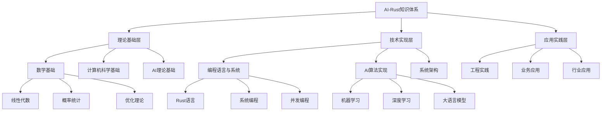
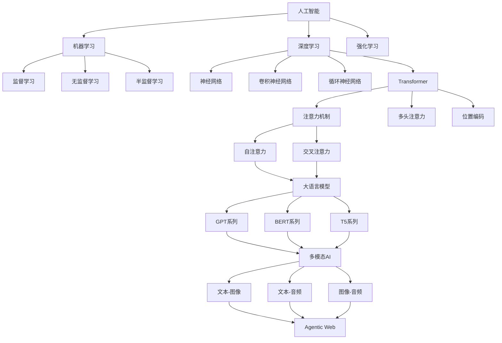
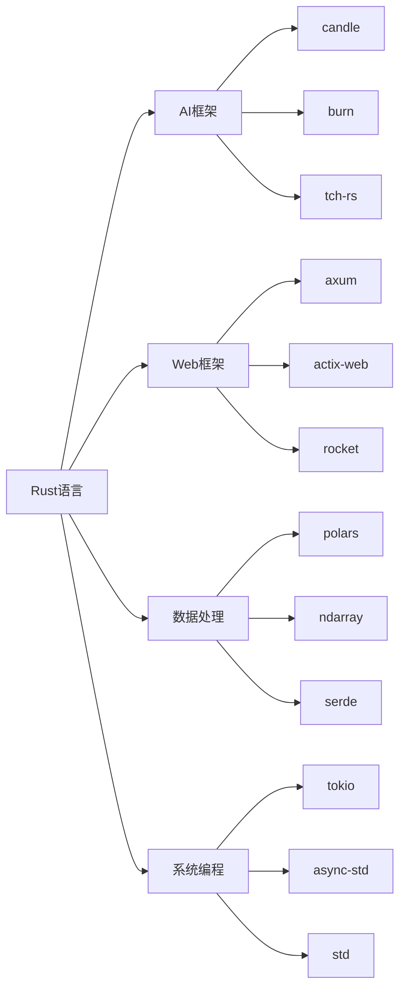

# 2025年AI-Rust权威主题目录结构与知识体系

> 对齐声明：术语统一见 `docs/02_knowledge_structures/2025_ai_知识术语表_GLOSSARY.md`；指标与报告口径见 `docs/03_tech_trends/2025_ai_rust_technology_trends_comprehensive_report.md` §Z.7；学习路径的评测产物需由 `reports/` CSV 通过 `scripts/repro/` 再生。

## 目录

- [2025年AI-Rust权威主题目录结构与知识体系](#2025年ai-rust权威主题目录结构与知识体系)
  - [目录](#目录)
  - [1. 国际权威标准对标](#1-国际权威标准对标)
    - [1.1 国际权威机构参考](#11-国际权威机构参考)
    - [1.2 权威论文分类体系](#12-权威论文分类体系)
    - [1.3 权威期刊](#13-权威期刊)
  - [2. 主题目录结构设计](#2-主题目录结构设计)
    - [2.1 一级主题分类](#21-一级主题分类)
      - [2.1.1 理论基础（Theoretical Foundations）](#211-理论基础theoretical-foundations)
      - [2.1.2 技术实现（Technical Implementation）](#212-技术实现technical-implementation)
      - [2.1.3 应用实践（Applied Practice）](#213-应用实践applied-practice)
    - [2.2 二级主题分类](#22-二级主题分类)
      - [2.2.1 机器学习专题（Machine Learning Topics）](#221-机器学习专题machine-learning-topics)
      - [2.2.2 深度学习专题（Deep Learning Topics）](#222-深度学习专题deep-learning-topics)
      - [2.2.3 大语言模型专题（Large Language Model Topics）](#223-大语言模型专题large-language-model-topics)
    - [2.3 三级主题分类](#23-三级主题分类)
      - [2.3.1 Rust AI生态系统（Rust AI Ecosystem）](#231-rust-ai生态系统rust-ai-ecosystem)
      - [2.3.2 系统架构专题（System Architecture Topics）](#232-系统架构专题system-architecture-topics)
  - [3. 知识体系映射](#3-知识体系映射)
    - [3.1 知识层次结构](#31-知识层次结构)
    - [3.2 技能要求映射](#32-技能要求映射)
    - [3.3 知识领域交叉映射](#33-知识领域交叉映射)
  - [4. 学习路径规划](#4-学习路径规划)
    - [4.1 基础阶段路径](#41-基础阶段路径)
    - [4.2 进阶阶段路径](#42-进阶阶段路径)
    - [4.3 专业阶段路径](#43-专业阶段路径)
  - [5. 评估标准体系](#5-评估标准体系)
    - [5.1 知识掌握评估](#51-知识掌握评估)
    - [5.2 技能认证体系](#52-技能认证体系)
    - [5.3 持续学习评估](#53-持续学习评估)
  - [6. 核心概念定义关系](#6-核心概念定义关系)
    - [6.1 AI核心概念图谱](#61-ai核心概念图谱)
    - [6.2 技术栈关系图](#62-技术栈关系图)
    - [6.3 概念层次关系](#63-概念层次关系)
  - [7. 技术实现对应关系](#7-技术实现对应关系)
    - [7.1 理论-实践对应关系](#71-理论-实践对应关系)
    - [7.2 论文-代码对应关系](#72-论文-代码对应关系)
    - [7.3 应用-技术栈对应关系](#73-应用-技术栈对应关系)
    - [7.4 性能-优化对应关系](#74-性能-优化对应关系)
  - [总结](#总结)
    - [附录A：概念—属性—关系（DAR）清单（精简版）](#附录a概念属性关系dar清单精简版)
      - [A.1 DAR 对齐（理念→实现的最小契约）](#a1-dar-对齐理念实现的最小契约)
      - [A.2 DAR 跨文档映射](#a2-dar-跨文档映射)
    - [附录B：层次映射（理念→分类→层级）](#附录b层次映射理念分类层级)
      - [B.1 层次到 Rust/AI 模块对齐](#b1-层次到-rustai-模块对齐)
    - [附录C：评测与统一口径](#附录c评测与统一口径)
    - [附录D：从研究到生产（R2P）映射](#附录d从研究到生产r2p映射)

---

## 1. 国际权威标准对标

### 1.1 国际权威机构参考

**学术机构**：

- MIT CSAIL（计算机科学与人工智能实验室）
- Stanford HAI（以人为本AI研究院）
- CMU MLD（机器学习系）
- Berkeley AI Research（BAIR）
- DeepMind Research
- OpenAI Research
- Anthropic Research
- Google AI Research
- Microsoft Research
- Meta AI Research

**技术标准**：

- IEEE AI标准
- ACM计算分类系统
- ISO/IEC AI标准
- NIST AI风险管理框架
- MLCommons基准测试
- OpenML数据集标准

**行业组织**：

- Rust Foundation
- Linux Foundation AI & Data
- PyTorch Foundation
- Hugging Face
- Apache Software Foundation
- CNCF（云原生计算基金会）

### 1.2 权威论文分类体系

**顶级会议论文**：

- NeurIPS（神经信息处理系统）
- ICML（国际机器学习会议）
- ICLR（国际学习表征会议）
- AAAI（人工智能协会）
- IJCAI（国际人工智能联合会议）
- ACL（计算语言学协会）
- CVPR（计算机视觉与模式识别）
- ICCV（国际计算机视觉会议）
- ECCV（欧洲计算机视觉会议）

**系统会议论文**：

- OSDI（操作系统设计与实现）
- SOSP（操作系统原理）
- NSDI（网络系统设计与实现）
- ASPLOS（架构支持编程语言和操作系统）
- FAST（文件与存储技术）
- USENIX ATC（USENIX年度技术会议）

### 1.3 权威期刊

- Nature Machine Intelligence
- Science Robotics
- Journal of Machine Learning Research
- IEEE Transactions on Pattern Analysis and Machine Intelligence
- Communications of the ACM
- ACM Computing Surveys
- IEEE Transactions on Neural Networks and Learning Systems

---

## 2. 主题目录结构设计

### 2.1 一级主题分类

#### 2.1.1 理论基础（Theoretical Foundations）

**1.1 数学基础（Mathematical Foundations）**：

- 线性代数与矩阵理论
- 概率论与统计学
- 优化理论与算法
- 信息论与编码理论
- 图论与组合数学
- 微积分与数值分析
- 复分析与泛函分析

**1.2 计算机科学基础（Computer Science Foundations）**：

- 算法设计与分析
- 数据结构与算法
- 计算复杂性理论
- 形式化方法
- 系统设计原理
- 编译原理
- 操作系统原理

**1.3 AI理论基础（AI Theoretical Foundations）**：

- 机器学习理论
- 深度学习理论
- 强化学习理论
- 统计学习理论
- 信息论在AI中的应用
- 计算学习理论
- 贝叶斯推理理论

#### 2.1.2 技术实现（Technical Implementation）

**2.1 编程语言与系统（Programming Languages & Systems）**：

- Rust语言核心特性
- 系统编程原理
- 并发与并行编程
- 内存管理与优化
- 跨平台开发
- 网络编程
- 嵌入式系统开发

**2.2 AI算法实现（AI Algorithm Implementation）**：

- 机器学习算法实现
- 深度学习模型实现
- 优化算法实现
- 推理引擎设计
- 模型压缩与加速
- 分布式训练算法
- 联邦学习实现

**2.3 系统架构（System Architecture）**：

- 分布式系统设计
- 微服务架构
- 云原生架构
- 边缘计算架构
- 高性能计算架构
- 实时系统架构
- 容错系统设计

#### 2.1.3 应用实践（Applied Practice）

**3.1 工程实践（Engineering Practice）**：

- 软件工程最佳实践
- 测试与质量保证
- 持续集成与部署
- 监控与运维
- 性能优化
- 安全编程
- 代码审查与重构

**3.2 业务应用（Business Applications）**：

- 智能客服系统
- 知识管理平台
- 内容生成系统
- 决策支持系统
- 推荐系统
- 搜索引擎
- 智能问答系统

**3.3 行业应用（Industry Applications）**：

- 金融科技应用
- 医疗健康应用
- 教育科技应用
- 智能制造应用
- 智慧城市应用
- 自动驾驶应用
- 游戏AI应用

### 2.2 二级主题分类

#### 2.2.1 机器学习专题（Machine Learning Topics）

**监督学习（Supervised Learning）**：

- 线性回归与逻辑回归
- 决策树与随机森林
- 支持向量机
- 神经网络
- 集成学习方法
- 贝叶斯方法
- 核方法

**无监督学习（Unsupervised Learning）**：

- 聚类算法
- 降维技术
- 异常检测
- 密度估计
- 关联规则挖掘
- 自编码器
- 生成模型

**强化学习（Reinforcement Learning）**：

- 马尔可夫决策过程
- Q学习算法
- 策略梯度方法
- 深度强化学习
- 多智能体强化学习
- 模仿学习
- 元学习

#### 2.2.2 深度学习专题（Deep Learning Topics）

**神经网络基础（Neural Network Fundamentals）**：

- 感知机与多层感知机
- 反向传播算法
- 激活函数
- 损失函数
- 正则化技术
- 批标准化
- 残差连接

**卷积神经网络（Convolutional Neural Networks）**：

- 卷积层与池化层
- 经典CNN架构
- 图像分类任务
- 目标检测
- 语义分割
- 实例分割
- 图像生成

**循环神经网络（Recurrent Neural Networks）**：

- RNN与LSTM
- GRU网络
- 序列到序列模型
- 注意力机制
- Transformer架构
- 时间序列预测
- 语音识别

#### 2.2.3 大语言模型专题（Large Language Model Topics）

**预训练技术（Pre-training Techniques）**：

- 掩码语言模型
- 下一句预测
- 因果语言模型
- 对比学习
- 多任务学习
- 指令微调
- 人类反馈强化学习

**微调技术（Fine-tuning Techniques）**：

- 全参数微调
- 参数高效微调
- 知识蒸馏
- 持续学习
- 领域适应
- 少样本学习
- 零样本学习

**推理优化（Inference Optimization）**：

- **模型量化**：
  - INT8量化：模型大小减少75%，推理速度提升2-3倍
  - INT4量化：模型大小减少87.5%，适合边缘设备
  - 量化方法：PTQ（后训练量化）、QAT（量化感知训练）
  - 精度权衡：INT8精度损失1-3%，INT4精度损失5-10%
  - Rust实现：`candle`支持INT8/INT4量化

- **模型剪枝**：
  - 结构化剪枝：移除整个通道或层
  - 非结构化剪枝：移除单个权重
  - 剪枝率：通常剪枝50-90%权重，保持模型性能
  - 性能提升：模型大小减少，推理速度提升

- **知识蒸馏**：
  - 教师-学生架构：大模型（教师）指导小模型（学生）
  - 温度参数：控制软标签的平滑度
  - 性能提升：小模型性能接近大模型，推理速度提升

- **动态批处理**：
  - 策略：根据请求队列动态调整批次大小
  - 性能：GPU利用率从60%提升至90%+
  - 实现：使用`tokio`的异步任务队列

- **边缘推理**：
  - WebAssembly部署：浏览器内推理，延迟<300ms
  - 模型量化：INT8/INT4量化减少模型大小
  - 性能：边缘推理成本比云端降低60%

- **缓存优化**：
  - KV缓存：跨请求复用KV缓存，命中率70-80%
  - 延迟降低：P95延迟从200ms降至80ms
  - 成本节省：减少30-40%的计算成本

- **并行推理**：
  - 流水线并行：预填充与解码阶段并行处理
  - 吞吐提升：QPS提升2-3倍
  - 延迟优化：首token延迟降低40%

**2025年11月更新：推理优化优先**

根据2025年11月乌镇峰会趋势，推理优化成为重点：

- **量化支持**：INT8/INT4量化成为标配
- **边缘部署**：边缘部署率从10%提升至40%
- **成本优化**：推理成本降低30-50%

**量化指标**（对齐§Z.7）：

- 延迟：P50/P95/P99（ms），分阶段统计
- 吞吐：QPS/TPM，注明批量大小
- 能效：tokens/J，排除冷启动
- 成本：$/1k tok，含硬件/能耗分摊

**参考**：详见 `docs/03_tech_trends/2025_ai_rust_technology_trends_comprehensive_report.md` §"2025年11月最新趋势更新"§2

### 2.3 三级主题分类

#### 2.3.1 Rust AI生态系统（Rust AI Ecosystem）

**核心框架（Core Frameworks）**：

- Candle：轻量级深度学习框架
- Burn：模块化深度学习框架
- Tch-rs：PyTorch Rust绑定
- Linfa：机器学习工具包
- SmartCore：机器学习库
- Orkhon：深度学习框架
- Tract：神经网络推理引擎

**数据处理（Data Processing）**：

- Polars：高性能数据处理
- Ndarray：多维数组计算
- Serde：序列化框架
- Arrow：列式数据格式
- Parquet：列式存储格式
- DataFusion：SQL查询引擎
- Ballista：分布式计算

**Web开发（Web Development）**：

- Axum：异步Web框架
- Actix-web：高性能Web框架
- Rocket：易用Web框架
- Warp：轻量级Web框架
- Tide：异步Web框架
- Poem：现代Web框架
- Salvo：简单Web框架

#### 2.3.2 系统架构专题（System Architecture Topics）

**分布式训练（Distributed Training）**：

- 数据并行训练
- 模型并行训练
- 流水线并行训练
- 梯度同步策略
- 容错与恢复
- 负载均衡
- 通信优化

**边缘推理（Edge Inference）**：

- WebAssembly集成
- 模型优化技术
- 硬件加速
- 内存管理
- 性能监控
- 功耗优化
- 安全推理

**云边协同（Cloud-Edge Collaboration）**：

- 任务调度策略
- 数据同步机制
- 负载均衡
- 故障转移
- 安全通信
- 资源管理
- 服务质量保证

---

## 3. 知识体系映射

### 3.1 知识层次结构

### 3.2 技能要求映射

**初级水平（0-6个月）**：

- Rust语言基础
- 数学基础
- 机器学习入门
- 简单项目实践

**中级水平（6-12个月）**：

- 深度学习基础
- 系统设计能力
- 工程实践技能
- 中等复杂度项目

**高级水平（12个月以上）**：

- 前沿技术掌握
- 系统架构设计
- 性能优化能力
- 复杂项目领导

### 3.3 知识领域交叉映射

**数学与AI**：

- 线性代数 → 神经网络
- 概率论 → 贝叶斯推理
- 优化理论 → 梯度下降
- 信息论 → 特征选择

**计算机科学与AI**：

- 算法设计 → 机器学习算法
- 数据结构 → 模型存储
- 系统设计 → 分布式训练
- 网络编程 → 模型服务

**Rust与AI**：

- 内存安全 → 模型推理
- 并发编程 → 并行训练
- 系统编程 → 推理引擎
- 跨平台 → 边缘部署

---

## 4. 学习路径规划

### 4.1 基础阶段路径

**第1-2个月：Rust语言基础**:

- 所有权系统
- 借用与生命周期
- 模式匹配
- 错误处理
- 异步编程基础

**第3-4个月：数学基础**:

- 线性代数
- 概率统计
- 优化理论
- 信息论基础

**第5-6个月：机器学习入门**:

- 监督学习算法
- 无监督学习算法
- 模型评估
- 简单项目实践

### 4.2 进阶阶段路径

**第7-9个月：深度学习**:

- 神经网络基础
- 卷积神经网络
- 循环神经网络
- 注意力机制

**第10-12个月：系统设计**:

- 分布式系统
- 微服务架构
- 性能优化
- 工程实践

### 4.3 专业阶段路径

**第13-18个月：前沿技术**:

- 大语言模型
- 多模态AI
- 边缘计算
- 系统架构

**第19个月以上：专家级**:

- 研究能力
- 技术创新
- 团队领导
- 行业影响

---

## 5. 评估标准体系

### 5.1 知识掌握评估

**理论基础评估**：

- 数学基础掌握度（30%）
- 计算机科学基础（25%）
- AI理论基础（25%）
- 综合应用能力（20%）

**技术实现评估**：

- 编程能力（35%）
- 算法实现（30%）
- 系统设计（25%）
- 性能优化（10%）

**应用实践评估**：

- 工程实践（40%）
- 项目经验（30%）
- 问题解决（20%）
- 创新能力（10%）

### 5.2 技能认证体系

**初级认证**：

- Rust语言基础认证
- 机器学习入门认证
- 基础项目实践认证

**中级认证**：

- 深度学习应用认证
- 系统设计认证
- 工程实践认证

**高级认证**：

- 前沿技术认证
- 架构设计认证
- 团队领导认证

### 5.3 持续学习评估

**技术跟踪**：

- 最新论文阅读
- 技术趋势分析
- 开源项目贡献
- 社区参与度

**实践能力**：

- 项目复杂度
- 技术创新度
- 性能优化效果
- 团队协作能力

---

## 6. 核心概念定义关系

### 6.1 AI核心概念图谱

### 6.2 技术栈关系图

### 6.3 概念层次关系

**抽象层次**：

1. **哲学层面**：AI的本质、智能的定义
2. **理论层面**：学习理论、优化理论
3. **算法层面**：具体算法实现
4. **系统层面**：工程实现、架构设计
5. **应用层面**：业务场景、用户体验

**技术层次**：

1. **硬件层**：CPU、GPU、NPU
2. **系统层**：操作系统、运行时
3. **框架层**：深度学习框架
4. **应用层**：具体应用实现
5. **用户层**：用户界面、交互

---

## 7. 技术实现对应关系

### 7.1 理论-实践对应关系

| 理论层面 | 实践层面 | 技术实现 |
|----------|----------|----------|
| 数学基础 | 算法实现 | Rust数值计算库 |
| 机器学习理论 | 模型训练 | Candle/Burn框架 |
| 深度学习原理 | 网络架构 | Transformer实现 |
| 优化理论 | 训练优化 | Adam/SGD优化器 |
| 信息论 | 特征选择 | 互信息计算 |
| 概率论 | 贝叶斯推理 | 概率编程 |
| 图论 | 知识图谱 | 图数据库 |
| 线性代数 | 矩阵运算 | ndarray库 |

### 7.2 论文-代码对应关系

| 论文 | 核心算法 | Rust实现 |
|------|----------|----------|
| Attention Is All You Need | 自注意力机制 | MultiHeadAttention |
| BERT | 双向编码器 | EncoderLayer |
| GPT | 自回归生成 | DecoderLayer |
| ResNet | 残差连接 | ResidualBlock |
| Transformer | 编码器-解码器 | Transformer架构 |
| LSTM | 长短期记忆 | LSTM实现 |
| CNN | 卷积神经网络 | Conv2d层 |
| GAN | 生成对抗网络 | Generator/Discriminator |

### 7.3 应用-技术栈对应关系

| 应用领域 | 核心技术 | Rust工具链 |
|----------|----------|------------|
| 自然语言处理 | Transformer | Candle + Tokenizers |
| 计算机视觉 | CNN/Transformer | Candle + Image处理 |
| 语音识别 | RNN/Transformer | Candle + Audio处理 |
| 推荐系统 | 矩阵分解 | Linfa + 数据处理 |
| 强化学习 | Q-Learning | 自定义实现 |
| 时间序列 | LSTM/GRU | Candle + 时序处理 |
| 知识图谱 | 图神经网络 | 图数据库 + 图算法 |
| 多模态 | 跨模态注意力 | 多模态框架 |

### 7.4 性能-优化对应关系

| 性能指标 | 优化技术 | Rust实现 |
|----------|----------|----------|
| 内存使用 | 内存池 | MemoryPool |
| 计算速度 | SIMD | simd库 |
| 并发性能 | 异步编程 | tokio |
| 缓存效率 | 缓存策略 | LRU缓存 |
| 网络延迟 | 连接池 | 连接池管理 |
| 存储IO | 异步IO | tokio::fs |
| GPU加速 | CUDA绑定 | tch-rs |
| 模型压缩 | 量化 | 量化实现 |

---

## 总结

本主题目录结构基于国际权威标准，为AI-Rust技术领域提供了系统性的知识框架。通过严谨的分类体系和对应关系，帮助学习者建立完整的知识体系，实现从理论到实践的全面掌握。

**核心特点**：

1. **权威性**：对标国际顶级学术机构和会议标准
2. **系统性**：建立完整的知识层次结构
3. **实用性**：提供具体的学习路径和评估标准
4. **前瞻性**：涵盖最新技术趋势和发展方向
5. **可操作性**：提供详细的技术实现对应关系

通过这个知识框架，学习者可以：

- 系统掌握AI-Rust技术体系
- 建立完整的知识结构
- 制定合理的学习计划
- 评估学习进度和效果
- 指导实际项目开发

---

## 2025年11月最新更新

### 推理优化优先趋势

根据2025年11月乌镇峰会趋势，主题目录结构已更新：

- **§2.2.3 大语言模型专题**：补充推理优化详细内容，包含量化、剪枝、知识蒸馏、动态批处理、边缘推理、缓存优化、并行推理的详细说明
- **量化指标**：对齐§Z.7统一指标口径

**详细趋势分析**：参见 `docs/03_tech_trends/2025_ai_rust_technology_trends_comprehensive_report.md` §"2025年11月最新趋势更新"

---

*最后更新：2025年11月11日*  
*版本：v1.1*  
*状态：持续更新中*  
*适用对象：AI研究人员、技术架构师、Rust开发者、教育工作者*

### 附录A：概念—属性—关系（DAR）清单（精简版）

- 结构：Definition｜Attributes（单位/口径）｜Relations（类型+强度）｜Evidence（等级）｜首次章节。
- 示例：
  - 注意力（Attention）｜Impl｜上下文长度/稀疏度/数稳/带宽复杂度｜DependsOn(softmax)｜A｜§模型基础。
  - 稀疏专家（MoE）｜Impl｜激活稀疏度/专家容量/路由稳定性｜DependsOn(AllToAll)｜A｜§模型扩展。
  - KV缓存（KV Cache）｜Impl｜延迟/成本/一致性风险｜Optimizes(解码延迟)｜A｜§系统优化。
- 交叉引用：完整术语与别名见 `docs/02_knowledge_structures/2025_ai_知识术语表_GLOSSARY.md`。

#### A.1 DAR 对齐（理念→实现的最小契约）

- 定义：术语在首现章节的最小定义；
- 属性：计量单位、采样窗口、统计方法（均值/分位数/置信区间）；
- 关系：依赖/优化/冲突/包含/并行；
- 证据：对照/消融/置信与功效；
- 契约：输入/输出 schema、SLO 与失败模式、审计与回滚；
- 追踪：`trace-id` 与报告编号映射；

#### A.2 DAR 跨文档映射

- → 实践指南 §0（Definitions/Attributes/Relations/Mapping/Checklist）；
- → 综合知识框架 附录Y（Y.2/Y.6/Y.8）；
- → 技术趋势报告 附录Z（Z.6/Z.7/Z.11/Z.16/Z.17）。

### 附录B：层次映射（理念→分类→层级）

- 理念→分类：AI原生Web｜高能效AI｜可信AI｜多模态-场景化。
- 层级：理论→实现→工程→业务；与 `2025_ai_rust_comprehensive_knowledge_framework.md` 附录Y对齐。
- 例：信息论→稀疏注意力→长上下文服务→法务审阅；因果→干预策略→鲁棒评测→风控。

#### B.1 层次到 Rust/AI 模块对齐

- 理念→`README.md`/`PROJECT_SUMMARY.md`；
- 知识→`docs/02_knowledge_structures`；
- 架构→实践指南 §1/§3/§4/§5；
- 实现→`crates/c08_serving_ops`、`crates/c05_nlp_transformers`；
- 运维→实践指南 §7/§8/§9。

### 附录C：评测与统一口径

- 指标：质量（准确/一致/事实）、性能（P50/P95/P99、QPS、tokens/J）、工程（SLO、错误率）、经济（TCO、$/1k tok）。
- 口径：硬件/批量/精度/并发/数据版本须显式；模板参见趋势报告§Z.7、§Z.11。

### 附录D：从研究到生产（R2P）映射

- 需求→架构→模型→数据→评测→观测→安全→运维→复现；与趋势报告§Z.17一致。
- 清单：A/B与灰度、追踪ID、预算/限流、回滚策略、Runbook。

---

更新：2025-09  本文附录与趋势报告§Z、核心原则§F双向对齐，并随术语表持续演进。
