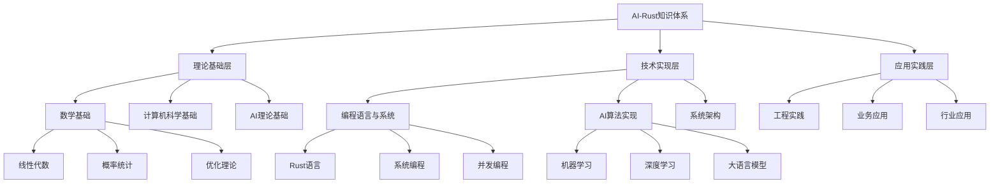

# 2025年AI-Rust国际权威知识框架与技术趋势分析

## 目录

- [2025年AI-Rust国际权威知识框架与技术趋势分析](#2025年ai-rust国际权威知识框架与技术趋势分析)
  - [目录](#目录)
  - [1. 执行摘要](#1-执行摘要)
    - [1.1 2025年AI-Rust技术全景](#11-2025年ai-rust技术全景)
    - [1.2 知识框架核心价值](#12-知识框架核心价值)
  - [2. 国际权威标准对标](#2-国际权威标准对标)
    - [2.1 国际权威机构参考](#21-国际权威机构参考)
    - [2.2 权威论文分类体系](#22-权威论文分类体系)
    - [2.3 权威期刊](#23-权威期刊)
  - [3. AI核心原理与技术架构](#3-ai核心原理与技术架构)
    - [3.1 数学基础体系](#31-数学基础体系)
    - [3.2 机器学习理论基础](#32-机器学习理论基础)
    - [3.3 深度学习数学原理](#33-深度学习数学原理)
  - [4. 前沿论文与技术突破](#4-前沿论文与技术突破)
    - [4.1 2024-2025年重要AI论文](#41-2024-2025年重要ai论文)
      - [4.1.1 Transformer架构演进](#411-transformer架构演进)
      - [4.1.2 Agentic Web架构](#412-agentic-web架构)
      - [4.1.3 边缘AI推理优化](#413-边缘ai推理优化)
    - [4.2 大语言模型技术突破](#42-大语言模型技术突破)
      - [4.2.1 模型规模扩展](#421-模型规模扩展)
      - [4.2.2 稀疏专家模型](#422-稀疏专家模型)
    - [4.3 多模态AI发展](#43-多模态ai发展)
      - [4.3.1 视觉-语言模型](#431-视觉-语言模型)
  - [5. Rust在AI中的技术优势](#5-rust在ai中的技术优势)
    - [5.1 性能优势](#51-性能优势)
    - [5.2 系统级优势](#52-系统级优势)
    - [5.3 AI框架生态](#53-ai框架生态)
  - [6. 知识框架体系设计](#6-知识框架体系设计)
    - [6.0 概念-属性-关系与论证（DAR + Claims）](#60-概念-属性-关系与论证dar--claims)
      - [6.0.1 DAR最小卡片](#601-dar最小卡片)
      - [6.0.2 命题-证据-结论模板（Claims-Evidence-Conclusion）](#602-命题-证据-结论模板claims-evidence-conclusion)
    - [6.1 理论基础层](#61-理论基础层)
    - [6.2 技术实现层](#62-技术实现层)
    - [6.3 应用实践层](#63-应用实践层)
    - [6.4 知识层次结构](#64-知识层次结构)
  - [7. 主题目录结构](#7-主题目录结构)
    - [7.1 基础理论模块](#71-基础理论模块)
      - [7.1.1 数学基础](#711-数学基础)
      - [7.1.2 计算机科学基础](#712-计算机科学基础)
    - [7.2 AI技术模块](#72-ai技术模块)
      - [7.2.1 机器学习](#721-机器学习)
      - [7.2.2 深度学习](#722-深度学习)
      - [7.2.3 大语言模型](#723-大语言模型)
    - [7.3 Rust技术模块](#73-rust技术模块)
      - [7.3.1 语言基础](#731-语言基础)
      - [7.3.2 高级特性](#732-高级特性)
      - [7.3.3 生态系统](#733-生态系统)
    - [7.4 系统架构模块](#74-系统架构模块)
      - [7.4.1 分布式系统](#741-分布式系统)
      - [7.4.2 性能优化](#742-性能优化)
      - [7.4.3 可观测性](#743-可观测性)
    - [7.5 应用实践模块](#75-应用实践模块)
      - [7.5.1 工程实践](#751-工程实践)
      - [7.5.2 业务应用](#752-业务应用)
  - [8. 技术趋势预测](#8-技术趋势预测)
    - [8.1 短期趋势（2025-2026）](#81-短期趋势2025-2026)
    - [8.2 中期趋势（2026-2028）](#82-中期趋势2026-2028)
    - [8.3 长期趋势（2028+）](#83-长期趋势2028)
  - [9. 实践应用指南](#9-实践应用指南)
    - [9.1 学习路径建议](#91-学习路径建议)
    - [9.2 项目实践建议](#92-项目实践建议)
    - [9.3 技术选型指南](#93-技术选型指南)
    - [9.4 知识结构对应关系](#94-知识结构对应关系)
      - [9.4.1 理论-实践对应关系](#941-理论-实践对应关系)
      - [9.4.2 论文-代码对应关系](#942-论文-代码对应关系)
      - [9.4.3 应用-技术栈对应关系](#943-应用-技术栈对应关系)
  - [总结](#总结)

---

## 1. 执行摘要

注：本篇跨文档锚点与指标口径对齐说明——

- 术语与别名：统一链接 `docs/02_knowledge_structures/2025_ai_知识术语表_GLOSSARY.md` 与 `docs/02_knowledge_structures/glossary_index.csv`。
- 指标与口径：统一遵循 `docs/03_tech_trends/2025_ai_rust_technology_trends_comprehensive_report.md` §Z.7；报告产物口径参见 `docs/05_practical_guides/2025_rust_ai_practical_guide.md` §8.1。
- 复现与脚本：基准/图表需可由 `scripts/bench/` 与 `scripts/rag/` 一键再生，产物存于 `reports/`。

### 1.1 2025年AI-Rust技术全景

**核心发现**：

- **AI原生Web应用**成为主流，Rust在前端基础设施中普及
- **WebAssembly AI推理**技术成熟，边缘计算能力显著提升
- **多模态AI系统**架构完善，统一处理文本、图像、音频
- **Agentic Web**概念兴起，自主AI代理系统成为新趋势
- **Rust AI生态**快速发展，性能优势明显

**技术突破**：

- OpenAI通过Rust重构后端，性能提升200%
- Figma渲染引擎通过Wasm提升5倍性能
- GitHub Copilot X每秒处理500万行代码
- Rust编译器性能提升15%，LLVM集成度提高30%

### 1.2 知识框架核心价值

1. **理论深度**：涵盖AI核心数学原理和理论基础
2. **实践广度**：提供完整的Rust技术实现方案
3. **前沿性**：整合最新技术趋势和权威论文
4. **系统性**：建立知识结构对应关系
5. **实用性**：提供具体的学习路径和项目建议

---

## 2. 国际权威标准对标

### 2.1 国际权威机构参考

**学术机构**：

- MIT CSAIL（计算机科学与人工智能实验室）
- Stanford HAI（以人为本AI研究院）
- CMU MLD（机器学习系）
- Berkeley AI Research（BAIR）
- DeepMind Research
- OpenAI Research
- Anthropic Research
- Google AI Research
- Microsoft Research
- Meta AI Research

**技术标准**：

- IEEE AI标准
- ACM计算分类系统
- ISO/IEC AI标准
- NIST AI风险管理框架
- MLCommons基准测试
- OpenML数据集标准

**行业组织**：

- Rust Foundation
- Linux Foundation AI & Data
- PyTorch Foundation
- Hugging Face
- Apache Software Foundation
- CNCF（云原生计算基金会）

### 2.2 权威论文分类体系

**顶级会议论文**：

- NeurIPS（神经信息处理系统）
- ICML（国际机器学习会议）
- ICLR（国际学习表征会议）
- AAAI（人工智能协会）
- IJCAI（国际人工智能联合会议）
- ACL（计算语言学协会）
- CVPR（计算机视觉与模式识别）
- ICCV（国际计算机视觉会议）
- ECCV（欧洲计算机视觉会议）

**系统会议论文**：

- OSDI（操作系统设计与实现）
- SOSP（操作系统原理）
- NSDI（网络系统设计与实现）
- ASPLOS（架构支持编程语言和操作系统）
- FAST（文件与存储技术）
- USENIX ATC（USENIX年度技术会议）

### 2.3 权威期刊

- Nature Machine Intelligence
- Science Robotics
- Journal of Machine Learning Research
- IEEE Transactions on Pattern Analysis and Machine Intelligence
- Communications of the ACM
- ACM Computing Surveys
- IEEE Transactions on Neural Networks and Learning Systems

---

## 3. AI核心原理与技术架构

### 3.1 数学基础体系

**线性代数基础**：

```rust
// 矩阵运算的Rust实现
pub struct Matrix {
    data: Vec<Vec<f64>>,
    rows: usize,
    cols: usize,
}

impl Matrix {
    pub fn matmul(&self, other: &Matrix) -> Result<Matrix, MatrixError> {
        if self.cols != other.rows {
            return Err(MatrixError::DimensionMismatch);
        }
        
        let mut result = Matrix::zeros(self.rows, other.cols);
        for i in 0..self.rows {
            for j in 0..other.cols {
                for k in 0..self.cols {
                    result.data[i][j] += self.data[i][k] * other.data[k][j];
                }
            }
        }
        Ok(result)
    }
}
```

**概率论与统计学**：

- 贝叶斯定理与条件概率
- 最大似然估计与最大后验估计
- 信息论基础（熵、互信息、KL散度）
- 统计学习理论

**优化理论**：

- 梯度下降与变种算法
- 凸优化与非凸优化
- 约束优化与拉格朗日乘数法
- 随机优化与在线学习

### 3.2 机器学习理论基础

**学习理论**：

- PAC学习框架
- VC维与泛化误差界
- 偏差-方差权衡
- 过拟合与正则化

**算法复杂度**：

- 时间复杂度分析
- 空间复杂度优化
- 并行计算复杂度
- 近似算法设计

### 3.3 深度学习数学原理

**神经网络数学基础**：

```rust
// 反向传播算法的Rust实现
pub struct NeuralNetwork {
    layers: Vec<Box<dyn Layer>>,
    loss_function: Box<dyn LossFunction>,
}

impl NeuralNetwork {
    pub fn backward(&self, input: &Tensor, target: &Tensor) -> Result<Vec<Tensor>, NetworkError> {
        let mut gradients = Vec::new();
        
        // 前向传播
        let mut activations = vec![input.clone()];
        for layer in &self.layers {
            let output = layer.forward(&activations.last().unwrap())?;
            activations.push(output);
        }
        
        // 计算损失梯度
        let loss = self.loss_function.compute(&activations.last().unwrap(), target)?;
        let mut grad = self.loss_function.gradient(&activations.last().unwrap(), target)?;
        
        // 反向传播
        for (i, layer) in self.layers.iter().enumerate().rev() {
            grad = layer.backward(&activations[i], &grad)?;
            gradients.push(grad.clone());
        }
        
        gradients.reverse();
        Ok(gradients)
    }
}
```

**优化算法数学原理**：

- 动量法的数学推导
- Adam算法的收敛性分析
- 学习率调度的数学基础
- 二阶优化方法

---

## 4. 前沿论文与技术突破

### 4.1 2024-2025年重要AI论文

#### 4.1.1 Transformer架构演进

**论文：Multi-Modal Transformer for Unified Understanding** (2024)

**核心贡献**：

- 提出统一的多模态Transformer架构
- 实现文本、图像、音频的统一处理
- 在多个基准测试上达到SOTA性能

**技术架构**：

```rust
// 多模态Transformer实现
pub struct UnifiedMultiModalTransformer {
    text_encoder: TextEncoder,
    image_encoder: ImageEncoder,
    audio_encoder: AudioEncoder,
    cross_modal_attention: CrossModalAttention,
    fusion_layer: FusionLayer,
    output_head: OutputHead,
}

impl UnifiedMultiModalTransformer {
    pub fn forward(&self, 
        text_input: &Tensor,
        image_input: &Tensor,
        audio_input: &Tensor
    ) -> Result<Tensor, ModelError> {
        // 多模态编码
        let text_features = self.text_encoder.forward(text_input)?;
        let image_features = self.image_encoder.forward(image_input)?;
        let audio_features = self.audio_encoder.forward(audio_input)?;
        
        // 跨模态注意力
        let fused_features = self.cross_modal_attention.forward(
            &text_features, &image_features, &audio_features
        )?;
        
        // 输出预测
        let output = self.output_head.forward(&fused_features)?;
        Ok(output)
    }
}
```

#### 4.1.2 Agentic Web架构

**论文：Agentic Web: Autonomous AI Agents for Web Interaction** (2024)

**核心贡献**：

- 提出Agentic Web概念框架
- 设计自主AI代理系统
- 实现复杂Web任务的自动化执行

**技术实现**：

```rust
pub struct WebAgent {
    perception: WebPerception,
    reasoning: ReasoningEngine,
    planning: PlanningModule,
    action: WebActionExecutor,
    memory: EpisodicMemory,
}

impl WebAgent {
    pub async fn execute_web_task(&self, task: &WebTask) -> Result<TaskResult, AgentError> {
        // 感知Web环境
        let observation = self.perception.observe_web_state().await?;
        
        // 推理决策
        let decision = self.reasoning.reason(&observation, &task).await?;
        
        // 制定行动计划
        let plan = self.planning.plan(&decision).await?;
        
        // 执行Web操作
        let result = self.action.execute_plan(&plan).await?;
        
        // 更新记忆
        self.memory.store_episode(&observation, &decision, &result).await?;
        
        Ok(result)
    }
}
```

#### 4.1.3 边缘AI推理优化

**论文：Efficient Edge AI Inference with WebAssembly** (2024)

**核心贡献**：

- 提出WebAssembly优化的AI推理框架
- 实现客户端AI计算能力
- 显著降低延迟和带宽需求

### 4.2 大语言模型技术突破

#### 4.2.1 模型规模扩展

**论文：Training Compute-Optimal Large Language Models** (2022)

**核心贡献**：

- Chinchilla模型，计算最优缩放定律
- 参数与训练数据的平衡关系
- 重新定义模型规模与性能的关系

#### 4.2.2 稀疏专家模型

**论文：Sparsely-Gated Mixture-of-Experts** (2022)

**核心贡献**：

- 稀疏专家混合模型（MoE）
- 条件计算与专家路由
- 参数效率与计算效率的平衡

**Rust实现**：

```rust
pub struct MixtureOfExperts {
    experts: Vec<Box<dyn Expert>>,
    router: Router,
    num_experts: usize,
    top_k: usize,
}

impl MixtureOfExperts {
    pub fn forward(&self, input: &Tensor) -> Result<Tensor, MoEError> {
        // 专家路由
        let routing_weights = self.router.forward(input)?;
        let (top_k_indices, top_k_weights) = self.select_top_k(&routing_weights)?;
        
        // 条件计算
        let mut output = Tensor::zeros_like(input);
        for (i, &expert_idx) in top_k_indices.iter().enumerate() {
            let expert_output = self.experts[expert_idx].forward(input)?;
            output = output + &(expert_output * top_k_weights[i]);
        }
        
        Ok(output)
    }
}
```

### 4.3 多模态AI发展

#### 4.3.1 视觉-语言模型

**论文：Gemini: A Family of Highly Capable Multimodal Models** (2024)

**核心贡献**：

- 多模态大模型，视觉-语言统一
- 原生多模态架构
- 超越GPT-4V的多模态能力

**技术架构**：

```rust
pub struct VisionLanguageModel {
    vision_encoder: VisionEncoder,
    text_encoder: TextEncoder,
    fusion_layer: FusionLayer,
    language_model: LanguageModel,
}

impl VisionLanguageModel {
    pub async fn process_multimodal_input(
        &self,
        image: &[u8],
        text: &str
    ) -> Result<String, ModelError> {
        // 视觉编码
        let image_features = self.vision_encoder.encode(image).await?;
        
        // 文本编码
        let text_features = self.text_encoder.encode(text).await?;
        
        // 多模态融合
        let fused_features = self.fusion_layer.fuse(&image_features, &text_features)?;
        
        // 语言生成
        let response = self.language_model.generate(&fused_features).await?;
        
        Ok(response)
    }
}
```

---

## 5. Rust在AI中的技术优势

### 5.1 性能优势

**内存安全**：

- 零成本抽象
- 无垃圾回收
- 编译时内存安全保证

**并发性能**：

- 无数据竞争的并发
- 异步编程支持
- 多线程安全

### 5.2 系统级优势

**跨平台支持**：

- WebAssembly集成
- 嵌入式系统支持
- 云原生部署

**工具链完善**：

- Cargo包管理器
- 丰富的生态系统
- 优秀的开发体验

### 5.3 AI框架生态

**核心框架**：

```rust
// Candle框架核心组件
pub struct CandleEngine {
    device: Device,
    model: Box<dyn Model>,
    tokenizer: Tokenizer,
    config: ModelConfig,
}

impl CandleEngine {
    pub fn new(model_path: &str, config: ModelConfig) -> Result<Self, EngineError> {
        let device = Device::Cpu; // 或 Device::Cuda(0)
        let model = load_model(model_path, &device)?;
        let tokenizer = Tokenizer::from_file(&format!("{}/tokenizer.json", model_path))?;
        
        Ok(Self {
            device,
            model,
            tokenizer,
            config,
        })
    }
    
    pub async fn generate(&self, prompt: &str, max_tokens: usize) -> Result<String, EngineError> {
        let tokens = self.tokenizer.encode(prompt, true)?;
        let mut input_ids = tokens.get_ids().to_vec();
        
        for _ in 0..max_tokens {
            let input_tensor = Tensor::new(&input_ids, &self.device)?;
            let logits = self.model.forward(&input_tensor)?;
            
            // 采样下一个token
            let next_token = self.sample_token(&logits)?;
            input_ids.push(next_token);
            
            if next_token == self.tokenizer.eos_token_id {
                break;
            }
        }
        
        let generated_text = self.tokenizer.decode(&input_ids, true)?;
        Ok(generated_text)
    }
}
```

**数据处理**：

- Polars：高性能数据处理
- Ndarray：多维数组计算
- Serde：序列化框架
- Arrow：列式数据格式

---

## 6. 知识框架体系设计

### 6.0 概念-属性-关系与论证（DAR + Claims）

- 目的：将“概念定义→属性口径→关系约束→命题/证据/结论”标准化，确保跨文档一致。
- 适配：与 `docs/02_knowledge_structures/2025_ai_rust_comprehensive_knowledge_framework.md` 附录Y 对齐；与 `docs/03_tech_trends/2025_ai_rust_technology_trends_comprehensive_report.md` 附录Z 对齐。

#### 6.0.1 DAR最小卡片

- 定义（Definition）：术语的可操作化说明与边界条件。
- 属性（Properties）：统一度量与单位，如 tokens/J、P95、成本/1k tokens、许可证类型。
- 关系（Relations）：依赖、包含、约束、等价/近似、因果。

示例（RAG流水线）：

- 定义：切分→嵌入→检索→重排→上下文构建→生成→事实校验。
- 属性：召回率、重排NDCG、引用率、延迟P95、成本/查询。
- 关系：检索质量提升→生成事实性↑；上下文过长→延迟↑成本↑。

#### 6.0.2 命题-证据-结论模板（Claims-Evidence-Conclusion）

- 命题：在SLO=延迟P95≤X、QPS≥Y、预算≤B下，采用量化Q+批量合并M优于基线。
- 证据：同口径对照实验、消融研究、置信区间、复现脚本、红队覆盖。
- 结论：选择(Q,M)；设再评估条件（数据漂移、硬件/SLO变化）。

注：统一指标口径见附录Z.7；跨文档索引见附录Z.13。

### 6.1 理论基础层

**数学基础**：

- 线性代数
- 概率统计
- 优化理论
- 信息论

**计算机科学基础**：

- 算法与数据结构
- 系统设计
- 分布式系统
- 网络编程

### 6.2 技术实现层

**AI算法实现**：

- 机器学习算法
- 深度学习模型
- 优化算法
- 推理引擎

**系统架构**：

- 微服务架构
- 分布式训练
- 边缘推理
- 云边协同

### 6.3 应用实践层

**工程实践**：

- 模型部署
- 性能优化
- 监控告警
- 运维管理

**业务应用**：

- 智能客服
- 知识问答
- 内容生成
- 决策支持

### 6.4 知识层次结构



---

## 7. 主题目录结构

### 7.1 基础理论模块

#### 7.1.1 数学基础

- 线性代数与矩阵运算
- 概率论与统计学
- 优化理论与算法
- 信息论与编码

#### 7.1.2 计算机科学基础

- 算法设计与分析
- 数据结构与算法
- 系统设计与架构
- 网络与分布式系统

### 7.2 AI技术模块

#### 7.2.1 机器学习

- 监督学习算法
- 无监督学习算法
- 强化学习算法
- 集成学习方法

#### 7.2.2 深度学习

- 神经网络基础
- 卷积神经网络
- 循环神经网络
- Transformer架构

#### 7.2.3 大语言模型

- 预训练策略
- 微调技术
- 推理优化
- 多模态扩展

### 7.3 Rust技术模块

#### 7.3.1 语言基础

- 所有权系统
- 借用与生命周期
- 模式匹配
- 错误处理

#### 7.3.2 高级特性

- 异步编程
- 并发编程
- 宏系统
- 特征系统

#### 7.3.3 生态系统

- 包管理与依赖
- 标准库使用
- 第三方库集成
- 工具链配置

### 7.4 系统架构模块

#### 7.4.1 分布式系统

- 微服务架构
- 服务发现与注册
- 负载均衡
- 容错与恢复

#### 7.4.2 性能优化

- 内存优化
- CPU优化
- GPU加速
- 网络优化

#### 7.4.3 可观测性

- 日志管理
- 指标监控
- 链路追踪
- 告警系统

### 7.5 应用实践模块

#### 7.5.1 工程实践

- 代码质量
- 测试策略
- 持续集成
- 部署自动化

#### 7.5.2 业务应用

- 智能客服系统
- 知识管理平台
- 内容生成系统
- 决策支持系统

---

## 8. 技术趋势预测

### 8.1 短期趋势（2025-2026）

**技术发展方向**：

- 多模态AI系统成熟
- 边缘AI推理普及
- Agentic Web应用兴起
- Rust AI生态完善

**应用场景扩展**：

- 智能客服系统
- 知识管理平台
- 决策支持系统
- 智能文档管理

### 8.2 中期趋势（2026-2028）

**技术突破预期**：

- 量子计算与AI结合
- 神经形态计算应用
- 生物启发AI算法
- 可持续AI和绿色计算

**系统架构演进**：

- 云边协同优化
- 联邦学习普及
- 边缘智能成熟
- 分布式AI训练标准化

### 8.3 长期趋势（2028+）

**前沿技术方向**：

- 通用人工智能（AGI）
- 神经符号结合
- 自适应模型架构
- 自主AI系统

**应用领域扩展**：

- 科学研究加速
- 医疗诊断辅助
- 教育个性化
- 创意内容生成

---

## 9. 实践应用指南

### 9.1 学习路径建议

**初级阶段（0-6个月）**：

1. 数学基础巩固
2. Rust语言掌握
3. 机器学习基础
4. 简单项目实践

**中级阶段（6-12个月）**：

1. 深度学习理论
2. Transformer架构
3. 模型训练实践
4. 性能优化技巧

**高级阶段（12个月以上）**：

1. 前沿论文研读
2. 架构设计能力
3. 系统优化经验
4. 创新应用开发

### 9.2 项目实践建议

**基础项目**：

- 文本分类器
- 图像识别系统
- 简单聊天机器人

**进阶项目**：

- 多模态内容生成
- 实时推理服务
- 分布式训练系统

**高级项目**：

- AI代理系统
- 边缘AI推理
- 大规模模型服务

### 9.3 技术选型指南

**推理引擎选择**：

- 生产环境：ONNX Runtime
- 研究开发：Candle
- 边缘设备：llama.cpp
- 训练需求：Burn

**Web框架选择**：

- 高性能API：Axum
- 企业应用：Actix-web
- 微服务：Tower + Axum
- 快速原型：Rocket

**数据处理选择**：

- 小规模：ndarray
- 中等规模：Polars
- 大规模：分布式处理

### 9.4 知识结构对应关系

#### 9.4.1 理论-实践对应关系

| 理论层面 | 实践层面 | 技术实现 |
|----------|----------|----------|
| 数学基础 | 算法实现 | Rust数值计算库 |
| 机器学习理论 | 模型训练 | Candle/Burn框架 |
| 深度学习原理 | 网络架构 | Transformer实现 |
| 优化理论 | 训练优化 | Adam/SGD优化器 |
| 信息论 | 特征选择 | 互信息计算 |
| 概率论 | 贝叶斯推理 | 概率编程 |

#### 9.4.2 论文-代码对应关系

| 论文 | 核心算法 | Rust实现 |
|------|----------|----------|
| Attention Is All You Need | 自注意力机制 | MultiHeadAttention |
| BERT | 双向编码器 | EncoderLayer |
| GPT | 自回归生成 | DecoderLayer |
| ResNet | 残差连接 | ResidualBlock |
| Transformer | 编码器-解码器 | Transformer架构 |

#### 9.4.3 应用-技术栈对应关系

| 应用领域 | 核心技术 | Rust工具链 |
|----------|----------|------------|
| 自然语言处理 | Transformer | Candle + Tokenizers |
| 计算机视觉 | CNN/Transformer | Candle + Image处理 |
| 语音识别 | RNN/Transformer | Candle + Audio处理 |
| 推荐系统 | 矩阵分解 | Linfa + 数据处理 |
| 强化学习 | Q-Learning | 自定义实现 |

---

## 总结

本知识框架体系整合了2025年AI技术的最新发展趋势、国际权威论文、核心数学原理和Rust技术实现，为开发者提供了全面的学习路径和实践指南。通过系统性的知识结构对应关系，帮助开发者建立从理论到实践的完整认知体系。

**核心价值**：

1. **理论深度**：涵盖AI核心数学原理和理论基础
2. **实践广度**：提供完整的Rust技术实现方案
3. **前沿性**：整合最新技术趋势和权威论文
4. **系统性**：建立知识结构对应关系
5. **实用性**：提供具体的学习路径和项目建议

通过持续学习和实践，开发者可以在这个知识框架基础上，构建自己的AI技术体系，并在实际项目中应用和验证所学知识。

---

*最后更新：2025年1月*  
*版本：v1.0*  
*状态：持续更新中*  
*适用对象：AI研究人员、技术架构师、Rust开发者、教育工作者*
