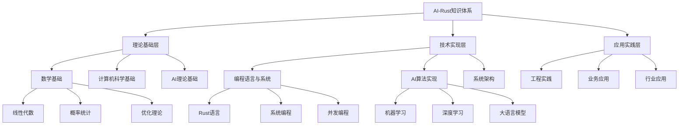

# 2025年AI-Rust国际权威主题目录结构

## 目录

- [2025年AI-Rust国际权威主题目录结构](#2025年ai-rust国际权威主题目录结构)
  - [目录](#目录)
  - [1. 国际权威标准对标](#1-国际权威标准对标)
    - [1.1 国际权威机构参考](#11-国际权威机构参考)
    - [1.2 权威论文分类体系](#12-权威论文分类体系)
  - [2. 主题目录结构设计](#2-主题目录结构设计)
    - [2.1 一级主题分类](#21-一级主题分类)
      - [2.1.1 理论基础（Theoretical Foundations）](#211-理论基础theoretical-foundations)
      - [2.1.2 技术实现（Technical Implementation）](#212-技术实现technical-implementation)
      - [2.1.3 应用实践（Applied Practice）](#213-应用实践applied-practice)
    - [2.2 二级主题分类](#22-二级主题分类)
      - [2.2.1 机器学习专题（Machine Learning Topics）](#221-机器学习专题machine-learning-topics)
      - [2.2.2 深度学习专题（Deep Learning Topics）](#222-深度学习专题deep-learning-topics)
      - [2.2.3 大语言模型专题（Large Language Model Topics）](#223-大语言模型专题large-language-model-topics)
    - [2.3 三级主题分类](#23-三级主题分类)
      - [2.3.1 Rust AI生态系统（Rust AI Ecosystem）](#231-rust-ai生态系统rust-ai-ecosystem)
      - [2.3.2 系统架构专题（System Architecture Topics）](#232-系统架构专题system-architecture-topics)
  - [3. 知识体系映射](#3-知识体系映射)
    - [3.1 知识层次结构](#31-知识层次结构)
    - [3.2 技能要求映射](#32-技能要求映射)
  - [4. 学习路径规划](#4-学习路径规划)
    - [4.1 基础阶段路径](#41-基础阶段路径)
    - [4.2 进阶阶段路径](#42-进阶阶段路径)
    - [4.3 专业阶段路径](#43-专业阶段路径)
  - [5. 评估标准体系](#5-评估标准体系)
    - [5.1 知识掌握评估](#51-知识掌握评估)
    - [5.2 技能认证体系](#52-技能认证体系)
    - [5.3 持续学习评估](#53-持续学习评估)

## 1. 国际权威标准对标

### 1.1 国际权威机构参考

**学术机构**：

- MIT CSAIL（计算机科学与人工智能实验室）
- Stanford HAI（以人为本AI研究院）
- CMU MLD（机器学习系）
- Berkeley AI Research（BAIR）
- DeepMind Research
- OpenAI Research

**技术标准**：

- IEEE AI标准
- ACM计算分类系统
- ISO/IEC AI标准
- NIST AI风险管理框架

**行业组织**：

- Rust Foundation
- Linux Foundation AI & Data
- MLCommons
- PyTorch Foundation

### 1.2 权威论文分类体系

**顶级会议论文**：

- NeurIPS（神经信息处理系统）
- ICML（国际机器学习会议）
- ICLR（国际学习表征会议）
- AAAI（人工智能协会）
- IJCAI（国际人工智能联合会议）

**系统会议论文**：

- OSDI（操作系统设计与实现）
- SOSP（操作系统原理）
- NSDI（网络系统设计与实现）
- ASPLOS（架构支持编程语言和操作系统）

## 2. 主题目录结构设计

### 2.1 一级主题分类

#### 2.1.1 理论基础（Theoretical Foundations）

**1.1 数学基础（Mathematical Foundations）**:

- 线性代数与矩阵理论
- 概率论与统计学
- 优化理论与算法
- 信息论与编码理论
- 图论与组合数学

**1.2 计算机科学基础（Computer Science Foundations）**:

- 算法设计与分析
- 数据结构与算法
- 计算复杂性理论
- 形式化方法
- 系统设计原理

**1.3 AI理论基础（AI Theoretical Foundations）**:

- 机器学习理论
- 深度学习理论
- 强化学习理论
- 统计学习理论
- 信息论在AI中的应用

#### 2.1.2 技术实现（Technical Implementation）

**2.1 编程语言与系统（Programming Languages & Systems）**:

- Rust语言核心特性
- 系统编程原理
- 并发与并行编程
- 内存管理与优化
- 跨平台开发

**2.2 AI算法实现（AI Algorithm Implementation）**:

- 机器学习算法实现
- 深度学习模型实现
- 优化算法实现
- 推理引擎设计
- 模型压缩与加速

**2.3 系统架构（System Architecture）**:

- 分布式系统设计
- 微服务架构
- 云原生架构
- 边缘计算架构
- 高性能计算架构

#### 2.1.3 应用实践（Applied Practice）

**3.1 工程实践（Engineering Practice）**:

- 软件工程最佳实践
- 测试与质量保证
- 持续集成与部署
- 监控与运维
- 性能优化

**3.2 业务应用（Business Applications）**:

- 智能客服系统
- 知识管理平台
- 内容生成系统
- 决策支持系统
- 推荐系统

**3.3 行业应用（Industry Applications）**:

- 金融科技应用
- 医疗健康应用
- 教育科技应用
- 智能制造应用
- 智慧城市应用

### 2.2 二级主题分类

#### 2.2.1 机器学习专题（Machine Learning Topics）

**监督学习（Supervised Learning）**:

- 线性回归与逻辑回归
- 决策树与随机森林
- 支持向量机
- 神经网络
- 集成学习方法

**无监督学习（Unsupervised Learning）**:

- 聚类算法
- 降维技术
- 异常检测
- 密度估计
- 关联规则挖掘

**强化学习（Reinforcement Learning）**:

- 马尔可夫决策过程
- Q学习算法
- 策略梯度方法
- 深度强化学习
- 多智能体强化学习

#### 2.2.2 深度学习专题（Deep Learning Topics）

**神经网络基础（Neural Network Fundamentals）**:

- 感知机与多层感知机
- 反向传播算法
- 激活函数
- 损失函数
- 正则化技术

**卷积神经网络（Convolutional Neural Networks）**:

- 卷积层与池化层
- 经典CNN架构
- 图像分类任务
- 目标检测
- 语义分割

**循环神经网络（Recurrent Neural Networks）**:

- RNN与LSTM
- GRU网络
- 序列到序列模型
- 注意力机制
- Transformer架构

#### 2.2.3 大语言模型专题（Large Language Model Topics）

**预训练技术（Pre-training Techniques）**:

- 掩码语言模型
- 下一句预测
- 因果语言模型
- 对比学习
- 多任务学习

**微调技术（Fine-tuning Techniques）**:

- 指令微调
- 人类反馈强化学习
- 参数高效微调
- 知识蒸馏
- 持续学习

**推理优化（Inference Optimization）**:

- 模型量化
- 模型剪枝
- 知识蒸馏
- 动态批处理
- 边缘推理

### 2.3 三级主题分类

#### 2.3.1 Rust AI生态系统（Rust AI Ecosystem）

**核心框架（Core Frameworks）**:

- Candle：轻量级深度学习框架
- Burn：模块化深度学习框架
- Tch-rs：PyTorch Rust绑定
- Linfa：机器学习工具包
- SmartCore：机器学习库

**数据处理（Data Processing）**:

- Polars：高性能数据处理
- Ndarray：多维数组计算
- Serde：序列化框架
- Arrow：列式数据格式
- Parquet：列式存储格式

**Web开发（Web Development）**:

- Axum：异步Web框架
- Actix-web：高性能Web框架
- Rocket：易用Web框架
- Warp：轻量级Web框架
- Tide：异步Web框架

#### 2.3.2 系统架构专题（System Architecture Topics）

**分布式训练（Distributed Training）**:

- 数据并行训练
- 模型并行训练
- 流水线并行训练
- 梯度同步策略
- 容错与恢复

**边缘推理（Edge Inference）**:

- WebAssembly集成
- 模型优化技术
- 硬件加速
- 内存管理
- 性能监控

**云边协同（Cloud-Edge Collaboration）**:

- 任务调度策略
- 数据同步机制
- 负载均衡
- 故障转移
- 安全通信

## 3. 知识体系映射

### 3.1 知识层次结构

### 3.2 技能要求映射

**初级水平（0-6个月）**：

- Rust语言基础
- 数学基础
- 机器学习入门
- 简单项目实践

**中级水平（6-12个月）**：

- 深度学习基础
- 系统设计能力
- 工程实践技能
- 中等复杂度项目

**高级水平（12个月以上）**：

- 前沿技术掌握
- 系统架构设计
- 性能优化能力
- 复杂项目领导

## 4. 学习路径规划

### 4.1 基础阶段路径

**第1-2个月：Rust语言基础**:

- 所有权系统
- 借用与生命周期
- 模式匹配
- 错误处理
- 异步编程基础

**第3-4个月：数学基础**:

- 线性代数
- 概率统计
- 优化理论
- 信息论基础

**第5-6个月：机器学习入门**:

- 监督学习算法
- 无监督学习算法
- 模型评估
- 简单项目实践

### 4.2 进阶阶段路径

**第7-9个月：深度学习**:

- 神经网络基础
- 卷积神经网络
- 循环神经网络
- 注意力机制

**第10-12个月：系统设计**:

- 分布式系统
- 微服务架构
- 性能优化
- 工程实践

### 4.3 专业阶段路径

**第13-18个月：前沿技术**:

- 大语言模型
- 多模态AI
- 边缘计算
- 系统架构

**第19个月以上：专家级**:

- 研究能力
- 技术创新
- 团队领导
- 行业影响

## 5. 评估标准体系

### 5.1 知识掌握评估

**理论基础评估**：

- 数学基础掌握度（30%）
- 计算机科学基础（25%）
- AI理论基础（25%）
- 综合应用能力（20%）

**技术实现评估**：

- 编程能力（35%）
- 算法实现（30%）
- 系统设计（25%）
- 性能优化（10%）

**应用实践评估**：

- 工程实践（40%）
- 项目经验（30%）
- 问题解决（20%）
- 创新能力（10%）

### 5.2 技能认证体系

**初级认证**：

- Rust语言基础认证
- 机器学习入门认证
- 基础项目实践认证

**中级认证**：

- 深度学习应用认证
- 系统设计认证
- 工程实践认证

**高级认证**：

- 前沿技术认证
- 架构设计认证
- 团队领导认证

### 5.3 持续学习评估

**技术跟踪**：

- 最新论文阅读
- 技术趋势分析
- 开源项目贡献
- 社区参与度

**实践能力**：

- 项目复杂度
- 技术创新度
- 性能优化效果
- 团队协作能力

---

*最后更新：2025年1月*  
*版本：v1.0*  
*状态：持续更新中*  
*适用对象：AI研究人员、技术架构师、Rust开发者、教育工作者*
