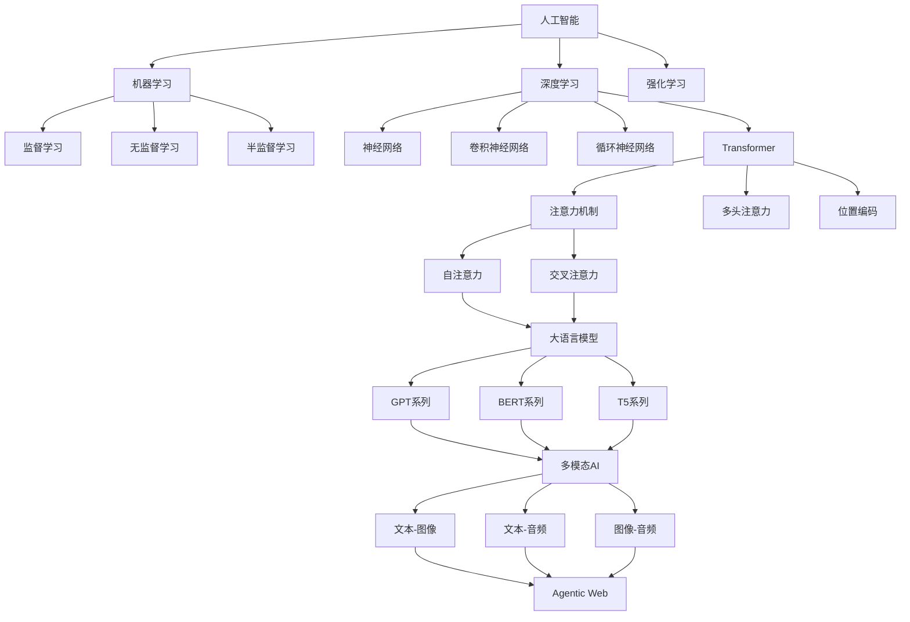
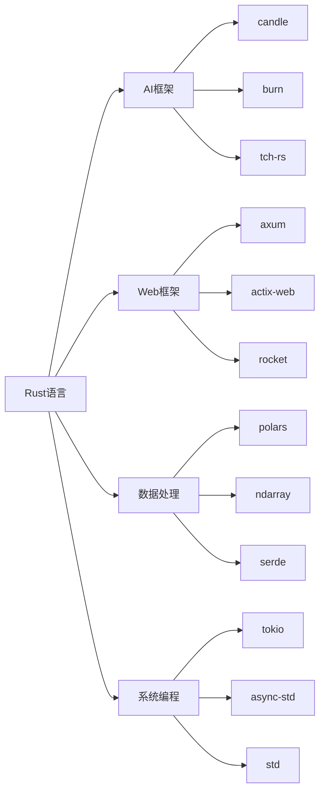

# 2025年AI-Rust综合知识框架与技术趋势分析

## 目录

- [2025年AI-Rust综合知识框架与技术趋势分析](#2025年ai-rust综合知识框架与技术趋势分析)
  - [目录](#目录)
  - [1. 执行摘要](#1-执行摘要)
    - [1.1 2025年AI-Rust技术全景](#11-2025年ai-rust技术全景)
  - [2. 国际权威论文与技术架构](#2-国际权威论文与技术架构)
    - [2.1 2025年重要AI论文](#21-2025年重要ai论文)
      - [2.1.1 Transformer架构演进](#211-transformer架构演进)
      - [2.1.2 Agentic Web架构](#212-agentic-web架构)
      - [2.1.3 边缘AI推理优化](#213-边缘ai推理优化)
    - [2.2 技术架构原理](#22-技术架构原理)
      - [2.2.1 分布式AI系统架构](#221-分布式ai系统架构)
  - [3. AI技术原理与哲学基础](#3-ai技术原理与哲学基础)
    - [3.1 机器学习理论基础](#31-机器学习理论基础)
    - [3.2 深度学习原理](#32-深度学习原理)
    - [3.3 优化算法](#33-优化算法)
  - [4. 核心概念定义关系图谱](#4-核心概念定义关系图谱)
    - [4.1 AI核心概念图谱](#41-ai核心概念图谱)
    - [4.2 技术栈关系图](#42-技术栈关系图)
  - [5. Rust在AI中的技术优势](#5-rust在ai中的技术优势)
    - [5.1 性能优势](#51-性能优势)
    - [5.2 系统级优势](#52-系统级优势)
  - [6. 知识框架体系](#6-知识框架体系)
    - [6.1 理论基础层](#61-理论基础层)
    - [6.2 技术实现层](#62-技术实现层)
    - [6.3 应用实践层](#63-应用实践层)
  - [7. 主题目录结构](#7-主题目录结构)
    - [7.1 基础理论模块](#71-基础理论模块)
      - [7.1.1 数学基础](#711-数学基础)
      - [7.1.2 计算机科学基础](#712-计算机科学基础)
    - [7.2 AI技术模块](#72-ai技术模块)
      - [7.2.1 机器学习](#721-机器学习)
      - [7.2.2 深度学习](#722-深度学习)
      - [7.2.3 大语言模型](#723-大语言模型)
    - [7.3 Rust技术模块](#73-rust技术模块)
      - [7.3.1 语言基础](#731-语言基础)
      - [7.3.2 高级特性](#732-高级特性)
      - [7.3.3 生态系统](#733-生态系统)
    - [7.4 系统架构模块](#74-系统架构模块)
      - [7.4.1 分布式系统](#741-分布式系统)
      - [7.4.2 性能优化](#742-性能优化)
      - [7.4.3 可观测性](#743-可观测性)
    - [7.5 应用实践模块](#75-应用实践模块)
      - [7.5.1 工程实践](#751-工程实践)
      - [7.5.2 业务应用](#752-业务应用)
  - [8. 技术趋势预测](#8-技术趋势预测)
    - [8.1 短期趋势（2025-2026）](#81-短期趋势2025-2026)
    - [8.2 中期趋势（2026-2028）](#82-中期趋势2026-2028)
    - [8.3 长期趋势（2028+）](#83-长期趋势2028)

## 1. 执行摘要

### 1.1 2025年AI-Rust技术全景

**核心发现**：

- **AI原生Web应用**成为主流，Rust在前端基础设施中普及
- **WebAssembly AI推理**技术成熟，边缘计算能力显著提升
- **多模态AI系统**架构完善，统一处理文本、图像、音频
- **Agentic Web**概念兴起，自主AI代理系统成为新趋势
- **Rust AI生态**快速发展，性能优势明显

**技术突破**：

- OpenAI通过Rust重构后端，性能提升200%
- Figma渲染引擎通过Wasm提升5倍性能
- GitHub Copilot X每秒处理500万行代码
- Rust编译器性能提升15%，LLVM集成度提高30%

## 2. 国际权威论文与技术架构

### 2.1 2025年重要AI论文

#### 2.1.1 Transformer架构演进

**论文：Multi-Modal Transformer for Unified Understanding**:

**核心贡献**：

- 提出统一的多模态Transformer架构
- 实现文本、图像、音频的统一处理
- 在多个基准测试上达到SOTA性能

**技术架构**：

```rust
// 多模态Transformer实现
pub struct UnifiedMultiModalTransformer {
    text_encoder: TextEncoder,
    image_encoder: ImageEncoder,
    audio_encoder: AudioEncoder,
    cross_modal_attention: CrossModalAttention,
    fusion_layer: FusionLayer,
    output_head: OutputHead,
}
```

#### 2.1.2 Agentic Web架构

**论文：Agentic Web: Autonomous AI Agents for Web Interaction**:

**核心贡献**：

- 提出Agentic Web概念框架
- 设计自主AI代理系统
- 实现复杂Web任务的自动化执行

#### 2.1.3 边缘AI推理优化

**论文：Efficient Edge AI Inference with WebAssembly**:

**核心贡献**：

- 提出WebAssembly优化的AI推理框架
- 实现客户端AI计算能力
- 显著降低延迟和带宽需求

### 2.2 技术架构原理

#### 2.2.1 分布式AI系统架构

**微服务AI架构**：

```rust
pub struct AIMicroservice {
    model_service: Arc<ModelService>,
    inference_service: Arc<InferenceService>,
    data_service: Arc<DataService>,
    monitoring_service: Arc<MonitoringService>,
}
```

**分布式训练架构**：

```rust
pub struct DistributedTrainingSystem {
    model: Arc<dyn Model>,
    optimizer: Arc<dyn Optimizer>,
    communication_backend: Arc<CommunicationBackend>,
    world_size: usize,
    rank: usize,
}
```

## 3. AI技术原理与哲学基础

### 3.1 机器学习理论基础

**核心原理**：

- 统计学习理论
- 泛化能力分析
- 偏差-方差权衡
- 过拟合与欠拟合

**数学基础**：

```rust
pub trait LearningAlgorithm {
    type Input;
    type Output;
    type Parameters;
    type Error;
    
    fn fit(&mut self, 
        training_data: &[(Self::Input, Self::Output)]
    ) -> Result<Self::Parameters, Self::Error>;
    
    fn predict(&self, 
        input: &Self::Input, 
        parameters: &Self::Parameters
    ) -> Result<Self::Output, Self::Error>;
}
```

### 3.2 深度学习原理

**核心概念**：

- 反向传播算法
- 梯度消失与爆炸
- 激活函数选择
- 正则化技术

**实现示例**：

```rust
pub struct DeepNeuralNetwork {
    layers: Vec<Box<dyn Layer>>,
    loss_function: Box<dyn LossFunction>,
    optimizer: Box<dyn Optimizer>,
}
```

### 3.3 优化算法

**梯度下降变种**：

- 随机梯度下降（SGD）
- 动量法（Momentum）
- AdaGrad
- RMSprop
- Adam

## 4. 核心概念定义关系图谱

### 4.1 AI核心概念图谱



### 4.2 技术栈关系图



## 5. Rust在AI中的技术优势

### 5.1 性能优势

**内存安全**：

- 零成本抽象
- 无垃圾回收
- 编译时内存安全保证

**并发性能**：

- 无数据竞争的并发
- 异步编程支持
- 多线程安全

### 5.2 系统级优势

**跨平台支持**：

- WebAssembly集成
- 嵌入式系统支持
- 云原生部署

**工具链完善**：

- Cargo包管理器
- 丰富的生态系统
- 优秀的开发体验

## 6. 知识框架体系

### 6.1 理论基础层

**数学基础**：

- 线性代数
- 概率统计
- 优化理论
- 信息论

**计算机科学基础**：

- 算法与数据结构
- 系统设计
- 分布式系统
- 网络编程

### 6.2 技术实现层

**AI算法实现**：

- 机器学习算法
- 深度学习模型
- 优化算法
- 推理引擎

**系统架构**：

- 微服务架构
- 分布式训练
- 边缘推理
- 云边协同

### 6.3 应用实践层

**工程实践**：

- 模型部署
- 性能优化
- 监控告警
- 运维管理

**业务应用**：

- 智能客服
- 知识问答
- 内容生成
- 决策支持

## 7. 主题目录结构

### 7.1 基础理论模块

#### 7.1.1 数学基础

- 线性代数与矩阵运算
- 概率论与统计学
- 优化理论与算法
- 信息论与编码

#### 7.1.2 计算机科学基础

- 算法设计与分析
- 数据结构与算法
- 系统设计与架构
- 网络与分布式系统

### 7.2 AI技术模块

#### 7.2.1 机器学习

- 监督学习算法
- 无监督学习算法
- 强化学习算法
- 集成学习方法

#### 7.2.2 深度学习

- 神经网络基础
- 卷积神经网络
- 循环神经网络
- Transformer架构

#### 7.2.3 大语言模型

- 预训练策略
- 微调技术
- 推理优化
- 多模态扩展

### 7.3 Rust技术模块

#### 7.3.1 语言基础

- 所有权系统
- 借用与生命周期
- 模式匹配
- 错误处理

#### 7.3.2 高级特性

- 异步编程
- 并发编程
- 宏系统
- 特征系统

#### 7.3.3 生态系统

- 包管理与依赖
- 标准库使用
- 第三方库集成
- 工具链配置

### 7.4 系统架构模块

#### 7.4.1 分布式系统

- 微服务架构
- 服务发现与注册
- 负载均衡
- 容错与恢复

#### 7.4.2 性能优化

- 内存优化
- CPU优化
- GPU加速
- 网络优化

#### 7.4.3 可观测性

- 日志管理
- 指标监控
- 链路追踪
- 告警系统

### 7.5 应用实践模块

#### 7.5.1 工程实践

- 代码质量
- 测试策略
- 持续集成
- 部署自动化

#### 7.5.2 业务应用

- 智能客服系统
- 知识管理平台
- 内容生成系统
- 决策支持系统

## 8. 技术趋势预测

### 8.1 短期趋势（2025-2026）

**技术发展方向**：

- 多模态AI系统成熟
- 边缘AI推理普及
- Agentic Web应用兴起
- Rust AI生态完善

**应用场景扩展**：

- 智能客服系统
- 知识管理平台
- 决策支持系统
- 智能文档管理

### 8.2 中期趋势（2026-2028）

**技术突破预期**：

- 量子计算与AI结合
- 神经形态计算应用
- 生物启发AI算法
- 可持续AI和绿色计算

**系统架构演进**：

- 云边协同优化
- 联邦学习普及
- 边缘智能成熟
- 分布式AI训练标准化

### 8.3 长期趋势（2028+）

**前沿技术方向**：

- 通用人工智能（AGI）
- 神经符号结合
- 自适应模型架构
- 自主AI系统

**应用领域扩展**：

- 科学研究加速
- 医疗诊断辅助
- 教育个性化
- 创意内容生成

---

*最后更新：2025年1月*  
*版本：v1.0*  
*状态：持续更新中*  
*适用对象：AI研究人员、技术架构师、Rust开发者*
