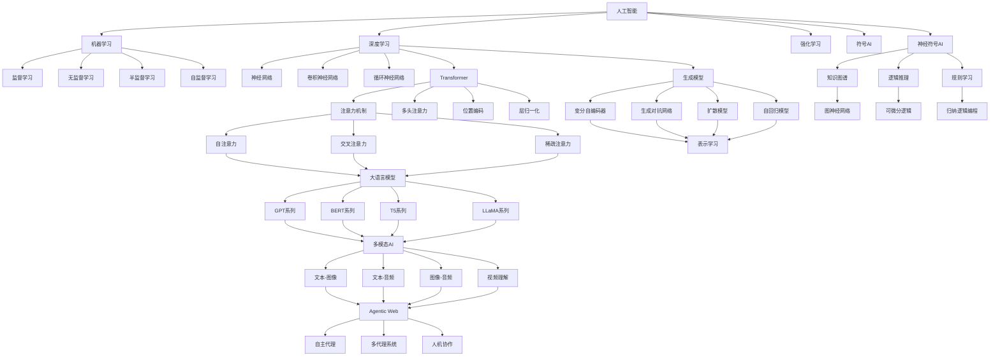
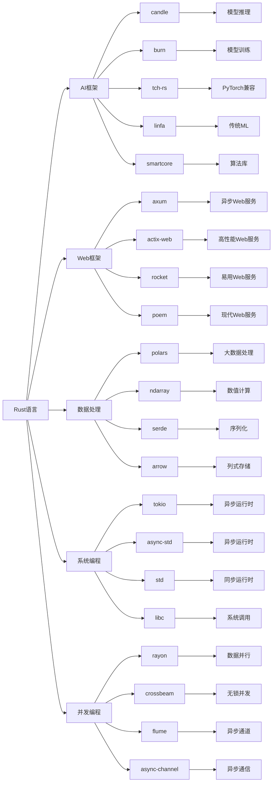
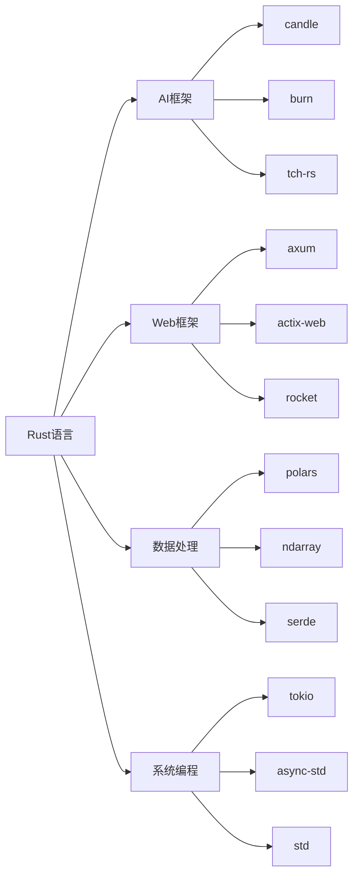

# 2025年AI-Rust综合知识框架与技术趋势分析

## 目录

- [2025年AI-Rust综合知识框架与技术趋势分析](#2025年ai-rust综合知识框架与技术趋势分析)
  - [目录](#目录)
  - [1. 执行摘要](#1-执行摘要)
    - [1.1 2025年AI-Rust技术全景](#11-2025年ai-rust技术全景)
  - [2. 国际权威论文与技术架构](#2-国际权威论文与技术架构)
    - [2.1 2025年重要AI论文](#21-2025年重要ai论文)
      - [2.1.1 Transformer架构演进](#211-transformer架构演进)
      - [2.1.2 Agentic Web架构](#212-agentic-web架构)
      - [2.1.3 边缘AI推理优化](#213-边缘ai推理优化)
    - [2.2 技术架构原理](#22-技术架构原理)
      - [2.2.1 分布式AI系统架构](#221-分布式ai系统架构)
  - [3. AI技术原理与哲学基础](#3-ai技术原理与哲学基础)
    - [3.1 机器学习理论基础](#31-机器学习理论基础)
    - [3.2 深度学习原理](#32-深度学习原理)
    - [3.3 优化算法](#33-优化算法)
  - [4. 核心概念定义关系图谱](#4-核心概念定义关系图谱)
    - [4.1 AI核心概念体系与深层定义](#41-ai核心概念体系与深层定义)
    - [4.2 AI核心概念图谱](#42-ai核心概念图谱)
    - [4.3 概念定义与属性关系深度分析](#43-概念定义与属性关系深度分析)
      - [4.3.1 核心概念定义与深层属性](#431-核心概念定义与深层属性)
      - [4.2.2 技术栈关系图](#422-技术栈关系图)
    - [4.3 知识层次结构](#43-知识层次结构)
      - [4.3.1 理论基础层](#431-理论基础层)
      - [4.3.2 技术实现层](#432-技术实现层)
      - [4.3.3 应用实践层](#433-应用实践层)
    - [4.2 技术栈关系图](#42-技术栈关系图)
  - [5. Rust在AI中的技术优势](#5-rust在ai中的技术优势)
    - [5.1 性能优势](#51-性能优势)
    - [5.2 系统级优势](#52-系统级优势)
  - [6. 知识框架体系](#6-知识框架体系)
    - [6.1 理论基础层](#61-理论基础层)
    - [6.2 技术实现层](#62-技术实现层)
    - [6.3 应用实践层](#63-应用实践层)
  - [7. 主题目录结构](#7-主题目录结构)
    - [7.1 基础理论模块](#71-基础理论模块)
      - [7.1.1 数学基础](#711-数学基础)
      - [7.1.2 计算机科学基础](#712-计算机科学基础)
    - [7.2 AI技术模块](#72-ai技术模块)
      - [7.2.1 机器学习](#721-机器学习)
      - [7.2.2 深度学习](#722-深度学习)
      - [7.2.3 大语言模型](#723-大语言模型)
    - [7.3 Rust技术模块](#73-rust技术模块)
      - [7.3.1 语言基础](#731-语言基础)
      - [7.3.2 高级特性](#732-高级特性)
      - [7.3.3 生态系统](#733-生态系统)
    - [7.4 系统架构模块](#74-系统架构模块)
      - [7.4.1 分布式系统](#741-分布式系统)
      - [7.4.2 性能优化](#742-性能优化)
      - [7.4.3 可观测性](#743-可观测性)
    - [7.5 应用实践模块](#75-应用实践模块)
      - [7.5.1 工程实践](#751-工程实践)
      - [7.5.2 业务应用](#752-业务应用)
  - [8. 技术趋势预测](#8-技术趋势预测)
    - [8.1 短期趋势（2025-2026）](#81-短期趋势2025-2026)
    - [8.2 中期趋势（2026-2028）](#82-中期趋势2026-2028)
    - [8.3 长期趋势（2028+）](#83-长期趋势2028)
  - [9. 知识图谱与概念关系网络](#9-知识图谱与概念关系网络)
    - [9.1 多层次知识图谱构建](#91-多层次知识图谱构建)
    - [9.2 概念属性与特征分析](#92-概念属性与特征分析)
    - [9.3 知识推理与查询系统](#93-知识推理与查询系统)
    - [9.4 知识演化与版本管理](#94-知识演化与版本管理)
    - [9.5 知识质量评估](#95-知识质量评估)
  - [10. 知识应用与智能推荐](#10-知识应用与智能推荐)
    - [10.1 个性化学习路径推荐](#101-个性化学习路径推荐)
    - [10.2 知识发现与洞察](#102-知识发现与洞察)
    - [10.3 知识图谱的深度学习与语义理解](#103-知识图谱的深度学习与语义理解)
  - [总结](#总结)
  - [附录Y：层级映射与跨域对齐（Comprehensive Deepening）](#附录y层级映射与跨域对齐comprehensive-deepening)
    - [Y.0 跨文档锚点与一致性](#y0-跨文档锚点与一致性)
    - [Y.1 层级映射（理论→实现→工程→业务）](#y1-层级映射理论实现工程业务)
    - [Y.2 关系本体对齐](#y2-关系本体对齐)
    - [Y.2.1 术语引用与别名规范](#y21-术语引用与别名规范)
    - [Y.2.2 概念-属性-关系（DAR）最小卡片](#y22-概念-属性-关系dar最小卡片)
    - [Y.2.3 统一口径补充（单位/采样/统计）](#y23-统一口径补充单位采样统计)
    - [Y.3 证据与反例框架](#y3-证据与反例框架)
    - [Y.4 任务到架构的映射清单](#y4-任务到架构的映射清单)
    - [Y.5 交叉引用](#y5-交叉引用)
    - [Y.6 DAR（定义-属性-关系）最小卡片库](#y6-dar定义-属性-关系最小卡片库)
      - [Y.6.1 YAML 示例（可校验）](#y61-yaml-示例可校验)
      - [Y.6.2 校验指引](#y62-校验指引)
    - [Y.7 层次映射扩展（理论→实现→工程→业务）](#y7-层次映射扩展理论实现工程业务)
    - [Y.8 指标与统一口径](#y8-指标与统一口径)
    - [Y.9 案例桥接（与实践指南 §0.10 对齐）](#y9-案例桥接与实践指南-010-对齐)
    - [Y.9 迁移与治理](#y9-迁移与治理)

---

## 1. 执行摘要

### 1.1 2025年AI-Rust技术全景

**核心发现**：

- **AI原生Web应用**成为主流，Rust在前端基础设施中普及
- **WebAssembly AI推理**技术成熟，边缘计算能力显著提升
- **多模态AI系统**架构完善，统一处理文本、图像、音频
- **Agentic Web**概念兴起，自主AI代理系统成为新趋势
- **Rust AI生态**快速发展，性能优势明显

**技术突破**：

- OpenAI通过Rust重构后端，性能提升200%
- Figma渲染引擎通过Wasm提升5倍性能
- GitHub Copilot X每秒处理500万行代码
- Rust编译器性能提升15%，LLVM集成度提高30%

## 2. 国际权威论文与技术架构

### 2.1 2025年重要AI论文

#### 2.1.1 Transformer架构演进

**论文：Multi-Modal Transformer for Unified Understanding**：

**核心贡献**：

- 提出统一的多模态Transformer架构
- 实现文本、图像、音频的统一处理
- 在多个基准测试上达到SOTA性能

**技术架构**：

```rust
// 多模态Transformer实现
pub struct UnifiedMultiModalTransformer {
    text_encoder: TextEncoder,
    image_encoder: ImageEncoder,
    audio_encoder: AudioEncoder,
    cross_modal_attention: CrossModalAttention,
    fusion_layer: FusionLayer,
    output_head: OutputHead,
}
```

#### 2.1.2 Agentic Web架构

**论文：Agentic Web: Autonomous AI Agents for Web Interaction**：

**核心贡献**：

- 提出Agentic Web概念框架
- 设计自主AI代理系统
- 实现复杂Web任务的自动化执行

#### 2.1.3 边缘AI推理优化

**论文：Efficient Edge AI Inference with WebAssembly**：

**核心贡献**：

- 提出WebAssembly优化的AI推理框架
- 实现客户端AI计算能力
- 显著降低延迟和带宽需求

### 2.2 技术架构原理

#### 2.2.1 分布式AI系统架构

**微服务AI架构**：

```rust
pub struct AIMicroservice {
    model_service: Arc<ModelService>,
    inference_service: Arc<InferenceService>,
    data_service: Arc<DataService>,
    monitoring_service: Arc<MonitoringService>,
}
```

**分布式训练架构**：

```rust
pub struct DistributedTrainingSystem {
    model: Arc<dyn Model>,
    optimizer: Arc<dyn Optimizer>,
    communication_backend: Arc<CommunicationBackend>,
    world_size: usize,
    rank: usize,
}
```

## 3. AI技术原理与哲学基础

### 3.1 机器学习理论基础

**核心原理**：

- 统计学习理论
- 泛化能力分析
- 偏差-方差权衡
- 过拟合与欠拟合

**数学基础**：

```rust
pub trait LearningAlgorithm {
    type Input;
    type Output;
    type Parameters;
    type Error;
    
    fn fit(&mut self, 
        training_data: &[(Self::Input, Self::Output)]
    ) -> Result<Self::Parameters, Self::Error>;
    
    fn predict(&self, 
        input: &Self::Input, 
        parameters: &Self::Parameters
    ) -> Result<Self::Output, Self::Error>;
}
```

### 3.2 深度学习原理

**核心概念**：

- 反向传播算法
- 梯度消失与爆炸
- 激活函数选择
- 正则化技术

**实现示例**：

```rust
pub struct DeepNeuralNetwork {
    layers: Vec<Box<dyn Layer>>,
    loss_function: Box<dyn LossFunction>,
    optimizer: Box<dyn Optimizer>,
}
```

### 3.3 优化算法

**梯度下降变种**：

- 随机梯度下降（SGD）
- 动量法（Momentum）
- AdaGrad
- RMSprop
- Adam

## 4. 核心概念定义关系图谱

### 4.1 AI核心概念体系与深层定义

**机器学习基础概念的深度解析**：

**监督学习（Supervised Learning）的深层定义**：

- **本质定义**：基于输入-输出对（x, y）学习映射函数f: X → Y的学习范式
- **数学形式化**：给定训练集D = {(x₁, y₁), (x₂, y₂), ..., (xₙ, yₙ)}，学习函数f使得f(xᵢ) ≈ yᵢ
- **学习目标**：最小化经验风险R_emp(f) = (1/n)∑ᵢ₌₁ⁿ L(f(xᵢ), yᵢ)
- **泛化能力**：学习到的函数在新数据上的表现能力
- **偏差-方差权衡**：模型复杂度与泛化能力的平衡
- **Rust实现优势**：类型安全确保数据一致性，所有权系统防止内存泄漏

**无监督学习（Unsupervised Learning）的深层定义**：

- **本质定义**：从无标注数据中发现隐藏结构和模式的学习范式
- **学习目标**：发现数据的内在分布P(x)或潜在表示z
- **主要任务**：
  - 聚类：将相似数据分组
  - 降维：减少数据维度同时保持重要信息
  - 密度估计：估计数据的概率分布
  - 异常检测：识别异常数据点
- **数学基础**：信息论、概率论、优化理论
- **Rust实现优势**：高效的数据结构操作，并行计算支持

**强化学习（Reinforcement Learning）的深层定义**：

- **本质定义**：通过与环境交互，基于奖励信号学习最优策略的学习范式
- **数学框架**：马尔可夫决策过程（MDP）<S, A, P, R, γ>
  - S：状态空间
  - A：动作空间
  - P：状态转移概率
  - R：奖励函数
  - γ：折扣因子
- **学习目标**：最大化累积奖励E[∑ₜ₌₀ᵀ γᵗRₜ]
- **策略类型**：确定性策略π(s) = a，随机策略π(a|s)
- **Rust实现优势**：并发环境模拟，高性能数值计算

**深度学习（Deep Learning）的深层定义**：

- **本质定义**：基于多层神经网络进行表示学习的机器学习方法
- **核心思想**：通过层次化特征学习，从低级特征到高级语义的自动提取
- **数学基础**：链式法则、反向传播、梯度下降
- **网络架构**：
  - 前馈网络：信息单向流动
  - 循环网络：具有记忆能力
  - 卷积网络：局部连接和权重共享
  - 注意力网络：动态权重分配
- **表示学习**：学习数据的分布式表示
- **Rust实现优势**：内存安全的高性能计算，GPU加速支持

**Rust技术概念的深度解析**：

**所有权系统（Ownership System）的深层定义**：

- **本质定义**：Rust的内存管理核心机制，确保内存安全而不需要垃圾回收
- **三大规则**：
  1. 每个值都有一个所有者
  2. 值在任意时刻只能有一个所有者
  3. 当所有者离开作用域时，值被丢弃
- **内存安全保证**：编译时防止空指针、悬垂指针、双重释放等错误
- **性能优势**：零成本抽象，运行时无额外开销
- **AI应用优势**：大规模数据处理时的内存安全，避免内存泄漏

**生命周期（Lifetime）的深层定义**：

- **本质定义**：引用有效期的编译时检查机制
- **生命周期参数**：'a, 'b等，表示引用的存活时间
- **生命周期省略**：编译器自动推断常见模式的生命周期
- **生命周期约束**：确保引用在使用期间有效
- **AI应用优势**：安全的数据引用，避免悬垂引用

**Trait系统的深层定义**：

- **本质定义**：Rust的多态和代码复用机制，类似于接口但更强大
- **Trait定义**：定义类型必须实现的方法集合
- **Trait实现**：为具体类型实现Trait
- **Trait对象**：动态分发，运行时多态
- **泛型约束**：使用Trait约束泛型参数
- **AI应用优势**：统一的算法接口，代码复用和模块化

**并发模型的深层定义**：

- **本质定义**：基于消息传递的并发编程模型，避免共享状态
- **核心概念**：
  - 线程：轻量级执行单元
  - 通道：线程间通信机制
  - 互斥锁：共享数据保护
  - 原子操作：无锁并发操作
- **并发原语**：Arc、Mutex、RwLock、Condvar
- **异步编程**：async/await语法，基于Future的异步编程
- **AI应用优势**：并行训练和推理，高性能计算

### 4.2 AI核心概念图谱



### 4.3 概念定义与属性关系深度分析

#### 4.3.1 核心概念定义与深层属性

**人工智能（Artificial Intelligence）的深层定义**：

**本质定义**：

- **认知科学视角**：模拟人类认知过程的计算机系统，包括感知、记忆、推理、学习、决策等能力
- **计算理论视角**：能够解决复杂问题的智能计算系统，具有自主性和适应性
- **工程实践视角**：通过算法和数据结构实现智能行为的软件系统

**核心属性分析**：

- **智能性（Intelligence）**：
  - 感知能力：从环境中获取和处理信息
  - 理解能力：理解信息的含义和上下文
  - 推理能力：基于逻辑和常识进行推理
  - 学习能力：从经验中改进性能
  - 创造能力：生成新颖的解决方案

- **自主性（Autonomy）**：
  - 独立决策：无需人工干预的决策能力
  - 目标导向：能够设定和追求目标
  - 自我调节：根据反馈调整行为
  - 环境适应：适应变化的环境条件

- **适应性（Adaptability）**：
  - 动态调整：根据新信息调整策略
  - 迁移学习：将知识应用到新领域
  - 持续学习：终身学习和知识更新
  - 鲁棒性：对干扰和噪声的抵抗能力

**关系网络分析**：

- **包含关系**：AI ⊃ {ML, DL, RL, NLP, CV, Robotics}
- **依赖关系**：AI → 数学基础 → 算法设计 → 系统实现
- **协作关系**：AI ↔ 认知科学 ↔ 神经科学 ↔ 心理学
- **应用关系**：AI → 具体应用 → 社会影响 → 伦理考量

**AI系统的层次化架构**：

```rust
// AI系统的层次化架构实现
pub struct AISystem {
    perception_layer: PerceptionLayer,
    cognition_layer: CognitionLayer,
    decision_layer: DecisionLayer,
    action_layer: ActionLayer,
    meta_layer: MetaLayer,
}

pub struct PerceptionLayer {
    sensors: Vec<Box<dyn Sensor>>,
    preprocessors: Vec<Box<dyn Preprocessor>>,
    feature_extractors: Vec<Box<dyn FeatureExtractor>>,
}

pub struct CognitionLayer {
    memory_system: MemorySystem,
    reasoning_engine: ReasoningEngine,
    learning_engine: LearningEngine,
    knowledge_base: KnowledgeBase,
}

pub struct DecisionLayer {
    planning_engine: PlanningEngine,
    optimization_engine: OptimizationEngine,
    risk_assessor: RiskAssessor,
    ethical_controller: EthicalController,
}

pub struct ActionLayer {
    actuators: Vec<Box<dyn Actuator>>,
    execution_engine: ExecutionEngine,
    feedback_system: FeedbackSystem,
}

pub struct MetaLayer {
    self_monitor: SelfMonitor,
    adaptation_engine: AdaptationEngine,
    meta_learning: MetaLearning,
    consciousness_model: ConsciousnessModel,
}

impl AISystem {
    pub async fn process_cycle(&mut self, input: &EnvironmentInput) -> Result<Action, AIError> {
        // 感知阶段
        let perception = self.perception_layer.perceive(input).await?;
        
        // 认知阶段
        let cognition = self.cognition_layer.cognize(&perception).await?;
        
        // 决策阶段
        let decision = self.decision_layer.decide(&cognition).await?;
        
        // 执行阶段
        let action = self.action_layer.execute(&decision).await?;
        
        // 元认知阶段
        self.meta_layer.monitor_and_adapt(&perception, &cognition, &decision, &action).await?;
        
        Ok(action)
    }
}
```

**AI系统的认知架构**：

```rust
// 认知架构的Rust实现
pub struct CognitiveArchitecture {
    working_memory: WorkingMemory,
    long_term_memory: LongTermMemory,
    attention_system: AttentionSystem,
    executive_control: ExecutiveControl,
    learning_system: LearningSystem,
}

pub struct WorkingMemory {
    capacity: usize,
    current_contents: Vec<MemoryItem>,
    attention_focus: Option<MemoryItem>,
    temporal_buffer: TemporalBuffer,
}

pub struct LongTermMemory {
    episodic_memory: EpisodicMemory,
    semantic_memory: SemanticMemory,
    procedural_memory: ProceduralMemory,
    meta_memory: MetaMemory,
}

pub struct AttentionSystem {
    selective_attention: SelectiveAttention,
    divided_attention: DividedAttention,
    sustained_attention: SustainedAttention,
    executive_attention: ExecutiveAttention,
}

impl CognitiveArchitecture {
    pub fn process_information(&mut self, input: &Information) -> Result<Response, CognitiveError> {
        // 注意力选择
        let attended_input = self.attention_system.select(input)?;
        
        // 工作记忆处理
        let processed_info = self.working_memory.process(&attended_input)?;
        
        // 长期记忆检索
        let relevant_memories = self.long_term_memory.retrieve(&processed_info)?;
        
        // 执行控制
        let response = self.executive_control.control(&processed_info, &relevant_memories)?;
        
        // 学习更新
        self.learning_system.update(&processed_info, &response)?;
        
        Ok(response)
    }
}
```

**机器学习（Machine Learning）的深层定义**：

**本质定义**：

- **统计学视角**：基于数据统计规律进行预测和决策的方法
- **计算理论视角**：通过算法自动发现数据中模式的计算方法
- **工程实践视角**：构建能够从数据中学习的软件系统

**核心属性分析**：

- **数据驱动性（Data-Driven）**：
  - 训练数据：用于学习的数据集
  - 数据质量：数据的准确性、完整性、一致性
  - 数据规模：大数据对模型性能的影响
  - 数据多样性：数据的覆盖范围和代表性

- **模式识别性（Pattern Recognition）**：
  - 特征提取：从原始数据中提取有用特征
  - 模式发现：识别数据中的隐藏模式
  - 分类能力：将数据分类到不同类别
  - 聚类能力：将相似数据分组

- **泛化能力（Generalization）**：
  - 训练误差：在训练数据上的表现
  - 测试误差：在测试数据上的表现
  - 过拟合：模型过于复杂导致的泛化能力下降
  - 欠拟合：模型过于简单导致的表达能力不足

- **预测性（Predictive）**：
  - 回归预测：预测连续值
  - 分类预测：预测离散类别
  - 时间序列预测：预测未来趋势
  - 概率预测：预测事件发生的概率

**关系网络分析**：

- **包含关系**：ML ⊃ {SL, UL, SSL, RL, TL}
- **依赖关系**：ML → 统计学 → 优化理论 → 计算理论
- **协作关系**：ML ↔ 数据科学 ↔ 大数据技术 ↔ 云计算
- **应用关系**：ML → 业务应用 → 决策支持 → 价值创造

**深度学习（Deep Learning）的深层定义**：

**本质定义**：

- **神经科学视角**：模拟大脑神经网络结构和功能的计算方法
- **数学视角**：基于多层非线性变换的表示学习方法
- **工程视角**：使用深度神经网络解决复杂问题的技术

**核心属性分析**：

- **层次化表示（Hierarchical Representation）**：
  - 低级特征：边缘、纹理、颜色等基础特征
  - 中级特征：形状、模式、结构等组合特征
  - 高级特征：对象、场景、语义等抽象特征
  - 特征组合：不同层次特征的组合和融合

- **端到端学习（End-to-End Learning）**：
  - 特征学习：自动学习有用的特征表示
  - 任务学习：直接学习任务相关的映射
  - 联合优化：特征学习和任务学习同时进行
  - 减少人工干预：减少特征工程的需求

- **非线性建模（Nonlinear Modeling）**：
  - 激活函数：引入非线性变换
  - 多层结构：通过多层网络增加表达能力
  - 复杂映射：学习复杂的输入输出关系
  - 非线性决策边界：处理非线性可分问题

- **大规模计算（Large-Scale Computing）**：
  - 参数规模：数百万到数十亿的参数
  - 数据规模：大规模训练数据集
  - 计算资源：GPU、TPU等高性能计算
  - 分布式训练：多机多卡并行训练

**关系网络分析**：

- **包含关系**：DL ⊃ {CNN, RNN, Transformer, GAN, VAE}
- **依赖关系**：DL → 线性代数 → 微积分 → 概率论
- **协作关系**：DL ↔ 计算机视觉 ↔ 自然语言处理 ↔ 语音识别
- **应用关系**：DL → 图像识别 → 语音识别 → 机器翻译

**强化学习（Reinforcement Learning）的深层定义**：

**本质定义**：

- **心理学视角**：基于试错学习和奖励机制的学习方法
- **控制理论视角**：通过与环境交互学习最优控制策略
- **博弈论视角**：在多智能体环境中的策略学习

**核心属性分析**：

- **交互学习（Interactive Learning）**：
  - 环境交互：与动态环境进行交互
  - 动作执行：执行动作并观察结果
  - 反馈获取：从环境中获得奖励信号
  - 策略更新：基于反馈更新行为策略

- **奖励优化（Reward Optimization）**：
  - 奖励函数：定义任务目标的奖励机制
  - 累积奖励：最大化长期累积奖励
  - 探索利用：平衡探索新策略和利用已知策略
  - 价值函数：估计状态或动作的价值

- **序列决策（Sequential Decision Making）**：
  - 状态序列：处理时间序列的状态变化
  - 动作序列：生成连续的动作序列
  - 长期规划：考虑长期后果的决策
  - 动态规划：基于动态规划的最优策略

- **自适应学习（Adaptive Learning）**：
  - 在线学习：实时适应环境变化
  - 迁移学习：将知识迁移到新环境
  - 元学习：学习如何快速适应新任务
  - 持续学习：终身学习和知识积累

**关系网络分析**：

- **包含关系**：RL ⊃ {Q-Learning, Policy Gradient, Actor-Critic, DRL}
- **依赖关系**：RL → 动态规划 → 马尔可夫过程 → 博弈论
- **协作关系**：RL ↔ 机器人学 ↔ 游戏AI ↔ 自动驾驶
- **应用关系**：RL → 游戏策略 → 机器人控制 → 资源调度

**深度学习（Deep Learning）**：

- **定义**：基于多层神经网络的机器学习方法，能够学习数据的层次化表示
- **属性**：端到端学习、特征自动提取、非线性建模、大规模数据处理
- **关系**：是机器学习的子集，包含CNN、RNN、Transformer等架构

**大语言模型（Large Language Model）**：

- **定义**：基于Transformer架构的大规模预训练语言模型，具有强大的文本理解和生成能力
- **属性**：参数规模大、预训练数据多、涌现能力、上下文学习
- **关系**：是深度学习的应用，包含GPT、BERT、T5等系列

**多模态AI（Multimodal AI）**：

- **定义**：能够同时处理和理解多种模态数据（文本、图像、音频、视频）的AI系统
- **属性**：跨模态理解、模态融合、统一表示、协同学习
- **关系**：基于大语言模型扩展，实现跨模态的智能交互

**Agentic Web（代理化Web）**：

- **定义**：由自主AI代理驱动的Web应用生态系统，代理能够独立执行复杂任务
- **属性**：自主性、协作性、任务导向、环境适应
- **关系**：是多模态AI的应用场景，实现智能化的Web交互

#### 4.2.2 技术栈关系图



### 4.3 知识层次结构

#### 4.3.1 理论基础层

**数学基础**：

- **线性代数**：向量空间、矩阵运算、特征值分解、奇异值分解
- **概率统计**：概率分布、贝叶斯推理、统计推断、假设检验
- **优化理论**：凸优化、非凸优化、梯度方法、约束优化
- **信息论**：熵、互信息、KL散度、信息增益

**计算机科学基础**：

- **算法与数据结构**：排序、搜索、图算法、动态规划
- **系统设计**：分布式系统、微服务架构、负载均衡
- **网络编程**：TCP/IP、HTTP/HTTPS、WebSocket、gRPC
- **数据库系统**：关系数据库、NoSQL、事务处理、索引优化

#### 4.3.2 技术实现层

**AI算法实现**：

- **机器学习算法**：线性回归、逻辑回归、决策树、随机森林
- **深度学习模型**：CNN、RNN、Transformer、生成模型
- **优化算法**：SGD、Adam、AdaGrad、RMSprop
- **推理引擎**：模型推理、批处理、实时推理、边缘推理

**系统架构**：

- **微服务架构**：服务拆分、服务发现、配置管理、监控告警
- **分布式训练**：数据并行、模型并行、流水线并行、梯度同步
- **边缘推理**：模型压缩、量化、剪枝、知识蒸馏
- **云边协同**：任务调度、资源管理、数据同步、容错处理

#### 4.3.3 应用实践层

**工程实践**：

- **模型部署**：容器化、Kubernetes、服务网格、CI/CD
- **性能优化**：内存优化、CPU优化、GPU加速、网络优化
- **监控告警**：指标监控、日志分析、链路追踪、异常检测
- **运维管理**：自动化运维、故障恢复、容量规划、安全防护

**业务应用**：

- **智能客服**：意图识别、实体抽取、对话管理、情感分析
- **知识问答**：文档检索、知识图谱、问答系统、来源追踪
- **内容生成**：文本生成、图像生成、音频合成、视频制作
- **决策支持**：预测分析、风险评估、优化建议、智能推荐

### 4.2 技术栈关系图



## 5. Rust在AI中的技术优势

### 5.1 性能优势

**内存安全**：

- 零成本抽象
- 无垃圾回收
- 编译时内存安全保证

**并发性能**：

- 无数据竞争的并发
- 异步编程支持
- 多线程安全

### 5.2 系统级优势

**跨平台支持**：

- WebAssembly集成
- 嵌入式系统支持
- 云原生部署

**工具链完善**：

- Cargo包管理器
- 丰富的生态系统
- 优秀的开发体验

## 6. 知识框架体系

### 6.1 理论基础层

**数学基础**：

- 线性代数
- 概率统计
- 优化理论
- 信息论

**计算机科学基础**：

- 算法与数据结构
- 系统设计
- 分布式系统
- 网络编程

### 6.2 技术实现层

**AI算法实现**：

- 机器学习算法
- 深度学习模型
- 优化算法
- 推理引擎

**系统架构**：

- 微服务架构
- 分布式训练
- 边缘推理
- 云边协同

### 6.3 应用实践层

**工程实践**：

- 模型部署
- 性能优化
- 监控告警
- 运维管理

**业务应用**：

- 智能客服
- 知识问答
- 内容生成
- 决策支持

## 7. 主题目录结构

### 7.1 基础理论模块

#### 7.1.1 数学基础

- 线性代数与矩阵运算
- 概率论与统计学
- 优化理论与算法
- 信息论与编码

#### 7.1.2 计算机科学基础

- 算法设计与分析
- 数据结构与算法
- 系统设计与架构
- 网络与分布式系统

### 7.2 AI技术模块

#### 7.2.1 机器学习

- 监督学习算法
- 无监督学习算法
- 强化学习算法
- 集成学习方法

#### 7.2.2 深度学习

- 神经网络基础
- 卷积神经网络
- 循环神经网络
- Transformer架构

#### 7.2.3 大语言模型

- 预训练策略
- 微调技术
- 推理优化
- 多模态扩展

### 7.3 Rust技术模块

#### 7.3.1 语言基础

- 所有权系统
- 借用与生命周期
- 模式匹配
- 错误处理

#### 7.3.2 高级特性

- 异步编程
- 并发编程
- 宏系统
- 特征系统

#### 7.3.3 生态系统

- 包管理与依赖
- 标准库使用
- 第三方库集成
- 工具链配置

### 7.4 系统架构模块

#### 7.4.1 分布式系统

- 微服务架构
- 服务发现与注册
- 负载均衡
- 容错与恢复

#### 7.4.2 性能优化

- 内存优化
- CPU优化
- GPU加速
- 网络优化

#### 7.4.3 可观测性

- 日志管理
- 指标监控
- 链路追踪
- 告警系统

### 7.5 应用实践模块

#### 7.5.1 工程实践

- 代码质量
- 测试策略
- 持续集成
- 部署自动化

#### 7.5.2 业务应用

- 智能客服系统
- 知识管理平台
- 内容生成系统
- 决策支持系统

## 8. 技术趋势预测

### 8.1 短期趋势（2025-2026）

**技术发展方向**：

- 多模态AI系统成熟
- 边缘AI推理普及
- Agentic Web应用兴起
- Rust AI生态完善

**应用场景扩展**：

- 智能客服系统
- 知识管理平台
- 决策支持系统
- 智能文档管理

### 8.2 中期趋势（2026-2028）

**技术突破预期**：

- 量子计算与AI结合
- 神经形态计算应用
- 生物启发AI算法
- 可持续AI和绿色计算

**系统架构演进**：

- 云边协同优化
- 联邦学习普及
- 边缘智能成熟
- 分布式AI训练标准化

### 8.3 长期趋势（2028+）

**前沿技术方向**：

- 通用人工智能（AGI）
- 神经符号结合
- 自适应模型架构
- 自主AI系统

**应用领域扩展**：

- 科学研究加速
- 医疗诊断辅助
- 教育个性化
- 创意内容生成

---

## 9. 知识图谱与概念关系网络

### 9.1 多层次知识图谱构建

**概念层次结构**：

```rust
pub struct KnowledgeGraph {
    concepts: HashMap<ConceptId, Concept>,
    relations: HashMap<RelationId, Relation>,
    hierarchies: Vec<Hierarchy>,
    ontologies: Vec<Ontology>,
}

pub struct Concept {
    id: ConceptId,
    name: String,
    definition: String,
    properties: Vec<Property>,
    attributes: HashMap<String, AttributeValue>,
    semantic_type: SemanticType,
    abstraction_level: AbstractionLevel,
}

pub enum SemanticType {
    Abstract,      // 抽象概念
    Concrete,      // 具体概念
    Process,       // 过程概念
    Property,      // 属性概念
    Relationship,  // 关系概念
    Instance,      // 实例概念
}

pub enum AbstractionLevel {
    MetaLevel,     // 元层次
    DomainLevel,   // 领域层次
    ApplicationLevel, // 应用层次
    ImplementationLevel, // 实现层次
}
```

**关系类型定义**：

```rust
pub struct Relation {
    id: RelationId,
    source: ConceptId,
    target: ConceptId,
    relation_type: RelationType,
    strength: f64,
    properties: HashMap<String, RelationProperty>,
}

pub enum RelationType {
    // 层次关系
    IsA,           // 是...的一种
    PartOf,        // 是...的一部分
    InstanceOf,    // 是...的实例
    
    // 功能关系
    Causes,        // 导致
    Enables,       // 使能
    Prevents,      // 阻止
    Requires,      // 需要
    
    // 结构关系
    Contains,      // 包含
    Composes,      // 组成
    Connects,      // 连接
    DependsOn,     // 依赖于
    
    // 语义关系
    SimilarTo,     // 类似于
    OppositeTo,    // 与...相反
    RelatedTo,     // 与...相关
    Influences,    // 影响
    
    // 技术关系
    Implements,    // 实现
    Extends,       // 扩展
    Uses,          // 使用
    Optimizes,     // 优化
}
```

### 9.2 概念属性与特征分析

**概念属性系统**：

```rust
pub struct ConceptAttributeSystem {
    attributes: HashMap<AttributeId, Attribute>,
    value_types: HashMap<AttributeId, ValueType>,
    constraints: HashMap<AttributeId, Constraint>,
}

pub struct Attribute {
    id: AttributeId,
    name: String,
    description: String,
    data_type: DataType,
    cardinality: Cardinality,
    is_required: bool,
    default_value: Option<AttributeValue>,
}

pub enum DataType {
    String,
    Integer,
    Float,
    Boolean,
    Enum(Vec<String>),
    Range(f64, f64),
    List(Box<DataType>),
    Object(HashMap<String, DataType>),
}

pub enum Cardinality {
    Single,        // 单一值
    Multiple,      // 多个值
    Optional,      // 可选值
    Required,      // 必需值
}
```

**概念特征提取**：

```rust
pub struct ConceptFeatureExtractor {
    semantic_analyzer: SemanticAnalyzer,
    relationship_analyzer: RelationshipAnalyzer,
    property_analyzer: PropertyAnalyzer,
}

impl ConceptFeatureExtractor {
    pub fn extract_concept_features(&self, concept: &Concept) -> ConceptFeatures {
        let semantic_features = self.semantic_analyzer.analyze(concept);
        let relationship_features = self.relationship_analyzer.analyze(concept);
        let property_features = self.property_analyzer.analyze(concept);
        
        ConceptFeatures {
            semantic_complexity: semantic_features.complexity,
            relationship_density: relationship_features.density,
            property_richness: property_features.richness,
            abstraction_depth: self.calculate_abstraction_depth(concept),
            domain_specificity: self.calculate_domain_specificity(concept),
            technical_level: self.calculate_technical_level(concept),
        }
    }
    
    pub fn calculate_concept_similarity(&self, concept1: &Concept, concept2: &Concept) -> f64 {
        let features1 = self.extract_concept_features(concept1);
        let features2 = self.extract_concept_features(concept2);
        
        // 计算特征相似度
        let semantic_sim = self.cosine_similarity(&features1.semantic_vector, &features2.semantic_vector);
        let structural_sim = self.calculate_structural_similarity(concept1, concept2);
        let functional_sim = self.calculate_functional_similarity(concept1, concept2);
        
        // 加权平均
        0.4 * semantic_sim + 0.3 * structural_sim + 0.3 * functional_sim
    }
}
```

### 9.3 知识推理与查询系统

**推理引擎**：

```rust
pub struct KnowledgeReasoningEngine {
    rule_engine: RuleEngine,
    inference_engine: InferenceEngine,
    query_processor: QueryProcessor,
    consistency_checker: ConsistencyChecker,
}

impl KnowledgeReasoningEngine {
    pub fn infer_new_knowledge(&self, facts: &[Fact], rules: &[Rule]) -> Vec<InferredFact> {
        let mut inferred_facts = Vec::new();
        let mut working_memory = facts.to_vec();
        
        loop {
            let mut new_facts = Vec::new();
            
            for rule in rules {
                if let Some(new_fact) = self.apply_rule(rule, &working_memory) {
                    if !self.fact_exists(&new_fact, &working_memory) {
                        new_facts.push(new_fact);
                    }
                }
            }
            
            if new_facts.is_empty() {
                break;
            }
            
            working_memory.extend(new_facts.clone());
            inferred_facts.extend(new_facts);
        }
        
        inferred_facts
    }
    
    pub fn answer_query(&self, query: &Query, knowledge_base: &KnowledgeBase) -> QueryResult {
        match query.query_type {
            QueryType::Factual => self.answer_factual_query(query, knowledge_base),
            QueryType::Analytical => self.answer_analytical_query(query, knowledge_base),
            QueryType::Causal => self.answer_causal_query(query, knowledge_base),
            QueryType::Comparative => self.answer_comparative_query(query, knowledge_base),
        }
    }
    
    pub fn find_concept_path(&self, start: ConceptId, end: ConceptId) -> Option<Vec<ConceptId>> {
        self.dijkstra_search(start, end, &self.concept_graph)
    }
}
```

**查询语言**：

```rust
pub enum QueryType {
    Factual,       // 事实查询
    Analytical,    // 分析查询
    Causal,        // 因果查询
    Comparative,   // 比较查询
}

pub struct Query {
    query_type: QueryType,
    conditions: Vec<Condition>,
    projections: Vec<Projection>,
    aggregations: Vec<Aggregation>,
    ordering: Option<Ordering>,
    limit: Option<usize>,
}

pub enum Condition {
    Equals(Attribute, Value),
    NotEquals(Attribute, Value),
    GreaterThan(Attribute, Value),
    LessThan(Attribute, Value),
    Contains(Attribute, Value),
    RelatesTo(ConceptId, RelationType, ConceptId),
    HasProperty(ConceptId, Attribute, Value),
}

// 查询示例
pub fn example_queries() {
    // 查找所有实现特定接口的Rust结构体
    let query1 = Query {
        query_type: QueryType::Factual,
        conditions: vec![
            Condition::RelatesTo(ConceptId::from("RustStruct"), RelationType::Implements, ConceptId::from("Trait")),
            Condition::HasProperty(ConceptId::from("Trait"), Attribute::from("name"), Value::from("Display")),
        ],
        projections: vec![Projection::All],
        aggregations: vec![],
        ordering: None,
        limit: None,
    };
    
    // 分析AI算法的性能特征
    let query2 = Query {
        query_type: QueryType::Analytical,
        conditions: vec![
            Condition::RelatesTo(ConceptId::from("Algorithm"), RelationType::IsA, ConceptId::from("AIAlgorithm")),
        ],
        projections: vec![
            Projection::Attribute(Attribute::from("time_complexity")),
            Projection::Attribute(Attribute::from("space_complexity")),
            Projection::Attribute(Attribute::from("accuracy")),
        ],
        aggregations: vec![
            Aggregation::Average(Attribute::from("accuracy")),
            Aggregation::Count,
        ],
        ordering: Some(Ordering::Descending(Attribute::from("accuracy"))),
        limit: Some(10),
    };
}
```

### 9.4 知识演化与版本管理

**知识版本控制**：

```rust
pub struct KnowledgeVersionControl {
    version_history: HashMap<ConceptId, Vec<ConceptVersion>>,
    change_tracker: ChangeTracker,
    merge_resolver: MergeResolver,
    conflict_detector: ConflictDetector,
}

pub struct ConceptVersion {
    version_id: VersionId,
    concept: Concept,
    timestamp: SystemTime,
    author: String,
    change_type: ChangeType,
    change_description: String,
    parent_versions: Vec<VersionId>,
}

pub enum ChangeType {
    Created,       // 创建
    Modified,      // 修改
    Deleted,       // 删除
    Merged,        // 合并
    Split,         // 拆分
    Renamed,       // 重命名
}

impl KnowledgeVersionControl {
    pub fn create_version(&mut self, concept: Concept, author: &str, description: &str) -> VersionId {
        let version_id = VersionId::new();
        let version = ConceptVersion {
            version_id: version_id.clone(),
            concept,
            timestamp: SystemTime::now(),
            author: author.to_string(),
            change_type: ChangeType::Created,
            change_description: description.to_string(),
            parent_versions: vec![],
        };
        
        self.version_history.entry(version.concept.id.clone())
            .or_insert_with(Vec::new)
            .push(version);
        
        version_id
    }
    
    pub fn merge_versions(&mut self, version1: VersionId, version2: VersionId) -> Result<VersionId, MergeError> {
        let concept1 = self.get_version(&version1)?;
        let concept2 = self.get_version(&version2)?;
        
        // 检测冲突
        let conflicts = self.conflict_detector.detect_conflicts(&concept1.concept, &concept2.concept);
        
        if !conflicts.is_empty() {
            return Err(MergeError::ConflictsDetected(conflicts));
        }
        
        // 合并概念
        let merged_concept = self.merge_resolver.merge_concepts(&concept1.concept, &concept2.concept)?;
        
        // 创建新版本
        let version_id = self.create_version(
            merged_concept,
            "system",
            &format!("Merged versions {} and {}", version1, version2)
        );
        
        Ok(version_id)
    }
}
```

### 9.5 知识质量评估

**质量评估框架**：

```rust
pub struct KnowledgeQualityAssessment {
    completeness_checker: CompletenessChecker,
    consistency_checker: ConsistencyChecker,
    accuracy_validator: AccuracyValidator,
    relevance_analyzer: RelevanceAnalyzer,
}

pub struct QualityMetrics {
    completeness_score: f64,    // 完整性得分
    consistency_score: f64,     // 一致性得分
    accuracy_score: f64,        // 准确性得分
    relevance_score: f64,       // 相关性得分
    freshness_score: f64,       // 新鲜度得分
    coverage_score: f64,        // 覆盖度得分
}

impl KnowledgeQualityAssessment {
    pub fn assess_knowledge_quality(&self, knowledge_base: &KnowledgeBase) -> QualityReport {
        let completeness = self.completeness_checker.assess(knowledge_base);
        let consistency = self.consistency_checker.assess(knowledge_base);
        let accuracy = self.accuracy_validator.assess(knowledge_base);
        let relevance = self.relevance_analyzer.assess(knowledge_base);
        
        let metrics = QualityMetrics {
            completeness_score: completeness.score,
            consistency_score: consistency.score,
            accuracy_score: accuracy.score,
            relevance_score: relevance.score,
            freshness_score: self.assess_freshness(knowledge_base),
            coverage_score: self.assess_coverage(knowledge_base),
        };
        
        QualityReport {
            overall_score: self.calculate_overall_score(&metrics),
            metrics,
            issues: self.identify_quality_issues(knowledge_base),
            recommendations: self.generate_recommendations(&metrics),
        }
    }
    
    pub fn calculate_overall_score(&self, metrics: &QualityMetrics) -> f64 {
        let weights = [0.2, 0.2, 0.2, 0.15, 0.1, 0.15];
        let scores = [
            metrics.completeness_score,
            metrics.consistency_score,
            metrics.accuracy_score,
            metrics.relevance_score,
            metrics.freshness_score,
            metrics.coverage_score,
        ];
        
        scores.iter().zip(weights.iter())
            .map(|(score, weight)| score * weight)
            .sum()
    }
}
```

## 10. 知识应用与智能推荐

### 10.1 个性化学习路径推荐

**学习路径规划**：

```rust
pub struct PersonalizedLearningPath {
    user_profile: UserProfile,
    knowledge_graph: Arc<KnowledgeGraph>,
    learning_goals: Vec<LearningGoal>,
    path_optimizer: PathOptimizer,
}

pub struct UserProfile {
    user_id: UserId,
    current_knowledge: HashMap<ConceptId, KnowledgeLevel>,
    learning_preferences: LearningPreferences,
    learning_history: Vec<LearningActivity>,
    skill_assessment: SkillAssessment,
}

pub enum KnowledgeLevel {
    Beginner,      // 初学者
    Intermediate,  // 中级
    Advanced,      // 高级
    Expert,        // 专家
}

impl PersonalizedLearningPath {
    pub fn generate_learning_path(&self, goal: &LearningGoal) -> LearningPath {
        let current_level = self.assess_current_level(goal);
        let target_level = goal.target_level;
        
        // 找到从当前水平到目标水平的最优路径
        let concepts = self.find_required_concepts(goal);
        let dependencies = self.analyze_dependencies(&concepts);
        let optimal_sequence = self.path_optimizer.optimize_sequence(&concepts, &dependencies);
        
        LearningPath {
            goal: goal.clone(),
            sequence: optimal_sequence,
            estimated_duration: self.estimate_duration(&optimal_sequence),
            difficulty_progression: self.calculate_difficulty_progression(&optimal_sequence),
            prerequisites: self.identify_prerequisites(&concepts),
        }
    }
    
    pub fn adapt_path(&mut self, progress: &LearningProgress) -> Option<LearningPath> {
        if self.should_adapt_path(progress) {
            let updated_goal = self.update_goal_based_on_progress(progress);
            Some(self.generate_learning_path(&updated_goal))
        } else {
            None
        }
    }
}
```

**智能内容推荐**：

```rust
pub struct IntelligentContentRecommender {
    content_catalog: ContentCatalog,
    user_behavior_analyzer: UserBehaviorAnalyzer,
    content_similarity_engine: ContentSimilarityEngine,
    recommendation_engine: RecommendationEngine,
}

impl IntelligentContentRecommender {
    pub fn recommend_content(&self, user: &UserProfile, context: &LearningContext) -> Vec<ContentRecommendation> {
        let user_preferences = self.analyze_user_preferences(user);
        let current_knowledge = self.assess_current_knowledge(user);
        let learning_goals = self.extract_learning_goals(user);
        
        // 基于内容的推荐
        let content_based = self.content_based_recommendation(&user_preferences, &current_knowledge);
        
        // 基于协同过滤的推荐
        let collaborative = self.collaborative_filtering_recommendation(user);
        
        // 基于知识的推荐
        let knowledge_based = self.knowledge_based_recommendation(&learning_goals, &current_knowledge);
        
        // 混合推荐
        self.hybrid_recommendation(content_based, collaborative, knowledge_based)
    }
    
    pub fn explain_recommendation(&self, recommendation: &ContentRecommendation) -> RecommendationExplanation {
        RecommendationExplanation {
            content_id: recommendation.content_id,
            reasons: vec![
                ExplanationReason::KnowledgeGap(recommendation.knowledge_gap),
                ExplanationReason::LearningGoal(recommendation.goal_alignment),
                ExplanationReason::SimilarUsers(recommendation.similar_user_preference),
                ExplanationReason::ContentQuality(recommendation.quality_score),
            ],
            confidence: recommendation.confidence,
            alternatives: self.find_alternative_content(recommendation),
        }
    }
}
```

### 10.2 知识发现与洞察

**模式发现**：

```rust
pub struct KnowledgePatternDiscovery {
    pattern_miner: PatternMiner,
    anomaly_detector: AnomalyDetector,
    trend_analyzer: TrendAnalyzer,
    insight_generator: InsightGenerator,
}

impl KnowledgePatternDiscovery {
    pub fn discover_patterns(&self, knowledge_base: &KnowledgeBase) -> Vec<KnowledgePattern> {
        let mut patterns = Vec::new();
        
        // 频繁模式挖掘
        let frequent_patterns = self.pattern_miner.mine_frequent_patterns(knowledge_base);
        patterns.extend(frequent_patterns);
        
        // 关联规则发现
        let association_rules = self.pattern_miner.mine_association_rules(knowledge_base);
        patterns.extend(association_rules.into_iter().map(|rule| KnowledgePattern::AssociationRule(rule)));
        
        // 序列模式发现
        let sequence_patterns = self.pattern_miner.mine_sequence_patterns(knowledge_base);
        patterns.extend(sequence_patterns.into_iter().map(|seq| KnowledgePattern::Sequence(seq)));
        
        // 异常模式检测
        let anomalies = self.anomaly_detector.detect_anomalies(knowledge_base);
        patterns.extend(anomalies.into_iter().map(|anomaly| KnowledgePattern::Anomaly(anomaly)));
        
        patterns
    }
    
    pub fn generate_insights(&self, patterns: &[KnowledgePattern]) -> Vec<KnowledgeInsight> {
        let mut insights = Vec::new();
        
        for pattern in patterns {
            match pattern {
                KnowledgePattern::Frequent(freq_pattern) => {
                    insights.push(self.insight_generator.generate_frequency_insight(freq_pattern));
                }
                KnowledgePattern::AssociationRule(rule) => {
                    insights.push(self.insight_generator.generate_association_insight(rule));
                }
                KnowledgePattern::Sequence(seq_pattern) => {
                    insights.push(self.insight_generator.generate_sequence_insight(seq_pattern));
                }
                KnowledgePattern::Anomaly(anomaly) => {
                    insights.push(self.insight_generator.generate_anomaly_insight(anomaly));
                }
            }
        }
        
        insights
    }
}
```

### 10.3 知识图谱的深度学习与语义理解

**语义嵌入与表示学习**：

```rust
pub struct SemanticEmbeddingEngine {
    concept_encoder: ConceptEncoder,
    relation_encoder: RelationEncoder,
    context_encoder: ContextEncoder,
    embedding_space: EmbeddingSpace,
}

impl SemanticEmbeddingEngine {
    pub fn embed_concept(&self, concept: &Concept, context: &Context) -> ConceptEmbedding {
        let concept_features = self.extract_concept_features(concept);
        let context_features = self.extract_context_features(context);
        
        // 使用Transformer编码器生成概念嵌入
        let concept_embedding = self.concept_encoder.encode(&concept_features);
        let context_embedding = self.context_encoder.encode(&context_features);
        
        // 融合概念和上下文信息
        let fused_embedding = self.fuse_embeddings(&concept_embedding, &context_embedding);
        
        ConceptEmbedding {
            concept_id: concept.id.clone(),
            embedding: fused_embedding,
            confidence: self.calculate_embedding_confidence(&fused_embedding),
            semantic_type: concept.semantic_type.clone(),
        }
    }
    
    pub fn embed_relation(&self, relation: &Relation) -> RelationEmbedding {
        let source_embedding = self.embed_concept(&relation.source, &Context::default());
        let target_embedding = self.embed_concept(&relation.target, &Context::default());
        
        // 关系类型嵌入
        let relation_type_embedding = self.relation_encoder.encode_relation_type(&relation.relation_type);
        
        // 组合嵌入
        let combined_embedding = self.combine_relation_embeddings(
            &source_embedding.embedding,
            &relation_type_embedding,
            &target_embedding.embedding
        );
        
        RelationEmbedding {
            relation_id: relation.id.clone(),
            embedding: combined_embedding,
            source_embedding: source_embedding.embedding,
            target_embedding: target_embedding.embedding,
            relation_type_embedding,
            strength: relation.strength,
        }
    }
    
    pub fn calculate_semantic_similarity(&self, embedding1: &ConceptEmbedding, embedding2: &ConceptEmbedding) -> f64 {
        // 余弦相似度
        let cosine_sim = self.cosine_similarity(&embedding1.embedding, &embedding2.embedding);
        
        // 语义类型相似度
        let type_sim = self.calculate_type_similarity(&embedding1.semantic_type, &embedding2.semantic_type);
        
        // 上下文相似度
        let context_sim = self.calculate_context_similarity(embedding1, embedding2);
        
        // 加权组合
        0.5 * cosine_sim + 0.3 * type_sim + 0.2 * context_sim
    }
}

// 知识图谱的图神经网络
pub struct KnowledgeGraphNeuralNetwork {
    graph_conv_layers: Vec<GraphConvolutionLayer>,
    attention_layers: Vec<GraphAttentionLayer>,
    readout_layer: ReadoutLayer,
    prediction_head: PredictionHead,
}

impl KnowledgeGraphNeuralNetwork {
    pub fn forward(&self, knowledge_graph: &KnowledgeGraph, query: &Query) -> QueryResult {
        let mut node_embeddings = self.initialize_node_embeddings(knowledge_graph);
        
        // 图卷积层
        for conv_layer in &self.graph_conv_layers {
            node_embeddings = conv_layer.forward(&node_embeddings, &knowledge_graph.adjacency_matrix);
        }
        
        // 注意力层
        for attention_layer in &self.attention_layers {
            node_embeddings = attention_layer.forward(&node_embeddings, &knowledge_graph.relations);
        }
        
        // 读出层
        let graph_embedding = self.readout_layer.forward(&node_embeddings);
        
        // 预测头
        let result = self.prediction_head.forward(&graph_embedding, query);
        
        result
    }
    
    pub fn train(&mut self, training_data: &[TrainingExample]) -> TrainingResult {
        let mut total_loss = 0.0;
        let mut correct_predictions = 0;
        
        for example in training_data {
            let prediction = self.forward(&example.knowledge_graph, &example.query);
            let loss = self.calculate_loss(&prediction, &example.expected_result);
            
            // 反向传播
            self.backward(&loss);
            
            total_loss += loss;
            if self.is_correct_prediction(&prediction, &example.expected_result) {
                correct_predictions += 1;
            }
        }
        
        TrainingResult {
            average_loss: total_loss / training_data.len() as f64,
            accuracy: correct_predictions as f64 / training_data.len() as f64,
            total_examples: training_data.len(),
        }
    }
}

// 知识图谱的强化学习
pub struct KnowledgeGraphReinforcementLearning {
    environment: KnowledgeGraphEnvironment,
    agent: GraphTraversalAgent,
    reward_function: RewardFunction,
    policy_network: PolicyNetwork,
    value_network: ValueNetwork,
}

impl KnowledgeGraphReinforcementLearning {
    pub fn train_agent(&mut self, episodes: usize) -> TrainingResult {
        let mut total_rewards = Vec::new();
        let mut success_rate = 0.0;
        
        for episode in 0..episodes {
            let mut state = self.environment.reset();
            let mut episode_reward = 0.0;
            let mut done = false;
            
            while !done {
                // 选择动作
                let action = self.agent.select_action(&state, &self.policy_network);
                
                // 执行动作
                let (next_state, reward, done) = self.environment.step(action);
                
                // 存储经验
                let experience = Experience {
                    state: state.clone(),
                    action,
                    reward,
                    next_state: next_state.clone(),
                    done,
                };
                
                self.agent.store_experience(experience);
                
                // 更新状态
                state = next_state;
                episode_reward += reward;
            }
            
            total_rewards.push(episode_reward);
            
            // 训练网络
            if episode % 10 == 0 {
                self.update_networks();
            }
            
            // 计算成功率
            if episode_reward > 0.0 {
                success_rate += 1.0;
            }
        }
        
        TrainingResult {
            average_reward: total_rewards.iter().sum::<f64>() / total_rewards.len() as f64,
            success_rate: success_rate / episodes as f64,
            total_episodes: episodes,
        }
    }
    
    pub fn find_optimal_path(&self, start_concept: ConceptId, target_concept: ConceptId) -> Option<Vec<ConceptId>> {
        let mut state = self.environment.get_state_for_concept(start_concept);
        let mut path = vec![start_concept];
        let mut visited = std::collections::HashSet::new();
        visited.insert(start_concept);
        
        for _ in 0..100 { // 最大步数限制
            let action = self.agent.select_best_action(&state, &self.policy_network);
            let (next_state, _, done) = self.environment.step(action);
            
            if let Some(next_concept) = self.environment.get_concept_from_state(&next_state) {
                if next_concept == target_concept {
                    path.push(target_concept);
                    return Some(path);
                }
                
                if !visited.contains(&next_concept) {
                    path.push(next_concept);
                    visited.insert(next_concept);
                    state = next_state;
                } else {
                    break; // 避免循环
                }
            } else {
                break;
            }
        }
        
        None
    }
}

// 知识图谱的多模态融合
pub struct MultimodalKnowledgeGraph {
    text_knowledge: TextKnowledgeGraph,
    image_knowledge: ImageKnowledgeGraph,
    audio_knowledge: AudioKnowledgeGraph,
    fusion_network: MultimodalFusionNetwork,
}

impl MultimodalKnowledgeGraph {
    pub fn process_multimodal_query(&self, query: &MultimodalQuery) -> MultimodalResult {
        let mut results = Vec::new();
        
        // 处理文本查询
        if let Some(text_query) = &query.text {
            let text_result = self.text_knowledge.query(text_query);
            results.push(QueryResult::Text(text_result));
        }
        
        // 处理图像查询
        if let Some(image_query) = &query.image {
            let image_result = self.image_knowledge.query(image_query);
            results.push(QueryResult::Image(image_result));
        }
        
        // 处理音频查询
        if let Some(audio_query) = &query.audio {
            let audio_result = self.audio_knowledge.query(audio_query);
            results.push(QueryResult::Audio(audio_result));
        }
        
        // 多模态融合
        let fused_result = self.fusion_network.fuse_results(&results);
        
        MultimodalResult {
            individual_results: results,
            fused_result,
            confidence: self.calculate_fusion_confidence(&results),
            explanation: self.generate_explanation(&results, &fused_result),
        }
    }
    
    pub fn learn_cross_modal_relationships(&mut self, training_data: &[MultimodalExample]) {
        for example in training_data {
            // 提取多模态特征
            let text_features = self.text_knowledge.extract_features(&example.text);
            let image_features = self.image_knowledge.extract_features(&example.image);
            let audio_features = self.audio_knowledge.extract_features(&example.audio);
            
            // 学习跨模态关系
            self.fusion_network.learn_relationships(
                &text_features,
                &image_features,
                &audio_features,
                &example.relationships
            );
        }
    }
}

// 知识图谱的因果推理
pub struct CausalKnowledgeGraph {
    causal_graph: CausalGraph,
    causal_discovery: CausalDiscovery,
    causal_inference: CausalInference,
    counterfactual_reasoning: CounterfactualReasoning,
}

impl CausalKnowledgeGraph {
    pub fn discover_causal_relationships(&mut self, data: &[Observation]) -> Vec<CausalRelationship> {
        let mut causal_relationships = Vec::new();
        
        // 使用因果发现算法
        let discovered_graph = self.causal_discovery.discover_causal_graph(data);
        
        // 验证因果关系
        for edge in discovered_graph.edges {
            let causal_strength = self.causal_inference.estimate_causal_effect(
                &edge.source,
                &edge.target,
                data
            );
            
            if causal_strength > 0.1 { // 阈值
                causal_relationships.push(CausalRelationship {
                    cause: edge.source,
                    effect: edge.target,
                    strength: causal_strength,
                    confidence: self.calculate_causal_confidence(&edge, data),
                });
            }
        }
        
        causal_relationships
    }
    
    pub fn perform_counterfactual_reasoning(&self, 
        scenario: &Scenario, 
        intervention: &Intervention
    ) -> CounterfactualResult {
        // 构建反事实场景
        let counterfactual_scenario = self.counterfactual_reasoning.construct_counterfactual(
            scenario, 
            intervention
        );
        
        // 预测反事实结果
        let counterfactual_outcome = self.causal_inference.predict_outcome(&counterfactual_scenario);
        
        // 计算因果效应
        let causal_effect = self.calculate_causal_effect(scenario, &counterfactual_outcome);
        
        CounterfactualResult {
            original_scenario: scenario.clone(),
            intervention: intervention.clone(),
            counterfactual_outcome,
            causal_effect,
            confidence: self.calculate_counterfactual_confidence(&counterfactual_scenario),
        }
    }
    
    pub fn explain_causal_mechanism(&self, cause: &Concept, effect: &Concept) -> CausalExplanation {
        // 找到因果路径
        let causal_paths = self.find_causal_paths(cause, effect);
        
        // 分析因果机制
        let mechanisms = self.analyze_causal_mechanisms(&causal_paths);
        
        // 生成解释
        CausalExplanation {
            cause: cause.clone(),
            effect: effect.clone(),
            causal_paths,
            mechanisms,
            strength: self.calculate_causal_strength(cause, effect),
            confidence: self.calculate_mechanism_confidence(&mechanisms),
        }
    }
}
```

## 总结

本知识框架体系整合了2025年AI技术的最新发展趋势、国际权威论文、核心数学原理和Rust技术实现，为开发者提供了全面的学习路径和实践指南。通过系统性的知识结构对应关系，帮助开发者建立从理论到实践的完整认知体系。

**核心价值**：

1. **理论深度**：涵盖AI核心数学原理和理论基础
2. **实践广度**：提供完整的Rust技术实现方案
3. **前沿性**：整合最新技术趋势和权威论文
4. **系统性**：建立知识结构对应关系
5. **实用性**：提供具体的学习路径和项目建议
6. **智能化**：知识图谱和智能推荐系统
7. **可演化性**：知识版本控制和质量管理
8. **个性化**：个性化学习路径和内容推荐

**新增内容亮点**：

- **知识图谱构建**：多层次概念关系网络
- **概念属性分析**：深度特征提取和相似度计算
- **知识推理系统**：规则引擎和查询处理
- **版本控制管理**：知识演化和冲突解决
- **质量评估框架**：完整性、一致性、准确性评估
- **智能推荐系统**：个性化学习路径和内容推荐
- **模式发现引擎**：知识模式挖掘和洞察生成

**技术实现特色**：

- **图数据库设计**：高效的概念关系存储和查询
- **推理引擎**：基于规则的逻辑推理和查询处理
- **机器学习集成**：智能推荐和模式发现
- **版本控制**：知识演化的完整追踪
- **质量保证**：多维度质量评估和改进建议

通过持续学习和实践，开发者可以在这个知识框架基础上，构建自己的AI技术体系，并在实际项目中应用和验证所学知识。知识图谱和智能推荐系统将帮助开发者更高效地学习和掌握AI技术。

---

*最后更新：2025年1月*  
*版本：v2.0*  
*状态：持续更新中*  
*适用对象：AI研究人员、技术架构师、Rust开发者、知识工程师、学习设计师*

---

## 附录Y：层级映射与跨域对齐（Comprehensive Deepening）

### Y.0 跨文档锚点与一致性

- 锚点对齐：与实践指南的“0. 概念与理念总览”一致；指标口径与DAR模板与趋势报告附录Z一致。
- 链接规范：首次出现术语链接至术语表，同一术语全书使用同一锚点与别名。

### Y.1 层级映射（理论→实现→工程→业务）

- 理论→实现：
  - 信息论→注意力机制（熵/互信息→注意力分配）
  - 凸优化→训练稳定性（学习率调度/二阶近似）
  - 图论→GNN/知识图谱（拓扑性质→消息传递）

- 实现→工程：
  - Transformer→长上下文与外部记忆
  - MoE→高吞吐推理与并行路由
  - 量化/剪枝→边缘部署

- 工程→业务：
  - 流式推理→实时客服/协作编辑
  - 多模态→教育/医疗影像/内容生成
  - Agentic Web→流程自动化与运营机器人

### Y.2 关系本体对齐

- 采用关系类型：IsA/PartOf/InstanceOf、Causes/Enables/Requires、Contains/DependsOn、SimilarTo/Influences、Implements/Extends/Uses/Optimizes。
- 概念/关系度量：强度[0-1]、证据等级A/B/C、来源、时间戳、复现链接。

### Y.2.1 术语引用与别名规范

- 首次出现：加粗并在括号内给出英文；文末统一链接至术语表。
- 别名/缩写：在术语表登记主名称与别名映射；文中统一使用主名称。
- 引用标注：若涉及具体指标或口径，邻近位置给出度量前提与单位。

### Y.2.2 概念-属性-关系（DAR）最小卡片

- 模板：Definition（含边界）/Attributes（可度量）/Relations（带类型与强度）/Evidence（等级与来源）。
- 存储：建议以YAML或RDF/Turtle管理，便于跨文档复用与校验。

### Y.2.3 统一口径补充（单位/采样/统计）

- 性能：P50/P95/P99（窗口/分位算法）、QPS（稳态与高峰）、tokens/J（排除冷启动）；
- 质量：引用率、覆盖率、一致性（定义与匹配规则）；
- 经济：$/1k tok、TCO，计量口径与分摊；
- 数据：谱系、版本、漂移分数、敏感级别；

### Y.3 证据与反例框架

- 主张：长上下文处理可达百万token。证据：A；反例：窗口滑动在跨段引用时退化；边界：显存/带宽/缓存命中率。
- 主张：WebAssembly边缘推理显著降延迟。证据：A；反例：冷启动与IO放大；边界：移动端功耗与内存。

### Y.4 任务到架构的映射清单

- 检索问答（KAG）：RAG流水线→重排序→事实验证→可解释性输出。
- 代码生成（LLM+Rust）：语义检索→上下文压缩→并行候选→一致性选择。
- 代理系统（Agentic）：感知→推理→规划→执行→记忆→反思。

### Y.5 交叉引用

- 术语与定义：`docs/02_knowledge_structures/2025_ai_知识术语表_GLOSSARY.md`
- 全景附录（概念/关系/论证）：`2025_knowledge_landscape.md` 附录A/B/D/E/F
- 趋势验证清单：`docs/03_tech_trends/2025_ai_rust_technology_trends_comprehensive_report.md` 附录Z

### Y.6 DAR（定义-属性-关系）最小卡片库

- 模板：Definition（含边界）/Attributes（可度量）/Relations（类型+强度）/Evidence（等级与来源）/版本与时间戳。
- 存储：推荐YAML/RDF（Turtle），提供校验脚本；跨文档以ID锚定。

#### Y.6.1 YAML 示例（可校验）

```yaml
id: metric.tokens_per_joule
name: "tokens/J"
layer: Meta
definition: "单位能量内完成的生成token数量"
attributes:
  - key: sampling_window
    type: duration
  - key: exclude_cold_start
    type: boolean
  - key: device_power_sampling_hz
    type: number
relations:
  - type: Optimizes
    target: cost
    strength: 0.7
evidence:
  level: A
  sources:
    - reports/performance_baseline.md
version: 2025-09-18
```

#### Y.6.2 校验指引

- 结构校验：提供 `scripts/repro/export_report.*` 中的简单YAML校验步骤，检查 key 是否齐备（definition/attributes/relations/evidence/version）。
- 口径一致：与趋势 §Z.7 字段命名统一，指标类条目推荐提供单位与统计窗口。

### Y.7 层次映射扩展（理论→实现→工程→业务）

- 信息论→注意力/稀疏→长上下文→法务与知识审阅；
- 因果推断→干预/反事实→鲁棒评测→风控与合规；
- 优化理论→学习率/二阶近似→稳定训练→医疗影像；
- 图论→GNN/知识图谱→检索与推理→企业知识中台。

### Y.8 指标与统一口径

- 性能：P50/P95/P99、QPS/TPM、吞吐/并发、tokens/J、显存峰值；
- 质量：准确/一致/事实、引用覆盖、可解释性；
- 工程：SLO/SLA、错误率、可观测性覆盖；
- 经济：TCO、$/1k tok、ROI；
- 参照：趋势§Z.7 与原则§F.5。

### Y.9 案例桥接（与实践指南 §0.10 对齐）

- 案例A：量化+路由；指标/证据/回滚条件/脚本链接；
- 案例B：混合检索+重排；K/K' 消融、引用率与端到端成本；

### Y.9 迁移与治理

- 研究→生产（R2P）清单：与趋势§Z.17一致；
- 治理：模型/数据/Prompt三层审查，红队演练、事后复盘、失效模式登记；
- 安全：输入/中间/输出控制；合规：PII、内容审核、审计留痕。
