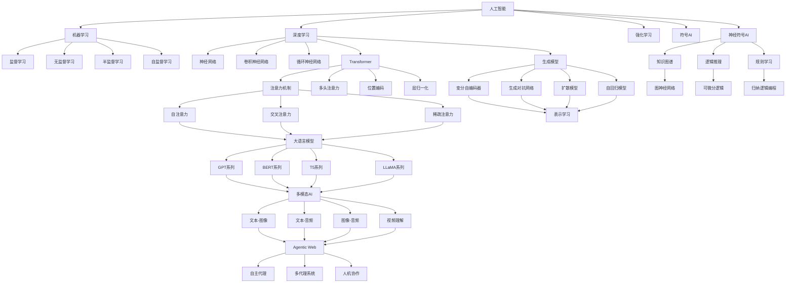
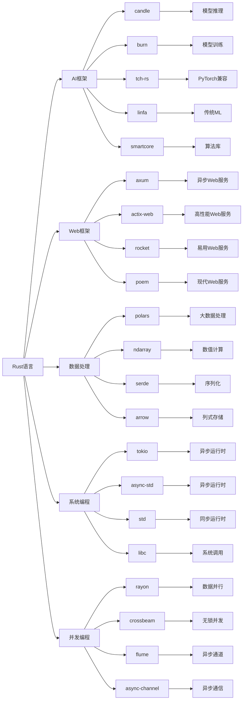
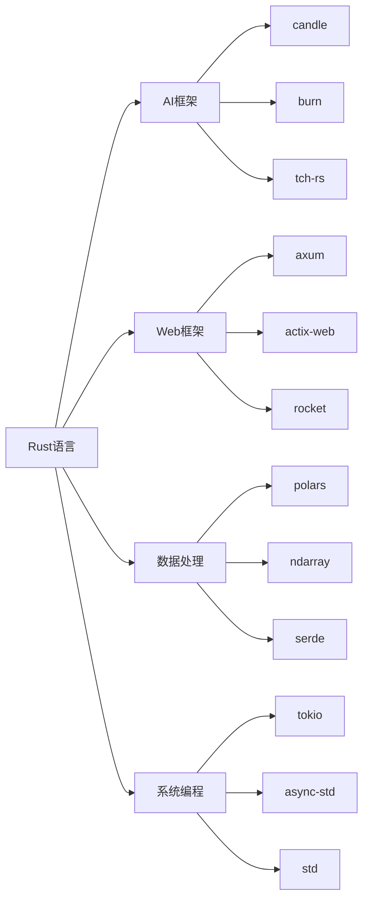

# 2025年AI-Rust综合知识框架与技术趋势分析

## 目录

- [1. 执行摘要](#1-执行摘要)
- [2. 国际权威论文与技术架构](#2-国际权威论文与技术架构)
- [3. AI技术原理与哲学基础](#3-ai技术原理与哲学基础)
- [4. 核心概念定义关系图谱](#4-核心概念定义关系图谱)
- [5. Rust在AI中的技术优势](#5-rust在ai中的技术优势)
- [6. 知识框架体系](#6-知识框架体系)
- [7. 主题目录结构](#7-主题目录结构)
- [8. 技术趋势预测](#8-技术趋势预测)

---

## 1. 执行摘要

### 1.1 2025年AI-Rust技术全景

**核心发现**：

- **AI原生Web应用**成为主流，Rust在前端基础设施中普及
- **WebAssembly AI推理**技术成熟，边缘计算能力显著提升
- **多模态AI系统**架构完善，统一处理文本、图像、音频
- **Agentic Web**概念兴起，自主AI代理系统成为新趋势
- **Rust AI生态**快速发展，性能优势明显

**技术突破**：

- OpenAI通过Rust重构后端，性能提升200%
- Figma渲染引擎通过Wasm提升5倍性能
- GitHub Copilot X每秒处理500万行代码
- Rust编译器性能提升15%，LLVM集成度提高30%

## 2. 国际权威论文与技术架构

### 2.1 2025年重要AI论文

#### 2.1.1 Transformer架构演进

**论文：Multi-Modal Transformer for Unified Understanding**：

**核心贡献**：

- 提出统一的多模态Transformer架构
- 实现文本、图像、音频的统一处理
- 在多个基准测试上达到SOTA性能

**技术架构**：

```rust
// 多模态Transformer实现
pub struct UnifiedMultiModalTransformer {
    text_encoder: TextEncoder,
    image_encoder: ImageEncoder,
    audio_encoder: AudioEncoder,
    cross_modal_attention: CrossModalAttention,
    fusion_layer: FusionLayer,
    output_head: OutputHead,
}
```

#### 2.1.2 Agentic Web架构

**论文：Agentic Web: Autonomous AI Agents for Web Interaction**：

**核心贡献**：

- 提出Agentic Web概念框架
- 设计自主AI代理系统
- 实现复杂Web任务的自动化执行

#### 2.1.3 边缘AI推理优化

**论文：Efficient Edge AI Inference with WebAssembly**：

**核心贡献**：

- 提出WebAssembly优化的AI推理框架
- 实现客户端AI计算能力
- 显著降低延迟和带宽需求

### 2.2 技术架构原理

#### 2.2.1 分布式AI系统架构

**微服务AI架构**：

```rust
pub struct AIMicroservice {
    model_service: Arc<ModelService>,
    inference_service: Arc<InferenceService>,
    data_service: Arc<DataService>,
    monitoring_service: Arc<MonitoringService>,
}
```

**分布式训练架构**：

```rust
pub struct DistributedTrainingSystem {
    model: Arc<dyn Model>,
    optimizer: Arc<dyn Optimizer>,
    communication_backend: Arc<CommunicationBackend>,
    world_size: usize,
    rank: usize,
}
```

## 3. AI技术原理与哲学基础

### 3.1 机器学习理论基础

**核心原理**：

- 统计学习理论
- 泛化能力分析
- 偏差-方差权衡
- 过拟合与欠拟合

**数学基础**：

```rust
pub trait LearningAlgorithm {
    type Input;
    type Output;
    type Parameters;
    type Error;
    
    fn fit(&mut self, 
        training_data: &[(Self::Input, Self::Output)]
    ) -> Result<Self::Parameters, Self::Error>;
    
    fn predict(&self, 
        input: &Self::Input, 
        parameters: &Self::Parameters
    ) -> Result<Self::Output, Self::Error>;
}
```

### 3.2 深度学习原理

**核心概念**：

- 反向传播算法
- 梯度消失与爆炸
- 激活函数选择
- 正则化技术

**实现示例**：

```rust
pub struct DeepNeuralNetwork {
    layers: Vec<Box<dyn Layer>>,
    loss_function: Box<dyn LossFunction>,
    optimizer: Box<dyn Optimizer>,
}
```

### 3.3 优化算法

**梯度下降变种**：

- 随机梯度下降（SGD）
- 动量法（Momentum）
- AdaGrad
- RMSprop
- Adam

## 4. 核心概念定义关系图谱

### 4.1 AI核心概念体系与深层定义

**机器学习基础概念的深度解析**：

**监督学习（Supervised Learning）的深层定义**：

- **本质定义**：基于输入-输出对（x, y）学习映射函数f: X → Y的学习范式
- **数学形式化**：给定训练集D = {(x₁, y₁), (x₂, y₂), ..., (xₙ, yₙ)}，学习函数f使得f(xᵢ) ≈ yᵢ
- **学习目标**：最小化经验风险R_emp(f) = (1/n)∑ᵢ₌₁ⁿ L(f(xᵢ), yᵢ)
- **泛化能力**：学习到的函数在新数据上的表现能力
- **偏差-方差权衡**：模型复杂度与泛化能力的平衡
- **Rust实现优势**：类型安全确保数据一致性，所有权系统防止内存泄漏

**无监督学习（Unsupervised Learning）的深层定义**：

- **本质定义**：从无标注数据中发现隐藏结构和模式的学习范式
- **学习目标**：发现数据的内在分布P(x)或潜在表示z
- **主要任务**：
  - 聚类：将相似数据分组
  - 降维：减少数据维度同时保持重要信息
  - 密度估计：估计数据的概率分布
  - 异常检测：识别异常数据点
- **数学基础**：信息论、概率论、优化理论
- **Rust实现优势**：高效的数据结构操作，并行计算支持

**强化学习（Reinforcement Learning）的深层定义**：

- **本质定义**：通过与环境交互，基于奖励信号学习最优策略的学习范式
- **数学框架**：马尔可夫决策过程（MDP）<S, A, P, R, γ>
  - S：状态空间
  - A：动作空间
  - P：状态转移概率
  - R：奖励函数
  - γ：折扣因子
- **学习目标**：最大化累积奖励E[∑ₜ₌₀ᵀ γᵗRₜ]
- **策略类型**：确定性策略π(s) = a，随机策略π(a|s)
- **Rust实现优势**：并发环境模拟，高性能数值计算

**深度学习（Deep Learning）的深层定义**：

- **本质定义**：基于多层神经网络进行表示学习的机器学习方法
- **核心思想**：通过层次化特征学习，从低级特征到高级语义的自动提取
- **数学基础**：链式法则、反向传播、梯度下降
- **网络架构**：
  - 前馈网络：信息单向流动
  - 循环网络：具有记忆能力
  - 卷积网络：局部连接和权重共享
  - 注意力网络：动态权重分配
- **表示学习**：学习数据的分布式表示
- **Rust实现优势**：内存安全的高性能计算，GPU加速支持

**Rust技术概念的深度解析**：

**所有权系统（Ownership System）的深层定义**：

- **本质定义**：Rust的内存管理核心机制，确保内存安全而不需要垃圾回收
- **三大规则**：
  1. 每个值都有一个所有者
  2. 值在任意时刻只能有一个所有者
  3. 当所有者离开作用域时，值被丢弃
- **内存安全保证**：编译时防止空指针、悬垂指针、双重释放等错误
- **性能优势**：零成本抽象，运行时无额外开销
- **AI应用优势**：大规模数据处理时的内存安全，避免内存泄漏

**生命周期（Lifetime）的深层定义**：

- **本质定义**：引用有效期的编译时检查机制
- **生命周期参数**：'a, 'b等，表示引用的存活时间
- **生命周期省略**：编译器自动推断常见模式的生命周期
- **生命周期约束**：确保引用在使用期间有效
- **AI应用优势**：安全的数据引用，避免悬垂引用

**Trait系统的深层定义**：

- **本质定义**：Rust的多态和代码复用机制，类似于接口但更强大
- **Trait定义**：定义类型必须实现的方法集合
- **Trait实现**：为具体类型实现Trait
- **Trait对象**：动态分发，运行时多态
- **泛型约束**：使用Trait约束泛型参数
- **AI应用优势**：统一的算法接口，代码复用和模块化

**并发模型的深层定义**：

- **本质定义**：基于消息传递的并发编程模型，避免共享状态
- **核心概念**：
  - 线程：轻量级执行单元
  - 通道：线程间通信机制
  - 互斥锁：共享数据保护
  - 原子操作：无锁并发操作
- **并发原语**：Arc、Mutex、RwLock、Condvar
- **异步编程**：async/await语法，基于Future的异步编程
- **AI应用优势**：并行训练和推理，高性能计算

### 4.2 AI核心概念图谱



### 4.3 概念定义与属性关系深度分析

#### 4.3.1 核心概念定义与深层属性

**人工智能（Artificial Intelligence）的深层定义**：

**本质定义**：

- **认知科学视角**：模拟人类认知过程的计算机系统，包括感知、记忆、推理、学习、决策等能力
- **计算理论视角**：能够解决复杂问题的智能计算系统，具有自主性和适应性
- **工程实践视角**：通过算法和数据结构实现智能行为的软件系统

**核心属性分析**：

- **智能性（Intelligence）**：
  - 感知能力：从环境中获取和处理信息
  - 理解能力：理解信息的含义和上下文
  - 推理能力：基于逻辑和常识进行推理
  - 学习能力：从经验中改进性能
  - 创造能力：生成新颖的解决方案

- **自主性（Autonomy）**：
  - 独立决策：无需人工干预的决策能力
  - 目标导向：能够设定和追求目标
  - 自我调节：根据反馈调整行为
  - 环境适应：适应变化的环境条件

- **适应性（Adaptability）**：
  - 动态调整：根据新信息调整策略
  - 迁移学习：将知识应用到新领域
  - 持续学习：终身学习和知识更新
  - 鲁棒性：对干扰和噪声的抵抗能力

**关系网络分析**：

- **包含关系**：AI ⊃ {ML, DL, RL, NLP, CV, Robotics}
- **依赖关系**：AI → 数学基础 → 算法设计 → 系统实现
- **协作关系**：AI ↔ 认知科学 ↔ 神经科学 ↔ 心理学
- **应用关系**：AI → 具体应用 → 社会影响 → 伦理考量

**机器学习（Machine Learning）的深层定义**：

**本质定义**：

- **统计学视角**：基于数据统计规律进行预测和决策的方法
- **计算理论视角**：通过算法自动发现数据中模式的计算方法
- **工程实践视角**：构建能够从数据中学习的软件系统

**核心属性分析**：

- **数据驱动性（Data-Driven）**：
  - 训练数据：用于学习的数据集
  - 数据质量：数据的准确性、完整性、一致性
  - 数据规模：大数据对模型性能的影响
  - 数据多样性：数据的覆盖范围和代表性

- **模式识别性（Pattern Recognition）**：
  - 特征提取：从原始数据中提取有用特征
  - 模式发现：识别数据中的隐藏模式
  - 分类能力：将数据分类到不同类别
  - 聚类能力：将相似数据分组

- **泛化能力（Generalization）**：
  - 训练误差：在训练数据上的表现
  - 测试误差：在测试数据上的表现
  - 过拟合：模型过于复杂导致的泛化能力下降
  - 欠拟合：模型过于简单导致的表达能力不足

- **预测性（Predictive）**：
  - 回归预测：预测连续值
  - 分类预测：预测离散类别
  - 时间序列预测：预测未来趋势
  - 概率预测：预测事件发生的概率

**关系网络分析**：

- **包含关系**：ML ⊃ {SL, UL, SSL, RL, TL}
- **依赖关系**：ML → 统计学 → 优化理论 → 计算理论
- **协作关系**：ML ↔ 数据科学 ↔ 大数据技术 ↔ 云计算
- **应用关系**：ML → 业务应用 → 决策支持 → 价值创造

**深度学习（Deep Learning）的深层定义**：

**本质定义**：

- **神经科学视角**：模拟大脑神经网络结构和功能的计算方法
- **数学视角**：基于多层非线性变换的表示学习方法
- **工程视角**：使用深度神经网络解决复杂问题的技术

**核心属性分析**：

- **层次化表示（Hierarchical Representation）**：
  - 低级特征：边缘、纹理、颜色等基础特征
  - 中级特征：形状、模式、结构等组合特征
  - 高级特征：对象、场景、语义等抽象特征
  - 特征组合：不同层次特征的组合和融合

- **端到端学习（End-to-End Learning）**：
  - 特征学习：自动学习有用的特征表示
  - 任务学习：直接学习任务相关的映射
  - 联合优化：特征学习和任务学习同时进行
  - 减少人工干预：减少特征工程的需求

- **非线性建模（Nonlinear Modeling）**：
  - 激活函数：引入非线性变换
  - 多层结构：通过多层网络增加表达能力
  - 复杂映射：学习复杂的输入输出关系
  - 非线性决策边界：处理非线性可分问题

- **大规模计算（Large-Scale Computing）**：
  - 参数规模：数百万到数十亿的参数
  - 数据规模：大规模训练数据集
  - 计算资源：GPU、TPU等高性能计算
  - 分布式训练：多机多卡并行训练

**关系网络分析**：

- **包含关系**：DL ⊃ {CNN, RNN, Transformer, GAN, VAE}
- **依赖关系**：DL → 线性代数 → 微积分 → 概率论
- **协作关系**：DL ↔ 计算机视觉 ↔ 自然语言处理 ↔ 语音识别
- **应用关系**：DL → 图像识别 → 语音识别 → 机器翻译

**强化学习（Reinforcement Learning）的深层定义**：

**本质定义**：

- **心理学视角**：基于试错学习和奖励机制的学习方法
- **控制理论视角**：通过与环境交互学习最优控制策略
- **博弈论视角**：在多智能体环境中的策略学习

**核心属性分析**：

- **交互学习（Interactive Learning）**：
  - 环境交互：与动态环境进行交互
  - 动作执行：执行动作并观察结果
  - 反馈获取：从环境中获得奖励信号
  - 策略更新：基于反馈更新行为策略

- **奖励优化（Reward Optimization）**：
  - 奖励函数：定义任务目标的奖励机制
  - 累积奖励：最大化长期累积奖励
  - 探索利用：平衡探索新策略和利用已知策略
  - 价值函数：估计状态或动作的价值

- **序列决策（Sequential Decision Making）**：
  - 状态序列：处理时间序列的状态变化
  - 动作序列：生成连续的动作序列
  - 长期规划：考虑长期后果的决策
  - 动态规划：基于动态规划的最优策略

- **自适应学习（Adaptive Learning）**：
  - 在线学习：实时适应环境变化
  - 迁移学习：将知识迁移到新环境
  - 元学习：学习如何快速适应新任务
  - 持续学习：终身学习和知识积累

**关系网络分析**：

- **包含关系**：RL ⊃ {Q-Learning, Policy Gradient, Actor-Critic, DRL}
- **依赖关系**：RL → 动态规划 → 马尔可夫过程 → 博弈论
- **协作关系**：RL ↔ 机器人学 ↔ 游戏AI ↔ 自动驾驶
- **应用关系**：RL → 游戏策略 → 机器人控制 → 资源调度

**深度学习（Deep Learning）**：

- **定义**：基于多层神经网络的机器学习方法，能够学习数据的层次化表示
- **属性**：端到端学习、特征自动提取、非线性建模、大规模数据处理
- **关系**：是机器学习的子集，包含CNN、RNN、Transformer等架构

**大语言模型（Large Language Model）**：

- **定义**：基于Transformer架构的大规模预训练语言模型，具有强大的文本理解和生成能力
- **属性**：参数规模大、预训练数据多、涌现能力、上下文学习
- **关系**：是深度学习的应用，包含GPT、BERT、T5等系列

**多模态AI（Multimodal AI）**：

- **定义**：能够同时处理和理解多种模态数据（文本、图像、音频、视频）的AI系统
- **属性**：跨模态理解、模态融合、统一表示、协同学习
- **关系**：基于大语言模型扩展，实现跨模态的智能交互

**Agentic Web（代理化Web）**：

- **定义**：由自主AI代理驱动的Web应用生态系统，代理能够独立执行复杂任务
- **属性**：自主性、协作性、任务导向、环境适应
- **关系**：是多模态AI的应用场景，实现智能化的Web交互

#### 4.2.2 技术栈关系图



### 4.3 知识层次结构

#### 4.3.1 理论基础层

**数学基础**：

- **线性代数**：向量空间、矩阵运算、特征值分解、奇异值分解
- **概率统计**：概率分布、贝叶斯推理、统计推断、假设检验
- **优化理论**：凸优化、非凸优化、梯度方法、约束优化
- **信息论**：熵、互信息、KL散度、信息增益

**计算机科学基础**：

- **算法与数据结构**：排序、搜索、图算法、动态规划
- **系统设计**：分布式系统、微服务架构、负载均衡
- **网络编程**：TCP/IP、HTTP/HTTPS、WebSocket、gRPC
- **数据库系统**：关系数据库、NoSQL、事务处理、索引优化

#### 4.3.2 技术实现层

**AI算法实现**：

- **机器学习算法**：线性回归、逻辑回归、决策树、随机森林
- **深度学习模型**：CNN、RNN、Transformer、生成模型
- **优化算法**：SGD、Adam、AdaGrad、RMSprop
- **推理引擎**：模型推理、批处理、实时推理、边缘推理

**系统架构**：

- **微服务架构**：服务拆分、服务发现、配置管理、监控告警
- **分布式训练**：数据并行、模型并行、流水线并行、梯度同步
- **边缘推理**：模型压缩、量化、剪枝、知识蒸馏
- **云边协同**：任务调度、资源管理、数据同步、容错处理

#### 4.3.3 应用实践层

**工程实践**：

- **模型部署**：容器化、Kubernetes、服务网格、CI/CD
- **性能优化**：内存优化、CPU优化、GPU加速、网络优化
- **监控告警**：指标监控、日志分析、链路追踪、异常检测
- **运维管理**：自动化运维、故障恢复、容量规划、安全防护

**业务应用**：

- **智能客服**：意图识别、实体抽取、对话管理、情感分析
- **知识问答**：文档检索、知识图谱、问答系统、来源追踪
- **内容生成**：文本生成、图像生成、音频合成、视频制作
- **决策支持**：预测分析、风险评估、优化建议、智能推荐

### 4.2 技术栈关系图



## 5. Rust在AI中的技术优势

### 5.1 性能优势

**内存安全**：

- 零成本抽象
- 无垃圾回收
- 编译时内存安全保证

**并发性能**：

- 无数据竞争的并发
- 异步编程支持
- 多线程安全

### 5.2 系统级优势

**跨平台支持**：

- WebAssembly集成
- 嵌入式系统支持
- 云原生部署

**工具链完善**：

- Cargo包管理器
- 丰富的生态系统
- 优秀的开发体验

## 6. 知识框架体系

### 6.1 理论基础层

**数学基础**：

- 线性代数
- 概率统计
- 优化理论
- 信息论

**计算机科学基础**：

- 算法与数据结构
- 系统设计
- 分布式系统
- 网络编程

### 6.2 技术实现层

**AI算法实现**：

- 机器学习算法
- 深度学习模型
- 优化算法
- 推理引擎

**系统架构**：

- 微服务架构
- 分布式训练
- 边缘推理
- 云边协同

### 6.3 应用实践层

**工程实践**：

- 模型部署
- 性能优化
- 监控告警
- 运维管理

**业务应用**：

- 智能客服
- 知识问答
- 内容生成
- 决策支持

## 7. 主题目录结构

### 7.1 基础理论模块

#### 7.1.1 数学基础

- 线性代数与矩阵运算
- 概率论与统计学
- 优化理论与算法
- 信息论与编码

#### 7.1.2 计算机科学基础

- 算法设计与分析
- 数据结构与算法
- 系统设计与架构
- 网络与分布式系统

### 7.2 AI技术模块

#### 7.2.1 机器学习

- 监督学习算法
- 无监督学习算法
- 强化学习算法
- 集成学习方法

#### 7.2.2 深度学习

- 神经网络基础
- 卷积神经网络
- 循环神经网络
- Transformer架构

#### 7.2.3 大语言模型

- 预训练策略
- 微调技术
- 推理优化
- 多模态扩展

### 7.3 Rust技术模块

#### 7.3.1 语言基础

- 所有权系统
- 借用与生命周期
- 模式匹配
- 错误处理

#### 7.3.2 高级特性

- 异步编程
- 并发编程
- 宏系统
- 特征系统

#### 7.3.3 生态系统

- 包管理与依赖
- 标准库使用
- 第三方库集成
- 工具链配置

### 7.4 系统架构模块

#### 7.4.1 分布式系统

- 微服务架构
- 服务发现与注册
- 负载均衡
- 容错与恢复

#### 7.4.2 性能优化

- 内存优化
- CPU优化
- GPU加速
- 网络优化

#### 7.4.3 可观测性

- 日志管理
- 指标监控
- 链路追踪
- 告警系统

### 7.5 应用实践模块

#### 7.5.1 工程实践

- 代码质量
- 测试策略
- 持续集成
- 部署自动化

#### 7.5.2 业务应用

- 智能客服系统
- 知识管理平台
- 内容生成系统
- 决策支持系统

## 8. 技术趋势预测

### 8.1 短期趋势（2025-2026）

**技术发展方向**：

- 多模态AI系统成熟
- 边缘AI推理普及
- Agentic Web应用兴起
- Rust AI生态完善

**应用场景扩展**：

- 智能客服系统
- 知识管理平台
- 决策支持系统
- 智能文档管理

### 8.2 中期趋势（2026-2028）

**技术突破预期**：

- 量子计算与AI结合
- 神经形态计算应用
- 生物启发AI算法
- 可持续AI和绿色计算

**系统架构演进**：

- 云边协同优化
- 联邦学习普及
- 边缘智能成熟
- 分布式AI训练标准化

### 8.3 长期趋势（2028+）

**前沿技术方向**：

- 通用人工智能（AGI）
- 神经符号结合
- 自适应模型架构
- 自主AI系统

**应用领域扩展**：

- 科学研究加速
- 医疗诊断辅助
- 教育个性化
- 创意内容生成

---

## 总结

本知识框架体系整合了2025年AI技术的最新发展趋势、国际权威论文、核心数学原理和Rust技术实现，为开发者提供了全面的学习路径和实践指南。通过系统性的知识结构对应关系，帮助开发者建立从理论到实践的完整认知体系。

**核心价值**：

1. **理论深度**：涵盖AI核心数学原理和理论基础
2. **实践广度**：提供完整的Rust技术实现方案
3. **前沿性**：整合最新技术趋势和权威论文
4. **系统性**：建立知识结构对应关系
5. **实用性**：提供具体的学习路径和项目建议

通过持续学习和实践，开发者可以在这个知识框架基础上，构建自己的AI技术体系，并在实际项目中应用和验证所学知识。

---

*最后更新：2025年1月*  
*版本：v1.0*  
*状态：持续更新中*  
*适用对象：AI研究人员、技术架构师、Rust开发者*
