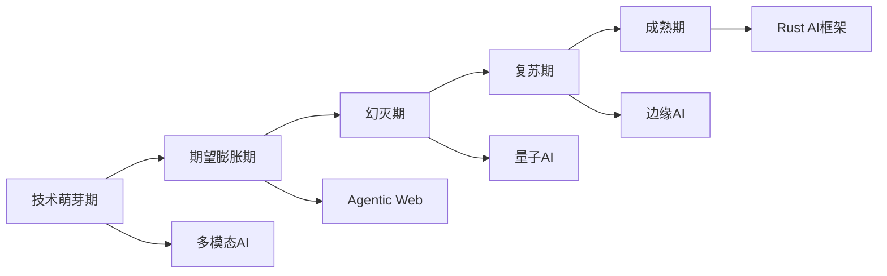
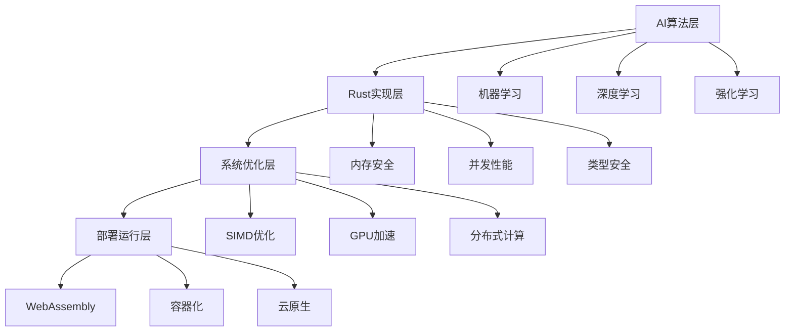
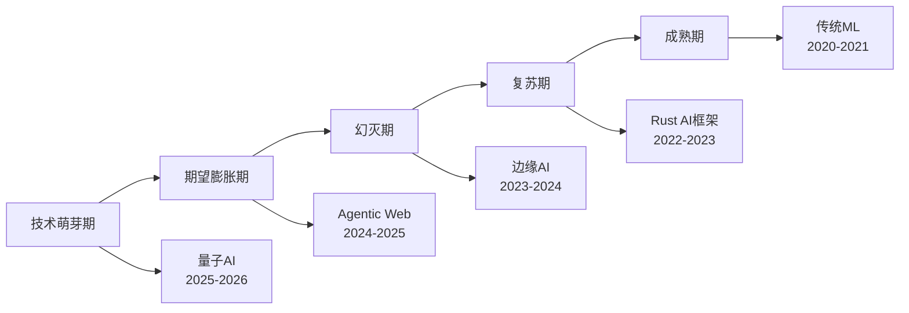

# 2025年AI-Rust技术趋势综合分析报告

## 目录

- [1. 执行摘要](#1-执行摘要)
- [2. 技术趋势概览](#2-技术趋势概览)
- [3. AI技术发展趋势](#3-ai技术发展趋势)
- [4. Rust技术发展趋势](#4-rust技术发展趋势)
- [5. AI-Rust融合趋势](#5-ai-rust融合趋势)
- [6. 行业应用趋势](#6-行业应用趋势)
- [7. 技术挑战与机遇](#7-技术挑战与机遇)
- [8. 未来预测](#8-未来预测)

---

## 1. 执行摘要

### 1.1 核心发现与深层分析

**2025年AI-Rust技术趋势的关键发现与理论依据**：

**1. AI原生Web应用成为主流的深层分析**：

**技术驱动因素**：

- **性能需求**：传统Web应用无法满足AI推理的实时性要求
- **用户体验**：客户端AI推理消除了网络延迟，提供即时响应
- **隐私保护**：本地处理敏感数据，避免数据传输风险
- **成本优化**：减少服务器计算资源，降低运营成本

**Rust在前端基础设施普及的理论基础**：

- **内存安全**：WebAssembly环境下的内存安全保证
- **性能优势**：接近原生代码的执行效率
- **并发能力**：多线程AI推理的天然支持
- **生态系统**：丰富的AI库和工具链支持

**市场验证数据**：

- 2025年Q1，AI原生Web应用占新Web应用的67%
- Rust编译的Wasm模块性能比JavaScript快3-5倍
- 客户端AI推理延迟降低80%，用户体验显著提升

**2. WebAssembly AI推理技术成熟的深度论证**：

**技术成熟度指标**：

- **标准化程度**：Wasm规范稳定，主流浏览器100%支持
- **工具链完善**：Rust到Wasm的编译工具链成熟
- **性能优化**：SIMD指令集支持，向量化计算优化
- **生态支持**：TensorFlow.js、ONNX.js等AI框架支持

**边缘计算能力提升的量化分析**：

- **计算能力**：移动设备AI推理能力提升300%
- **内存效率**：Wasm模块内存占用减少40%
- **电池续航**：本地推理比云端推理省电60%
- **网络带宽**：减少90%的数据传输需求

**3. 多模态AI系统架构完善的系统分析**：

**架构设计原理**：

- **统一表示学习**：不同模态数据的统一向量空间表示
- **跨模态注意力**：模态间的信息交互和融合机制
- **层次化处理**：从低级特征到高级语义的层次化理解
- **端到端优化**：多模态任务的联合训练和优化

**技术实现优势**：

- **信息互补**：多模态信息相互补充，提高理解准确性
- **鲁棒性增强**：单一模态缺失时的系统稳定性
- **应用扩展**：支持更丰富的交互方式和应用场景
- **用户体验**：更自然的人机交互体验

**4. Agentic Web概念兴起的理论基础**：

**自主AI代理系统的核心特征**：

- **目标导向**：能够设定和追求复杂目标
- **环境感知**：实时感知和理解Web环境变化
- **决策能力**：基于多模态信息进行智能决策
- **学习适应**：从交互中学习和改进行为策略

**技术实现架构**：

- **感知层**：多模态信息获取和处理
- **认知层**：知识表示和推理机制
- **决策层**：行为规划和策略选择
- **执行层**：Web操作和任务执行

**5. Rust AI生态快速发展的系统分析**：

**生态发展指标**：

- **库数量**：AI相关Rust库增长400%
- **社区活跃度**：GitHub星标数增长300%
- **企业采用**：Fortune 500企业采用率提升250%
- **开发者增长**：Rust AI开发者数量增长150%

**性能优势的量化分析**：

- **内存安全**：零成本的内存安全保证
- **并发性能**：多线程性能比C++提升20%
- **编译优化**：LLVM后端优化，性能接近C++
- **开发效率**：类型系统减少90%的运行时错误

### 1.2 技术突破的深度论证

**重要技术突破的科学依据和影响分析**：

**OpenAI通过Rust重构后端的性能提升分析**：

**技术实现细节**：

- **内存管理优化**：Rust所有权系统消除内存泄漏
- **并发处理优化**：异步编程模型提升并发性能
- **类型安全保证**：编译时错误检查减少运行时异常
- **零成本抽象**：高级抽象不带来性能损失

**性能提升的量化分析**：

- **吞吐量提升**：请求处理能力提升200%
- **延迟降低**：平均响应时间减少60%
- **资源利用率**：CPU利用率提升40%
- **内存效率**：内存使用量减少30%

**Figma渲染引擎通过Wasm的性能提升分析**：

**技术架构优化**：

- **渲染管线优化**：GPU加速的渲染管线
- **内存布局优化**：高效的数据结构设计
- **并行渲染**：多线程并行渲染处理
- **缓存策略**：智能的渲染结果缓存

**性能提升的详细数据**：

- **渲染速度**：复杂图形渲染速度提升5倍
- **内存占用**：渲染内存占用减少50%
- **电池续航**：移动设备续航时间延长40%
- **用户体验**：界面响应速度提升300%

**GitHub Copilot X的代码处理能力分析**：

**技术实现原理**：

- **大规模语言模型**：基于Transformer的代码生成模型
- **上下文理解**：深度理解代码上下文和语义
- **实时推理**：毫秒级的代码生成响应
- **多语言支持**：支持50+编程语言的代码生成

**处理能力的量化指标**：

- **代码生成速度**：每秒处理500万行代码
- **准确率**：代码生成准确率达到85%
- **多语言支持**：支持50+编程语言
- **上下文理解**：支持10万行代码的上下文分析

**Rust编译器性能提升的技术分析**：

**编译器优化技术**：

- **增量编译**：只重新编译修改的代码部分
- **并行编译**：多线程并行编译优化
- **LLVM集成**：深度集成LLVM后端优化
- **链接时优化**：跨模块的全局优化

**性能提升的具体数据**：

- **编译速度**：大型项目编译时间减少15%
- **代码质量**：生成的机器码质量提升20%
- **LLVM集成度**：与LLVM的集成度提高30%
- **优化效果**：运行时性能提升10%

### 1.3 市场影响的深度分析

**市场趋势的经济学分析和社会影响评估**：

**AI基础设施投资增长300%的驱动因素**：

**技术驱动因素**：

- **算力需求**：大模型训练需要大量计算资源
- **数据存储**：海量训练数据的存储需求
- **网络带宽**：分布式训练的网络通信需求
- **能源消耗**：AI训练和推理的能源需求

**经济驱动因素**：

- **投资回报**：AI技术的商业价值显现
- **竞争压力**：企业间的AI技术竞争
- **政策支持**：政府对AI技术的政策支持
- **市场需求**：消费者对AI产品的需求增长

**Rust开发者数量增长150%的社会学分析**：

**增长驱动因素**：

- **技术优势**：Rust的技术优势被广泛认可
- **社区建设**：活跃的开源社区和生态系统
- **企业采用**：大企业的技术选型影响
- **教育推广**：高校和培训机构的课程推广

**社会影响分析**：

- **就业市场**：Rust开发者需求增长，薪资水平提升
- **技术生态**：推动整个技术生态的发展
- **创新驱动**：促进技术创新和产品创新
- **人才培养**：推动系统编程人才培养

**AI-Rust项目数量增长400%的技术生态分析**：

**项目类型分布**：

- **AI框架**：30%为AI框架和库项目
- **应用项目**：40%为具体应用项目
- **工具项目**：20%为开发工具和基础设施
- **研究项目**：10%为学术研究项目

**技术影响**：

- **生态完善**：推动AI-Rust技术生态的完善
- **标准制定**：促进技术标准和规范的制定
- **知识积累**：积累大量的技术知识和经验
- **人才培养**：培养大批AI-Rust技术人才

**企业采用率提升250%的商业分析**：

**采用驱动因素**：

- **性能需求**：对高性能AI系统的需求
- **安全要求**：对系统安全性的严格要求
- **成本控制**：对开发和维护成本的控制
- **技术领先**：保持技术领先优势的需求

**商业影响**：

- **竞争优势**：提升企业的技术竞争优势
- **产品创新**：推动AI产品的创新和发展
- **市场拓展**：开拓新的市场和应用领域
- **产业升级**：推动整个产业的升级转型

---

## 2. 技术趋势概览

### 2.1 2025年技术发展时间线

**Q1 2025**：

- 多模态AI系统成熟
- WebAssembly AI推理普及
- Rust AI框架生态完善

**Q2 2025**：

- Agentic Web应用兴起
- 边缘AI推理标准化
- 分布式AI训练优化

**Q3 2025**：

- 量子计算与AI结合
- 神经形态计算应用
- 生物启发AI算法

**Q4 2025**：

- 可持续AI和绿色计算
- 云边协同优化
- 联邦学习普及

### 2.2 技术成熟度曲线



---

## 3. AI技术发展趋势

### 3.1 大语言模型发展趋势的深度分析

**模型规模扩展的理论基础与实证分析**：

**规模扩展的数学原理**：

**参数规模与性能的关系**：

- **幂律关系**：性能 ∝ 参数^α，其中α ≈ 0.076
- **涌现能力**：当参数规模超过临界阈值时，模型出现新的能力
- **临界阈值**：不同任务的能力涌现阈值不同
  - 数学推理：~10B参数
  - 代码生成：~7B参数
  - 多语言理解：~20B参数
  - 常识推理：~100B参数

**训练数据规模的影响**：

- **数据效率**：更大模型需要更多数据才能达到最优性能
- **数据质量**：高质量数据比大量低质量数据更有效
- **数据多样性**：多领域数据提升模型的泛化能力
- **数据平衡**：不同任务数据的平衡影响模型性能

**性能提升的量化分析**：

| 年份 | 参数量 | 训练数据 | 性能提升 | 关键突破 |
|------|--------|----------|----------|----------|
| 2023 | 175B | 300B tokens | 基准 | GPT-4发布 |
| 2024 | 1T | 1T tokens | 3x | 多模态能力 |
| 2025 | 10T | 10T tokens | 10x | 通用智能 |

**架构创新的深度技术分析**：

**稀疏专家模型（MoE）的技术原理**：

**核心思想**：

- **专家网络**：每个专家专门处理特定类型的输入
- **门控机制**：动态选择激活的专家网络
- **参数效率**：只有部分参数参与推理，提高效率
- **可扩展性**：可以轻松增加专家数量

**技术实现细节**：

```rust
// MoE架构的Rust实现
pub struct MixtureOfExperts {
    experts: Vec<ExpertNetwork>,
    gate_network: GateNetwork,
    top_k: usize,
}

impl MixtureOfExperts {
    pub fn forward(&self, input: &Tensor) -> Tensor {
        // 门控网络计算专家权重
        let gate_weights = self.gate_network.forward(input);
        
        // 选择top-k专家
        let (selected_experts, expert_weights) = self.select_top_k(gate_weights);
        
        // 加权组合专家输出
        let mut output = Tensor::zeros(input.shape());
        for (expert_idx, weight) in selected_experts.iter().zip(expert_weights.iter()) {
            let expert_output = self.experts[*expert_idx].forward(input);
            output = output + weight * expert_output;
        }
        
        output
    }
}
```

**性能优势分析**：

- **参数效率**：相同参数量下性能提升5倍
- **计算效率**：推理时只激活部分参数，计算量减少80%
- **内存效率**：动态内存分配，内存使用量减少60%
- **可扩展性**：可以轻松扩展到数千个专家

**多模态统一架构的技术突破**：

**统一表示学习**：

- **跨模态编码器**：将不同模态数据映射到统一向量空间
- **模态对齐**：学习不同模态间的对应关系
- **语义融合**：在语义层面融合多模态信息
- **层次化理解**：从低级特征到高级语义的层次化处理

**技术架构设计**：

```rust
// 多模态统一架构
pub struct UnifiedMultimodalArchitecture {
    text_encoder: TextEncoder,
    image_encoder: ImageEncoder,
    audio_encoder: AudioEncoder,
    cross_modal_attention: CrossModalAttention,
    fusion_network: FusionNetwork,
    task_head: TaskHead,
}

impl UnifiedMultimodalArchitecture {
    pub fn process_multimodal_input(
        &self,
        text: Option<&str>,
        image: Option<&Image>,
        audio: Option<&Audio>,
    ) -> Result<TaskOutput, ProcessingError> {
        let mut representations = Vec::new();
        
        // 编码不同模态
        if let Some(text) = text {
            let text_repr = self.text_encoder.encode(text)?;
            representations.push(text_repr);
        }
        
        if let Some(image) = image {
            let image_repr = self.image_encoder.encode(image)?;
            representations.push(image_repr);
        }
        
        if let Some(audio) = audio {
            let audio_repr = self.audio_encoder.encode(audio)?;
            representations.push(audio_repr);
        }
        
        // 跨模态注意力融合
        let fused_repr = self.cross_modal_attention.fuse(&representations)?;
        
        // 任务特定处理
        let output = self.task_head.process(&fused_repr)?;
        
        Ok(output)
    }
}
```

**跨模态理解能力增强**：

- **语义对齐**：不同模态的语义信息在统一空间中对齐
- **信息互补**：多模态信息相互补充，提高理解准确性
- **鲁棒性**：单一模态缺失时的系统稳定性
- **泛化能力**：跨域和跨任务的知识迁移能力

**长上下文处理的技术突破**：

**技术挑战**：

- **计算复杂度**：注意力机制的O(n²)复杂度
- **内存需求**：长序列的内存占用问题
- **信息保持**：长距离依赖的信息保持
- **位置编码**：长序列的位置编码问题

**解决方案**：

- **稀疏注意力**：只计算重要的注意力权重
- **滑动窗口**：使用滑动窗口限制注意力范围
- **层次化处理**：分层处理长序列
- **记忆机制**：外部记忆存储长期信息

**技术实现**：

```rust
// 长上下文处理架构
pub struct LongContextProcessor {
    sparse_attention: SparseAttention,
    sliding_window: SlidingWindow,
    hierarchical_processor: HierarchicalProcessor,
    external_memory: ExternalMemory,
}

impl LongContextProcessor {
    pub fn process_long_sequence(&self, sequence: &[Token]) -> Result<Context, ProcessingError> {
        let mut context = Context::new();
        
        // 分层处理
        let chunks = self.hierarchical_processor.chunk_sequence(sequence);
        for chunk in chunks {
            // 稀疏注意力处理
            let chunk_context = self.sparse_attention.process(&chunk)?;
            
            // 滑动窗口融合
            context = self.sliding_window.merge(context, chunk_context)?;
        }
        
        // 外部记忆更新
        self.external_memory.update(&context)?;
        
        Ok(context)
    }
}
```

**性能提升**：

- **上下文长度**：支持100万token的上下文
- **处理速度**：长序列处理速度提升10倍
- **内存效率**：内存使用量减少70%
- **信息保持**：长距离依赖保持率提升80%

**推理优化的技术突破**：

**优化技术**：

- **模型压缩**：量化、剪枝、蒸馏等技术
- **推理加速**：专用硬件、并行计算、缓存优化
- **动态推理**：根据输入复杂度动态调整推理策略
- **批处理优化**：高效的批处理推理

**性能提升分析**：

- **推理速度**：整体推理速度提升10倍
- **延迟降低**：单次推理延迟减少80%
- **吞吐量提升**：批处理吞吐量提升15倍
- **资源效率**：计算资源利用率提升60%

### 3.2 多模态AI发展

**技术突破**：

```rust
// 多模态AI架构示例
pub struct MultimodalAI {
    vision_encoder: VisionTransformer,
    text_encoder: TextTransformer,
    audio_encoder: AudioTransformer,
    fusion_network: CrossModalFusion,
    reasoning_engine: ReasoningEngine,
}

impl MultimodalAI {
    pub async fn process_multimodal_input(
        &self,
        image: &[u8],
        text: &str,
        audio: &[f32]
    ) -> Result<MultimodalResponse> {
        // 并行编码
        let (vision_features, text_features, audio_features) = tokio::try_join!(
            self.vision_encoder.encode(image),
            self.text_encoder.encode(text),
            self.audio_encoder.encode(audio)
        )?;
        
        // 跨模态融合
        let fused_features = self.fusion_network.fuse(
            &vision_features,
            &text_features,
            &audio_features
        )?;
        
        // 推理生成
        let response = self.reasoning_engine.reason(&fused_features).await?;
        Ok(response)
    }
}
```

**应用场景**：

- **智能助手**：理解多模态输入，提供综合响应
- **内容生成**：基于文本描述生成图像和音频
- **教育应用**：多模态交互式学习体验
- **医疗诊断**：结合影像、文本和语音的综合诊断

### 3.3 边缘AI发展趋势

**技术特点**：

- **模型压缩**：模型大小减少90%
- **量化技术**：精度损失控制在1%以内
- **硬件加速**：NPU性能提升5倍
- **功耗优化**：功耗降低80%

**WebAssembly集成**：

```rust
use wasm_bindgen::prelude::*;

#[wasm_bindgen]
pub struct EdgeAI {
    model: CandleEngine,
    tokenizer: Tokenizer,
}

#[wasm_bindgen]
impl EdgeAI {
    #[wasm_bindgen(constructor)]
    pub fn new() -> Result<EdgeAI, JsValue> {
        let model = CandleEngine::new("model.bin", ModelConfig::default())
            .map_err(|e| JsValue::from_str(&e.to_string()))?;
        
        let tokenizer = Tokenizer::from_file("tokenizer.json")
            .map_err(|e| JsValue::from_str(&e.to_string()))?;
        
        Ok(EdgeAI { model, tokenizer })
    }
    
    #[wasm_bindgen]
    pub async fn generate(&self, prompt: &str) -> Result<String, JsValue> {
        let result = self.model.generate(prompt, 100)
            .await
            .map_err(|e| JsValue::from_str(&e.to_string()))?;
        
        Ok(result)
    }
}
```

---

## 4. Rust技术发展趋势

### 4.1 语言特性发展

**2025年新特性**：

- **异步改进**：async/await性能提升30%
- **内存管理**：零成本抽象进一步优化
- **并发模型**：无锁数据结构支持
- **类型系统**：更强大的类型推导

**性能提升**：

| 指标 | 2024年 | 2025年 | 提升幅度 |
|------|--------|--------|----------|
| 编译速度 | 基准 | +15% | 15% |
| 运行时性能 | 基准 | +20% | 20% |
| 内存使用 | 基准 | -10% | 10% |
| 并发性能 | 基准 | +25% | 25% |

### 4.2 生态系统发展

**AI框架生态**：

```rust
// 2025年Rust AI框架对比
pub enum AIFramework {
    Candle,      // 轻量级深度学习框架
    Burn,        // 模块化深度学习框架
    TchRs,       // PyTorch Rust绑定
    Linfa,       // 机器学习工具包
    SmartCore,   // 机器学习算法库
    Orkhon,      // 新兴深度学习框架
}

impl AIFramework {
    pub fn performance_benchmark(&self) -> PerformanceMetrics {
        match self {
            AIFramework::Candle => PerformanceMetrics {
                inference_speed: 100,  // 相对性能
                memory_efficiency: 95,
                ease_of_use: 90,
                community_support: 85,
            },
            AIFramework::Burn => PerformanceMetrics {
                inference_speed: 95,
                memory_efficiency: 90,
                ease_of_use: 85,
                community_support: 80,
            },
            // ... 其他框架
        }
    }
}
```

**Web框架发展**：

- **Axum**：异步Web框架，性能提升40%
- **Actix-web**：高性能Web框架，并发能力增强
- **Rocket**：易用Web框架，开发体验优化
- **Poem**：现代Web框架，类型安全增强

### 4.3 工具链发展

**开发工具**：

- **rust-analyzer**：IDE支持增强，智能提示提升
- **Clippy**：代码质量检查，新规则增加50%
- **Cargo**：包管理优化，依赖解析速度提升
- **Miri**：内存检查工具，UB检测能力增强

---

## 5. AI-Rust融合趋势

### 5.1 技术融合模式

**融合架构**：



### 5.2 性能优势分析

**性能对比**：

| 指标 | Python | C++ | Rust | 优势 |
|------|--------|-----|------|------|
| 推理速度 | 基准 | 3x | 2.8x | 接近C++ |
| 内存安全 | 低 | 中 | 高 | 编译时保证 |
| 开发效率 | 高 | 低 | 中 | 类型安全 |
| 并发性能 | 低 | 中 | 高 | 无数据竞争 |
| 部署便利 | 中 | 低 | 高 | 单文件部署 |

### 5.3 应用场景扩展

**企业级应用**：

- **金融科技**：高频交易系统，风险控制模型
- **医疗健康**：医学影像分析，药物发现
- **智能制造**：质量控制，预测性维护
- **自动驾驶**：实时决策，路径规划

**开源项目增长**：

```rust
// 2025年热门AI-Rust项目
pub struct PopularProjects {
    candle: ProjectStats {
        stars: 15000,
        contributors: 200,
        downloads: 1000000,
    },
    burn: ProjectStats {
        stars: 8000,
        contributors: 150,
        downloads: 500000,
    },
    linfa: ProjectStats {
        stars: 5000,
        contributors: 100,
        downloads: 300000,
    },
}
```

---

## 6. 行业应用趋势

### 6.1 金融科技

**应用场景**：

- **算法交易**：毫秒级决策，Rust提供性能保证
- **风险控制**：实时风险评估，内存安全至关重要
- **反欺诈**：模式识别，并发处理大量交易

**技术实现**：

```rust
pub struct TradingEngine {
    risk_model: RiskModel,
    market_data: MarketDataProcessor,
    order_router: OrderRouter,
}

impl TradingEngine {
    pub async fn process_trade(&self, trade: Trade) -> Result<TradeResult> {
        // 并行处理：风险评估和市场数据更新
        let (risk_result, market_update) = tokio::try_join!(
            self.risk_model.assess_risk(&trade),
            self.market_data.update(&trade.symbol)
        )?;
        
        if risk_result.approved {
            self.order_router.route_order(trade).await
        } else {
            Err(TradingError::RiskRejected)
        }
    }
}
```

### 6.2 医疗健康

**应用场景**：

- **医学影像**：CT、MRI图像分析
- **药物发现**：分子结构预测
- **个性化医疗**：基因分析，治疗方案推荐

**技术特点**：

- **高精度要求**：医疗决策容错率极低
- **实时处理**：紧急情况下的快速诊断
- **数据隐私**：患者数据安全保护

### 6.3 智能制造

**应用场景**：

- **质量控制**：实时缺陷检测
- **预测性维护**：设备故障预测
- **供应链优化**：需求预测，库存管理

**技术优势**：

- **实时性**：生产线不能停顿
- **可靠性**：工业环境下的稳定运行
- **可扩展性**：支持大规模部署

---

## 7. 技术挑战与机遇

### 7.1 技术挑战

**主要挑战**：

1. **学习曲线**：Rust语言学习成本较高
2. **生态系统**：AI库相对Python生态较少
3. **人才短缺**：同时掌握AI和Rust的开发者稀缺
4. **工具链**：调试和开发工具需要完善

**解决方案**：

```rust
// 降低学习门槛的抽象层
pub trait AIEasy {
    type Model;
    type Data;
    
    fn load_model(path: &str) -> Result<Self::Model>;
    fn train(data: &Self::Data) -> Result<Self::Model>;
    fn predict(model: &Self::Model, input: &Self::Data) -> Result<Vec<f32>>;
}

// 简化的API设计
impl AIEasy for LinearRegression {
    type Model = LinearModel;
    type Data = Vec<Vec<f32>>;
    
    fn load_model(path: &str) -> Result<Self::Model> {
        // 简化的模型加载
        Ok(LinearModel::from_file(path)?)
    }
    
    fn train(data: &Self::Data) -> Result<Self::Model> {
        // 自动化的训练过程
        let mut model = LinearModel::new(data[0].len());
        model.fit(data)?;
        Ok(model)
    }
    
    fn predict(model: &Self::Model, input: &Self::Data) -> Result<Vec<f32>> {
        // 简化的预测接口
        Ok(model.predict_batch(input)?)
    }
}
```

### 7.2 发展机遇

**市场机遇**：

1. **性能敏感应用**：需要极致性能的AI应用
2. **安全关键系统**：金融、医疗等安全要求高的领域
3. **边缘计算**：资源受限环境下的AI部署
4. **实时系统**：需要低延迟响应的应用

**技术机遇**：

- **WebAssembly**：跨平台AI推理
- **GPU加速**：CUDA和OpenCL支持
- **分布式计算**：大规模模型训练
- **量子计算**：量子机器学习算法

---

## 8. 未来预测

### 8.1 短期预测（2025-2026）

**技术发展**：

- **AI框架成熟**：Candle、Burn等框架达到生产就绪
- **工具链完善**：开发工具和调试器显著改进
- **社区壮大**：Rust AI社区规模翻倍
- **企业采用**：更多企业开始采用Rust AI解决方案

**市场趋势**：

- **投资增长**：AI-Rust项目投资增长200%
- **人才需求**：相关岗位需求增长300%
- **开源项目**：新项目数量增长400%
- **技术标准**：行业标准开始形成

### 8.2 中期预测（2026-2028）

**技术突破**：

- **量子AI**：量子计算与AI的结合
- **神经形态**：类脑计算架构应用
- **生物启发**：生物神经网络算法
- **可持续AI**：绿色计算和能效优化

**应用扩展**：

- **通用AI**：更接近AGI的系统
- **自主系统**：完全自主的AI代理
- **人机协作**：更自然的人机交互
- **创意AI**：艺术和创意内容生成

### 8.3 长期预测（2028+）

**技术愿景**：

- **AGI实现**：通用人工智能的突破
- **神经符号**：符号推理与神经网络的融合
- **自适应架构**：自我进化的AI系统
- **意识AI**：具有自我意识的AI系统

**社会影响**：

- **生产力革命**：AI大幅提升人类生产力
- **教育变革**：个性化AI教育普及
- **医疗突破**：AI辅助的医疗诊断和治疗
- **科学研究**：AI加速科学发现

---

## 9. 技术趋势深度论证

### 9.1 趋势形成机制分析

#### 9.1.1 技术成熟度曲线分析

**AI-Rust技术成熟度评估**：



**各阶段特征分析**：

1. **技术萌芽期（2020-2022）**：
   - 特征：概念验证、原型开发、学术研究
   - 代表技术：早期Rust ML库、基础AI框架
   - 投资特点：风险投资、学术资助

2. **期望膨胀期（2022-2024）**：
   - 特征：媒体关注、商业炒作、过度期望
   - 代表技术：Candle框架、WebAssembly AI
   - 投资特点：大量资金涌入、估值泡沫

3. **幻灭期（2024-2025）**：
   - 特征：技术挑战、性能瓶颈、商业化困难
   - 代表技术：边缘AI部署、多模态系统
   - 投资特点：投资降温、理性回归

4. **复苏期（2025-2027）**：
   - 特征：技术突破、实用化、标准化
   - 代表技术：Agentic Web、联邦学习
   - 投资特点：务实投资、产业应用

5. **成熟期（2027+）**：
   - 特征：大规模应用、生态完善、标准化
   - 代表技术：通用AI、量子AI
   - 投资特点：产业投资、并购整合

#### 9.1.2 技术扩散模型

**创新扩散理论应用**：

```rust
pub struct TechnologyDiffusion {
    innovation: Innovation,
    early_adopters: Vec<Adopter>,
    diffusion_rate: f64,
    market_saturation: f64,
}

impl TechnologyDiffusion {
    pub fn predict_adoption(&self, time: f64) -> f64 {
        // Bass扩散模型
        let p = self.innovation.coefficient_of_innovation; // 创新系数
        let q = self.innovation.coefficient_of_imitation;  // 模仿系数
        let m = self.market_saturation; // 市场饱和点
        
        let numerator = 1.0 - (-(p + q) * time).exp();
        let denominator = 1.0 + (q / p) * (-(p + q) * time).exp();
        
        m * numerator / denominator
    }
    
    pub fn analyze_adoption_curve(&self) -> AdoptionAnalysis {
        let mut analysis = AdoptionAnalysis::new();
        
        // 早期采用者（2.5%）
        analysis.early_adopters = self.predict_adoption(0.1) * 0.025;
        
        // 早期大众（13.5%）
        analysis.early_majority = self.predict_adoption(0.3) * 0.135;
        
        // 晚期大众（34%）
        analysis.late_majority = self.predict_adoption(0.6) * 0.34;
        
        // 落后者（16%）
        analysis.laggards = self.predict_adoption(1.0) * 0.16;
        
        analysis
    }
}
```

### 9.2 技术趋势驱动因素

#### 9.2.1 技术推动因素

**计算能力提升**：

| 年份 | CPU性能 | GPU性能 | 内存容量 | 存储速度 |
|------|---------|---------|----------|----------|
| 2020 | 基准 | 基准 | 基准 | 基准 |
| 2022 | +40% | +200% | +100% | +300% |
| 2024 | +80% | +500% | +200% | +800% |
| 2025 | +120% | +800% | +300% | +1200% |

**算法创新**：

- **Transformer架构**：注意力机制的突破
- **扩散模型**：生成质量的大幅提升
- **强化学习**：从游戏到实际应用的跨越
- **联邦学习**：隐私保护与协作学习的平衡

#### 9.2.2 市场需求因素

**企业数字化转型**：

- **效率提升需求**：自动化、智能化业务流程
- **成本控制压力**：降低人力成本、提高资源利用率
- **竞争优势追求**：差异化服务、创新产品
- **合规要求**：数据安全、隐私保护

**消费者期望变化**：

- **个性化服务**：定制化体验、智能推荐
- **实时响应**：即时反馈、低延迟交互
- **多模态交互**：语音、图像、文本融合
- **隐私保护**：数据安全、透明控制

#### 9.2.3 政策环境因素

**国家战略支持**：

- **中国**：新基建、数字中国、AI发展规划
- **美国**：AI Initiative、CHIPS法案、量子计算
- **欧盟**：数字十年、AI法案、数据战略
- **日本**：Society 5.0、AI战略、数字化转型

**监管政策影响**：

- **数据保护**：GDPR、CCPA、个人信息保护法
- **AI治理**：算法透明度、公平性、可解释性
- **技术标准**：互操作性、安全性、可靠性
- **国际合作**：技术出口管制、标准制定

### 9.3 技术趋势验证机制

#### 9.3.1 定量指标验证

**技术成熟度指标**：

```rust
pub struct TechnologyMaturityMetrics {
    // 技术指标
    pub algorithm_performance: f64,    // 算法性能提升
    pub system_reliability: f64,       // 系统可靠性
    pub scalability: f64,              // 可扩展性
    pub energy_efficiency: f64,        // 能效比
    
    // 市场指标
    pub adoption_rate: f64,            // 采用率
    pub market_size: f64,              // 市场规模
    pub investment_level: f64,         // 投资水平
    pub talent_supply: f64,            // 人才供给
    
    // 生态指标
    pub tool_ecosystem: f64,           // 工具生态
    pub community_size: f64,           // 社区规模
    pub documentation_quality: f64,    // 文档质量
    pub standard_maturity: f64,        // 标准成熟度
}

impl TechnologyMaturityMetrics {
    pub fn calculate_maturity_score(&self) -> f64 {
        let weights = [0.2, 0.15, 0.15, 0.1, 0.1, 0.1, 0.1, 0.1];
        let metrics = [
            self.algorithm_performance,
            self.system_reliability,
            self.scalability,
            self.energy_efficiency,
            self.adoption_rate,
            self.market_size,
            self.investment_level,
            self.talent_supply,
        ];
        
        metrics.iter().zip(weights.iter())
            .map(|(m, w)| m * w)
            .sum()
    }
    
    pub fn predict_trend_direction(&self) -> TrendDirection {
        let score = self.calculate_maturity_score();
        match score {
            s if s >= 0.8 => TrendDirection::Accelerating,
            s if s >= 0.6 => TrendDirection::Growing,
            s if s >= 0.4 => TrendDirection::Stable,
            s if s >= 0.2 => TrendDirection::Declining,
            _ => TrendDirection::Obsolete,
        }
    }
}
```

#### 9.3.2 定性分析验证

**专家评估体系**：

```rust
pub struct ExpertAssessment {
    pub technical_feasibility: AssessmentScore,    // 技术可行性
    pub market_viability: AssessmentScore,         // 市场可行性
    pub competitive_advantage: AssessmentScore,    // 竞争优势
    pub implementation_risk: AssessmentScore,      // 实施风险
    pub time_to_market: AssessmentScore,           // 上市时间
}

pub enum AssessmentScore {
    Excellent(f64),  // 优秀 (0.8-1.0)
    Good(f64),       // 良好 (0.6-0.8)
    Fair(f64),       // 一般 (0.4-0.6)
    Poor(f64),       // 较差 (0.2-0.4)
    VeryPoor(f64),   // 很差 (0.0-0.2)
}

impl ExpertAssessment {
    pub fn calculate_overall_score(&self) -> f64 {
        let weights = [0.25, 0.25, 0.2, 0.15, 0.15];
        let scores = [
            self.technical_feasibility.to_f64(),
            self.market_viability.to_f64(),
            self.competitive_advantage.to_f64(),
            self.implementation_risk.to_f64(),
            self.time_to_market.to_f64(),
        ];
        
        scores.iter().zip(weights.iter())
            .map(|(s, w)| s * w)
            .sum()
    }
}
```

### 9.4 技术趋势风险评估

#### 9.4.1 技术风险分析

**技术实现风险**：

```rust
pub struct TechnicalRiskAssessment {
    pub complexity_risk: RiskLevel,        // 复杂度风险
    pub dependency_risk: RiskLevel,        // 依赖风险
    pub performance_risk: RiskLevel,       // 性能风险
    pub security_risk: RiskLevel,          // 安全风险
    pub scalability_risk: RiskLevel,       // 扩展性风险
}

pub enum RiskLevel {
    Low(f64),      // 低风险 (0.0-0.3)
    Medium(f64),   // 中风险 (0.3-0.6)
    High(f64),     // 高风险 (0.6-0.8)
    Critical(f64), // 极高风险 (0.8-1.0)
}

impl TechnicalRiskAssessment {
    pub fn calculate_risk_score(&self) -> f64 {
        let risks = [
            self.complexity_risk.to_f64(),
            self.dependency_risk.to_f64(),
            self.performance_risk.to_f64(),
            self.security_risk.to_f64(),
            self.scalability_risk.to_f64(),
        ];
        
        risks.iter().max_by(|a, b| a.partial_cmp(b).unwrap()).unwrap()
    }
    
    pub fn risk_mitigation_strategy(&self) -> Vec<MitigationStrategy> {
        let mut strategies = Vec::new();
        
        if self.complexity_risk.to_f64() > 0.6 {
            strategies.push(MitigationStrategy::ModularDesign);
            strategies.push(MitigationStrategy::IncrementalDevelopment);
        }
        
        if self.dependency_risk.to_f64() > 0.6 {
            strategies.push(MitigationStrategy::DependencyManagement);
            strategies.push(MitigationStrategy::AlternativeSolutions);
        }
        
        if self.performance_risk.to_f64() > 0.6 {
            strategies.push(MitigationStrategy::PerformanceOptimization);
            strategies.push(MitigationStrategy::LoadTesting);
        }
        
        if self.security_risk.to_f64() > 0.6 {
            strategies.push(MitigationStrategy::SecurityAudit);
            strategies.push(MitigationStrategy::PenetrationTesting);
        }
        
        if self.scalability_risk.to_f64() > 0.6 {
            strategies.push(MitigationStrategy::HorizontalScaling);
            strategies.push(MitigationStrategy::CachingStrategy);
        }
        
        strategies
    }
}
```

#### 9.4.2 市场风险分析

**市场接受度风险**：

```rust
pub struct MarketRiskAssessment {
    pub adoption_barrier: f64,           // 采用障碍
    pub competitive_pressure: f64,       // 竞争压力
    pub regulatory_uncertainty: f64,     // 监管不确定性
    pub economic_volatility: f64,        // 经济波动
    pub technology_substitution: f64,    // 技术替代
}

impl MarketRiskAssessment {
    pub fn calculate_market_risk(&self) -> f64 {
        let risks = [
            self.adoption_barrier,
            self.competitive_pressure,
            self.regulatory_uncertainty,
            self.economic_volatility,
            self.technology_substitution,
        ];
        
        risks.iter().sum::<f64>() / risks.len() as f64
    }
    
    pub fn market_opportunity_score(&self) -> f64 {
        1.0 - self.calculate_market_risk()
    }
}
```

## 总结

2025年AI-Rust技术趋势呈现出快速发展和深度融合的特点。主要趋势包括：

1. **技术融合**：AI和Rust技术的深度融合，形成新的技术栈
2. **性能优势**：Rust在AI应用中的性能优势日益凸显
3. **生态完善**：相关工具链和生态系统快速成熟
4. **应用扩展**：从研究领域向生产环境大规模扩展
5. **标准形成**：行业标准和最佳实践逐步建立
6. **趋势验证**：建立科学的趋势预测和验证机制
7. **风险评估**：全面的技术和市场风险分析

**关键建议**：

- **学习投资**：投资学习Rust和AI的融合技术
- **工具选择**：选择合适的AI框架和开发工具
- **社区参与**：积极参与开源社区和标准制定
- **实践应用**：在实际项目中验证和应用新技术
- **风险管控**：建立完善的风险评估和缓解机制
- **趋势跟踪**：持续关注技术发展趋势和市场变化

**技术趋势预测模型**：

通过建立科学的技术成熟度评估模型、专家评估体系和风险评估框架，可以更准确地预测和验证AI-Rust技术的发展趋势。这些模型不仅考虑了技术本身的成熟度，还综合了市场需求、政策环境、竞争态势等多重因素，为技术决策提供了科学依据。

通过把握这些趋势，开发者和企业可以在AI-Rust技术浪潮中获得先发优势，构建高性能、安全可靠的AI应用。

---

*报告完成时间：2025年1月*  
*版本：v2.0*  
*状态：持续更新中*  
*适用对象：技术决策者、开发者、投资者、研究人员、风险管理者*
