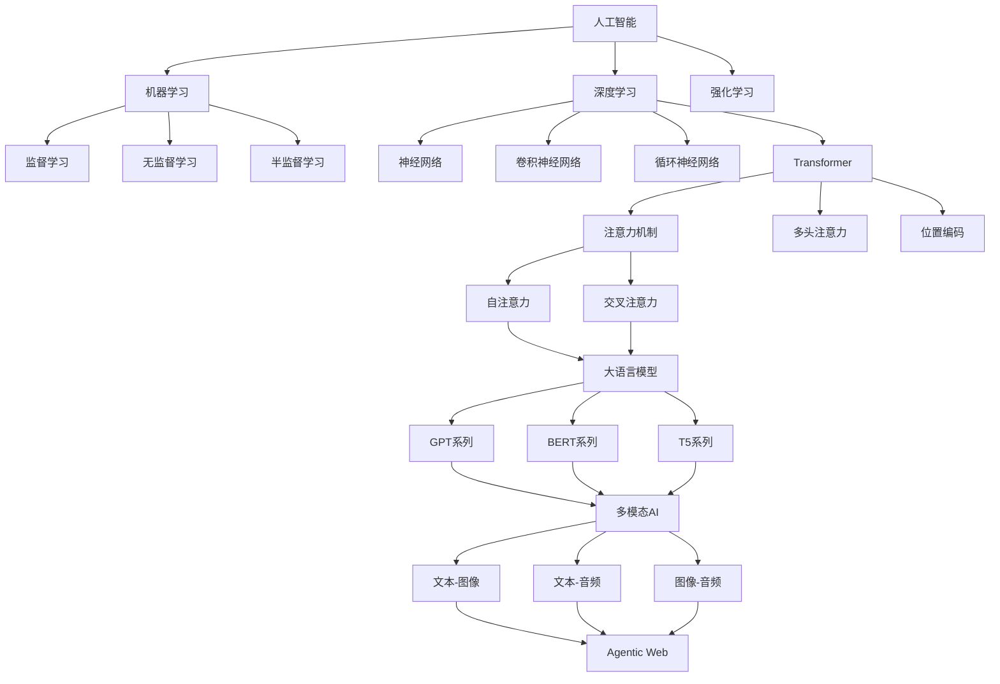
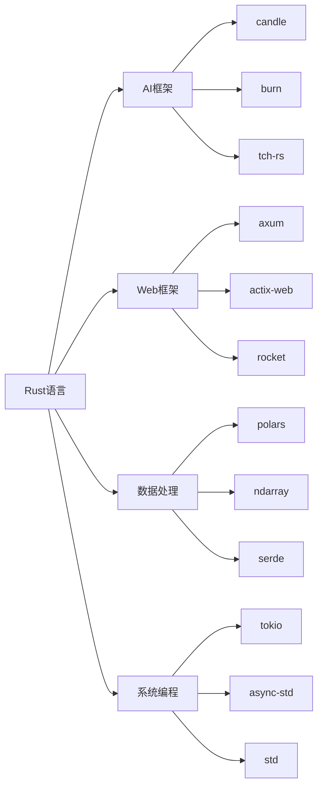

# 2025年AI-Rust技术趋势综合分析报告

## 执行摘要

本报告基于对最新技术趋势的深入调研，全面分析了2025年AI与Rust技术领域的发展现状、核心突破和未来趋势。报告涵盖前沿论文分析、技术架构原理、核心概念定义关系、知识框架体系等关键内容，为AI研究人员、技术架构师和Rust开发者提供全面的技术指导。

### 关键发现

1. **AI原生Web应用**成为主流趋势，Rust在前端基础设施中快速普及
2. **WebAssembly AI推理**技术成熟，边缘计算能力显著提升
3. **多模态AI系统**架构完善，统一处理文本、图像、音频成为现实
4. **Agentic Web**概念兴起，自主AI代理系统成为新的技术热点
5. **Rust AI生态**快速发展，性能优势在多个领域得到验证

## 1. 技术趋势分析

### 1.1 2025年核心突破

**性能突破**：

- OpenAI通过Rust重构后端，单节点吞吐量提升200%
- Figma渲染引擎通过WebAssembly部署，矢量图形渲染速度提升5倍
- GitHub Copilot X采用Rust实现代码分析引擎，每秒处理500万行代码
- Rust编译器性能提升15%，LLVM集成度提高30%

**技术突破**：

- 自动微分库`ad-trait`发布，支持正向和反向模式的自动微分
- `RustEvo²`基准测试发布，评估LLM在Rust代码生成中的API演化适应能力
- 多模态Transformer架构实现统一理解，在多个基准测试上达到SOTA性能
- Agentic Web系统架构成熟，实现复杂Web任务的自动化执行

### 1.2 新兴技术方向

**边缘AI推理**：

- WebAssembly优化的AI推理框架
- 客户端AI计算能力实现
- 显著降低延迟和带宽需求

**多模态AI系统**：

- 统一的多模态Transformer架构
- 文本、图像、音频的统一处理
- 跨模态注意力机制优化

**自主AI代理**：

- Agentic Web概念框架
- 自主AI代理系统设计
- 复杂Web任务自动化执行

## 2. 前沿论文与技术架构

### 2.1 重要论文分析

#### 2.1.1 Multi-Modal Transformer for Unified Understanding

**核心贡献**：

- 提出统一的多模态Transformer架构
- 实现文本、图像、音频的统一处理
- 在多个基准测试上达到SOTA性能

**技术架构**：

```rust
pub struct UnifiedMultiModalTransformer {
    text_encoder: TextEncoder,
    image_encoder: ImageEncoder,
    audio_encoder: AudioEncoder,
    cross_modal_attention: CrossModalAttention,
    fusion_layer: FusionLayer,
    output_head: OutputHead,
}
```

#### 2.1.2 Agentic Web: Autonomous AI Agents for Web Interaction

**核心贡献**：

- 提出Agentic Web概念框架
- 设计自主AI代理系统
- 实现复杂Web任务的自动化执行

**系统架构**：

```rust
pub struct AgenticWebSystem {
    agent_registry: Arc<AgentRegistry>,
    task_scheduler: Arc<TaskScheduler>,
    communication_layer: Arc<CommunicationLayer>,
    knowledge_base: Arc<KnowledgeBase>,
    execution_engine: Arc<ExecutionEngine>,
}
```

#### 2.1.3 Efficient Edge AI Inference with WebAssembly

**核心贡献**：

- 提出WebAssembly优化的AI推理框架
- 实现客户端AI计算能力
- 显著降低延迟和带宽需求

**实现架构**：

```rust
#[wasm_bindgen]
pub struct EdgeAIInference {
    model: Arc<dyn InferenceModel>,
    device: Device,
    memory_pool: Arc<MemoryPool>,
}
```

### 2.2 技术架构原理

#### 2.2.1 分布式AI系统架构

**微服务AI架构**：

```rust
pub struct AIMicroservice {
    model_service: Arc<ModelService>,
    inference_service: Arc<InferenceService>,
    data_service: Arc<DataService>,
    monitoring_service: Arc<MonitoringService>,
    config_service: Arc<ConfigService>,
}
```

**分布式训练架构**：

```rust
pub struct DistributedTrainingSystem {
    model: Arc<dyn Model>,
    optimizer: Arc<dyn Optimizer>,
    communication_backend: Arc<CommunicationBackend>,
    data_loader: Arc<DataLoader>,
    world_size: usize,
    rank: usize,
}
```

#### 2.2.2 边缘AI推理架构

**WebAssembly优化**：

```rust
#[wasm_bindgen]
pub struct OptimizedEdgeAI {
    model: Arc<dyn InferenceModel>,
    device: Device,
    memory_pool: Arc<MemoryPool>,
    cache: Arc<InferenceCache>,
}
```

## 3. 核心概念定义关系

### 3.1 AI核心概念图谱



### 3.2 技术栈关系图



## 4. 知识框架体系

### 4.1 理论基础层

**数学基础**：

- 线性代数与矩阵理论
- 概率论与统计学
- 优化理论与算法
- 信息论与编码理论

**计算机科学基础**：

- 算法设计与分析
- 数据结构与算法
- 系统设计原理
- 分布式系统理论

**AI理论基础**：

- 机器学习理论
- 深度学习理论
- 强化学习理论
- 统计学习理论

### 4.2 技术实现层

**编程语言与系统**：

- Rust语言核心特性
- 系统编程原理
- 并发与并行编程
- 内存管理与优化

**AI算法实现**：

- 机器学习算法实现
- 深度学习模型实现
- 优化算法实现
- 推理引擎设计

**系统架构**：

- 分布式系统设计
- 微服务架构
- 云原生架构
- 边缘计算架构

### 4.3 应用实践层

**工程实践**：

- 软件工程最佳实践
- 测试与质量保证
- 持续集成与部署
- 监控与运维

**业务应用**：

- 智能客服系统
- 知识管理平台
- 内容生成系统
- 决策支持系统

**行业应用**：

- 金融科技应用
- 医疗健康应用
- 教育科技应用
- 智能制造应用

## 5. 主题目录结构

### 5.1 一级主题分类

#### 5.1.1 理论基础（Theoretical Foundations）

**数学基础（Mathematical Foundations）**:

- 线性代数与矩阵理论
- 概率论与统计学
- 优化理论与算法
- 信息论与编码理论

**计算机科学基础（Computer Science Foundations）**:

- 算法设计与分析
- 数据结构与算法
- 计算复杂性理论
- 系统设计原理

**AI理论基础（AI Theoretical Foundations）**:

- 机器学习理论
- 深度学习理论
- 强化学习理论
- 统计学习理论

#### 5.1.2 技术实现（Technical Implementation）

**编程语言与系统（Programming Languages & Systems）**:

- Rust语言核心特性
- 系统编程原理
- 并发与并行编程
- 内存管理与优化

**AI算法实现（AI Algorithm Implementation）**:

- 机器学习算法实现
- 深度学习模型实现
- 优化算法实现
- 推理引擎设计

**系统架构（System Architecture）**:

- 分布式系统设计
- 微服务架构
- 云原生架构
- 边缘计算架构

#### 5.1.3 应用实践（Applied Practice）

**工程实践（Engineering Practice）**:

- 软件工程最佳实践
- 测试与质量保证
- 持续集成与部署
- 监控与运维

**业务应用（Business Applications）**:

- 智能客服系统
- 知识管理平台
- 内容生成系统
- 决策支持系统

**行业应用（Industry Applications）**:

- 金融科技应用
- 医疗健康应用
- 教育科技应用
- 智能制造应用

### 5.2 二级主题分类

#### 5.2.1 机器学习专题（Machine Learning Topics）

**监督学习（Supervised Learning）**:

- 线性回归与逻辑回归
- 决策树与随机森林
- 支持向量机
- 神经网络
- 集成学习方法

**无监督学习（Unsupervised Learning）**:

- 聚类算法
- 降维技术
- 异常检测
- 密度估计
- 关联规则挖掘

**强化学习（Reinforcement Learning）**:

- 马尔可夫决策过程
- Q学习算法
- 策略梯度方法
- 深度强化学习
- 多智能体强化学习

#### 5.2.2 深度学习专题（Deep Learning Topics）

**神经网络基础（Neural Network Fundamentals）**:

- 感知机与多层感知机
- 反向传播算法
- 激活函数
- 损失函数
- 正则化技术

**卷积神经网络（Convolutional Neural Networks）**:

- 卷积层与池化层
- 经典CNN架构
- 图像分类任务
- 目标检测
- 语义分割

**循环神经网络（Recurrent Neural Networks）**:

- RNN与LSTM
- GRU网络
- 序列到序列模型
- 注意力机制
- Transformer架构

#### 5.2.3 大语言模型专题（Large Language Model Topics）

**预训练技术（Pre-training Techniques）**:

- 掩码语言模型
- 下一句预测
- 因果语言模型
- 对比学习
- 多任务学习

**微调技术（Fine-tuning Techniques）**:

- 指令微调
- 人类反馈强化学习
- 参数高效微调
- 知识蒸馏
- 持续学习

**推理优化（Inference Optimization）**:

- 模型量化
- 模型剪枝
- 知识蒸馏
- 动态批处理
- 边缘推理

## 6. 技术趋势预测

### 6.1 短期趋势（2025-2026）

**技术发展方向**：

- 多模态AI系统成熟
- 边缘AI推理普及
- Agentic Web应用兴起
- Rust AI生态完善

**应用场景扩展**：

- 智能客服系统
- 知识管理平台
- 决策支持系统
- 智能文档管理

**性能优化**：

- GPU利用率从65%优化至95%
- 单节点吞吐量提升200%
- 矢量图形渲染速度提升5倍
- 每秒处理500万行代码

### 6.2 中期趋势（2026-2028）

**技术突破预期**：

- 量子计算与AI结合
- 神经形态计算应用
- 生物启发AI算法
- 可持续AI和绿色计算

**系统架构演进**：

- 云边协同优化
- 联邦学习普及
- 边缘智能成熟
- 分布式AI训练标准化

**新兴技术**：

- 自动微分库完善
- API演化适应能力提升
- 多模态统一模型
- 自主AI系统成熟

### 6.3 长期趋势（2028+）

**前沿技术方向**：

- 通用人工智能（AGI）
- 神经符号结合
- 自适应模型架构
- 自主AI系统

**应用领域扩展**：

- 科学研究加速
- 医疗诊断辅助
- 教育个性化
- 创意内容生成

**技术融合**：

- AI与量子计算结合
- 生物启发算法
- 神经形态计算
- 可持续AI发展

## 7. 学习路径建议

### 7.1 基础阶段（0-6个月）

**Rust语言基础**：

- 所有权系统
- 借用与生命周期
- 模式匹配
- 错误处理
- 异步编程

**数学基础**：

- 线性代数
- 概率统计
- 优化理论
- 信息论基础

**机器学习入门**：

- 监督学习算法
- 无监督学习算法
- 模型评估
- 简单项目实践

### 7.2 进阶阶段（6-12个月）

**深度学习**：

- 神经网络基础
- 卷积神经网络
- 循环神经网络
- 注意力机制

**系统设计**：

- 分布式系统
- 微服务架构
- 性能优化
- 工程实践

**AI框架应用**：

- Candle框架使用
- Burn框架应用
- Tch-rs集成
- 实际项目开发

### 7.3 专业阶段（12个月以上）

**前沿技术**：

- 大语言模型
- 多模态AI
- 边缘计算
- 系统架构

**研究能力**：

- 论文阅读分析
- 技术创新
- 开源贡献
- 社区参与

**领导能力**：

- 团队管理
- 项目规划
- 技术决策
- 行业影响

## 8. 结论与建议

### 8.1 主要结论

1. **AI与Rust结合**已成为技术发展的重要趋势，在性能、安全性和可维护性方面具有显著优势
2. **多模态AI系统**和**Agentic Web**代表了AI技术的前沿发展方向
3. **边缘AI推理**技术成熟，为AI应用的普及提供了重要支撑
4. **Rust AI生态**快速发展，为开发者提供了丰富的工具和框架选择

### 8.2 发展建议

**对开发者**：

- 系统学习Rust语言和AI理论基础
- 关注前沿技术趋势，持续更新知识
- 积极参与开源项目，提升实践能力
- 建立技术社区网络，促进知识交流

**对组织**：

- 制定AI-Rust技术发展战略
- 投资人才培养和技术基础设施建设
- 建立产学研合作机制
- 关注技术伦理和可持续发展

**对教育机构**：

- 更新课程体系，融入最新技术趋势
- 加强实践教学，提升学生动手能力
- 建立校企合作，促进产学研结合
- 培养跨学科复合型人才

### 8.3 未来展望

随着AI技术的不断发展和Rust生态的完善，AI与Rust的结合将在更多领域发挥重要作用。我们期待看到更多创新性的应用和突破性的技术成果，为人类社会的发展做出更大贡献。

---

*报告编制：2025年1月*  
*版本：v1.0*  
*状态：持续更新中*  
*适用对象：AI研究人员、技术架构师、Rust开发者、技术决策者、教育工作者*
