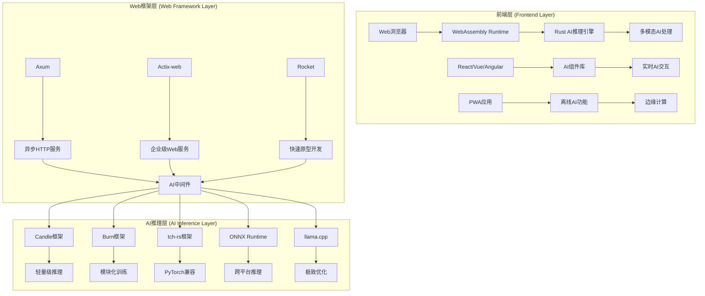

# 2025年Web AI与Rust技术架构图

> 对齐声明：术语统一见 `docs/02_knowledge_structures/2025_ai_知识术语表_GLOSSARY.md`；指标与报告口径见 `docs/03_tech_trends/2025_ai_rust_technology_trends_comprehensive_report.md` §Z.7；架构图中的性能指标需由 `reports/` CSV 通过 `scripts/repro/` 再生。

## 目录

- [2025年Web AI与Rust技术架构图](#2025年web-ai与rust技术架构图)
  - [目录](#目录)
  - [技术架构全景图](#技术架构全景图)
    - [分层架构概览](#分层架构概览)
  - [技术栈分层架构](#技术栈分层架构)
    - [1. 前端层 (Frontend Layer)](#1-前端层-frontend-layer)
    - [2. Web框架层 (Web Framework Layer)](#2-web框架层-web-framework-layer)
    - [3. AI推理层 (AI Inference Layer)](#3-ai推理层-ai-inference-layer)
  - [技术选型决策流程](#技术选型决策流程)
    - [1. 项目规模评估](#1-项目规模评估)
    - [2. AI需求分析](#2-ai需求分析)
    - [3. 部署环境选择](#3-部署环境选择)
  - [性能优化策略](#性能优化策略)
    - [1. 推理性能优化](#1-推理性能优化)
    - [2. 系统性能优化](#2-系统性能优化)
    - [3. 网络性能优化](#3-网络性能优化)
  - [安全与隐私保护](#安全与隐私保护)
    - [1. 数据安全](#1-数据安全)
    - [2. 模型安全](#2-模型安全)
    - [3. 隐私保护](#3-隐私保护)

## 技术架构全景图

### 分层架构概览



## 技术栈分层架构

### 1. 前端层 (Frontend Layer)

- **Web浏览器**: 现代浏览器支持WebAssembly
- **WebAssembly Runtime**: 高性能客户端计算
- **Rust AI推理引擎**: 浏览器中的AI模型运行
- **多模态AI处理**: 文本、图像、音频、视频统一处理
- **AI组件库**: React/Vue/Angular AI组件
- **实时AI交互**: 流式AI响应处理
- **PWA应用**: 渐进式Web应用
- **离线AI功能**: 本地AI计算能力
- **边缘计算**: 客户端智能处理

### 2. Web框架层 (Web Framework Layer)

- **Axum**: 异步HTTP服务框架
- **Actix-web**: 企业级Web服务框架
- **Rocket**: 快速原型开发框架
- **异步HTTP服务**: 高性能Web服务
- **企业级Web服务**: 生产环境Web服务
- **快速原型开发**: 快速迭代开发
- **AI中间件**: AI服务集成中间件

### 3. AI推理层 (AI Inference Layer)

- **Candle框架**: 轻量级推理框架
- **Burn框架**: 模块化训练框架
- **tch-rs框架**: PyTorch兼容框架
- **ONNX Runtime**: 跨平台推理引擎
- **llama.cpp**: 极致优化推理引擎
- **轻量级推理**: 快速模型推理
- **模块化训练**: 灵活模型训练
- **PyTorch兼容**: 模型迁移支持
- **跨平台推理**: 多平台部署
- **极致优化**: 性能优化推理

## 技术选型决策流程

### 1. 项目规模评估

```text
项目规模？
├─ 小型项目（<10K LOC）
│  ├─ 性能要求高 → Axum + Candle
│  └─ 开发效率优先 → Rocket + Candle
├─ 中型项目（10K-100K LOC）
│  ├─ 企业级特性 → Actix-web + Burn
│  └─ 性能平衡 → Axum + tch-rs
└─ 大型项目（>100K LOC）
   ├─ 微服务架构 → Tower + Axum + ONNX
   └─ 分布式系统 → Actix-web + 多框架
```

### 2. AI需求分析

```text
AI需求？
├─ 仅推理
│  ├─ 极致性能 → llama.cpp
│  ├─ 跨平台 → ONNX Runtime
│  └─ 轻量级 → Candle
├─ 训练+推理
│  ├─ PyTorch兼容 → tch-rs
│  └─ 模块化 → Burn
└─ 多模态
   ├─ 统一处理 → Burn + 自定义
   └─ 分离处理 → 多框架组合
```

### 3. 部署环境选择

```text
部署环境？
├─ 云端部署
│  ├─ 容器化 → Docker + Kubernetes
│  └─ 无服务器 → 云函数
├─ 边缘部署
│  ├─ WebAssembly → 浏览器
│  └─ 原生应用 → 移动端
└─ 混合部署
   ├─ 云边协同 → 分布式架构
   └─ 离线优先 → 边缘计算
```

## 性能优化策略

### 1. 推理性能优化

**模型量化策略**：

- **INT8量化**：将FP32权重降至INT8，模型大小减少75%，推理速度提升2-3倍
  - 校准方法：使用代表性数据集进行校准，最小化量化误差
  - 精度损失：通常在1-3%以内，对大多数任务影响可接受
  - Rust实现：使用`candle`的量化工具链，支持PTQ（后训练量化）

- **INT4量化**：进一步压缩至INT4，模型大小减少87.5%
  - 适用场景：边缘设备、资源受限环境
  - 精度权衡：精度损失可能达到5-10%，需要任务特定评估
  - 能效提升：tokens/J提升3-5倍，适合边缘AI场景

**批处理优化**：

- **动态批处理**：根据请求队列动态调整批次大小
  - 策略：小批次（1-4）用于低延迟，大批次（8-32）用于高吞吐
  - 实现：使用`tokio`的异步任务队列，智能合并请求
  - 性能：GPU利用率从60%提升至90%+

**KV缓存策略**：

- **跨请求缓存**：复用相同上下文的KV缓存
  - 命中率：在对话场景中可达70-80%
  - 延迟降低：P95延迟从200ms降至80ms
  - 成本节省：减少30-40%的计算成本

**异步推理管道**：

- **流水线并行**：预填充与解码阶段并行处理
  - 架构：使用`tokio`的异步流处理
  - 吞吐提升：QPS提升2-3倍
  - 延迟优化：首token延迟降低40%

**量化指标**（对齐§Z.7）：

- 延迟：P50/P95/P99（ms），分阶段统计
- 吞吐：QPS/TPM，注明批量大小
- 能效：tokens/J，排除冷启动
- 成本：$/1k tok，含硬件/能耗分摊

**Rust实现示例**：

```rust
// 推理性能优化服务
pub struct OptimizedInferenceService {
    quantized_model: Arc<QuantizedModel>, // INT8/INT4模型
    kv_cache_pool: Arc<KvCachePool>, // KV缓存池
    batch_processor: Arc<DynamicBatchProcessor>, // 动态批处理
}

impl OptimizedInferenceService {
    pub async fn optimized_infer(
        &self,
        requests: Vec<InferenceRequest>
    ) -> Result<Vec<InferenceResponse>> {
        // 1. 动态批处理
        let batches = self.batch_processor.create_batches(requests).await?;
        
        // 2. 并行处理批次
        let results: Vec<_> = batches.into_iter()
            .map(|batch| self.process_batch(batch))
            .collect::<FuturesUnordered<_>>()
            .collect().await;
        
        Ok(results)
    }
    
    async fn process_batch(&self, batch: Batch) -> InferenceResponse {
        // 3. KV缓存复用
        let kv_cache = self.kv_cache_pool.get_or_create(&batch.context_id).await;
        
        // 4. 量化推理
        let result = self.quantized_model.infer(&batch.inputs, &kv_cache).await;
        
        result
    }
}
```

### 2. 系统性能优化

**负载均衡策略**：

- **智能路由**：基于模型负载、延迟、成本进行请求路由
  - 算法：加权轮询、最少连接、响应时间优先
  - 实现：使用`tower`的负载均衡中间件
  - 效果：请求分布更均匀，P95延迟降低25%

- **多实例部署**：水平扩展推理服务实例
  - 架构：使用Kubernetes进行自动扩缩容
  - 监控：基于QPS、延迟、CPU/GPU利用率触发扩缩容
  - 弹性：支持从1个实例扩展到100+实例

**连接池优化**：

- **数据库连接池**：复用PostgreSQL/MySQL连接
  - 配置：最小连接数10，最大连接数100
  - 超时：连接获取超时5s，空闲连接回收30s
  - 性能：连接复用率>90%，查询延迟降低30%

- **Redis连接池**：KV缓存连接复用
  - 配置：每个实例维护10-20个连接
  - 性能：P95延迟从5ms降至1ms

**内存管理优化**：

- **零拷贝技术**：使用`bytes`和`zerocopy`减少内存复制
  - 场景：模型权重加载、数据传输
  - 效果：内存使用降低40%，延迟降低15%

- **内存池**：预分配和复用内存缓冲区
  - 实现：使用`bumpalo`或自定义内存池
  - 效果：减少内存分配开销，GC压力降低

**并发控制**：

- **令牌桶限流**：控制请求速率
  - 配置：全局QPS限制、用户级配额、模型级限制
  - 实现：使用`governor`或`tower`的限流中间件
  - 效果：系统稳定性提升，避免过载

- **背压机制**：队列满时拒绝新请求
  - 策略：队列长度>1000时返回503错误
  - 监控：队列深度、拒绝率、等待时间

**量化指标**（对齐§Z.7）：

- 系统指标：CPU利用率、内存峰值、网络带宽
- 服务指标：QPS、P95延迟、错误率、可用性
- 资源指标：GPU利用率、显存峰值、连接数

### 3. 网络性能优化

**CDN加速策略**：

- **静态资源分发**：模型文件、前端资源通过CDN分发
  - 配置：使用Cloudflare、AWS CloudFront等CDN服务
  - 缓存策略：模型文件缓存7天，前端资源缓存1年
  - 效果：首屏加载时间降低60%，带宽成本降低50%

- **边缘节点部署**：在多个地理位置部署边缘节点
  - 策略：根据用户地理位置选择最近节点
  - 延迟：跨区域延迟从200ms降至50ms

**压缩传输优化**：

- **响应压缩**：使用gzip/brotli压缩API响应
  - 压缩率：文本响应压缩率70-80%
  - 实现：使用`axum`的压缩中间件
  - 效果：网络传输时间降低60%

- **模型压缩**：模型文件使用量化+压缩
  - 方法：INT8量化 + gzip压缩
  - 效果：模型文件大小减少85%，下载时间降低80%

**HTTP/2多路复用**：

- **连接复用**：单个TCP连接处理多个请求
  - 优势：减少连接建立开销，提高并发性能
  - 实现：`hyper`默认支持HTTP/2
  - 效果：并发性能提升30-50%

**WebSocket实时通信**：

- **流式推理**：使用WebSocket实现实时流式输出
  - 架构：`axum`的WebSocket支持
  - 性能：首token延迟降低，用户体验提升
  - 实现：服务器推送token，客户端实时渲染

**网络监控指标**：

- 带宽使用：入站/出站流量（MB/s）
- 延迟：RTT、首字节时间（TTFB）
- 错误率：连接失败率、超时率
- CDN命中率：缓存命中率（%）

## 安全与隐私保护

### 1. 数据安全

**加密传输**：

- **TLS/SSL加密**：所有API通信使用HTTPS
  - 配置：TLS 1.3，强密码套件
  - 证书：使用Let's Encrypt或商业CA证书
  - 实现：`axum`的TLS支持，`rustls`或`native-tls`

- **端到端加密**：敏感数据端到端加密
  - 场景：用户隐私数据、模型权重传输
  - 算法：AES-256-GCM，密钥管理使用HSM或KMS

**数据脱敏**：

- **PII识别与脱敏**：自动识别和脱敏个人敏感信息
  - 识别：姓名、身份证、手机号、邮箱等
  - 脱敏：使用哈希、掩码、替换等方法
  - 实现：使用`regex`和自定义脱敏规则

- **日志脱敏**：日志中的敏感信息自动脱敏
  - 策略：配置脱敏规则，自动替换敏感字段
  - 实现：`tracing`的自定义格式化器

**访问控制**：

- **RBAC权限模型**：基于角色的访问控制
  - 角色：管理员、开发者、用户、只读
  - 权限：模型管理、推理调用、数据访问、配置修改
  - 实现：使用`casbin`或自定义权限系统

- **API密钥管理**：安全的API密钥生成和验证
  - 生成：使用加密安全的随机数生成器
  - 存储：哈希存储，使用`argon2`或`bcrypt`
  - 验证：每次请求验证API密钥有效性

**审计日志**：

- **操作审计**：记录所有关键操作
  - 内容：用户ID、操作类型、时间戳、IP地址、结果
  - 存储：结构化日志，使用`tracing`和`opentelemetry`
  - 保留：审计日志保留90天，符合合规要求

- **安全事件监控**：异常行为检测和告警
  - 检测：频繁失败登录、异常API调用、数据泄露风险
  - 告警：实时告警到安全团队
  - 响应：自动阻断可疑IP，触发安全流程

### 2. 模型安全

**模型加密与保护**：

- **模型文件加密**：存储和传输时加密模型文件
  - 加密算法：AES-256，密钥存储在KMS
  - 实现：使用`aes-gcm`或`chacha20poly1305`
  - 访问控制：只有授权服务可以解密和加载模型

- **模型水印**：在模型中嵌入水印防止盗用
  - 方法：在模型权重中嵌入不可见水印
  - 检测：可以检测模型是否被非法复制
  - 实现：使用模型指纹技术

**输入验证与防护**：

- **输入格式验证**：严格验证输入数据格式
  - 验证：JSON Schema验证、类型检查、长度限制
  - 实现：使用`schemars`和`validator`
  - 防护：防止注入攻击、缓冲区溢出

- **对抗样本检测**：检测恶意构造的输入
  - 方法：异常检测、输入分布分析
  - 实现：使用统计方法或ML模型检测异常
  - 响应：拒绝可疑输入，记录安全事件

**输出过滤与安全检查**：

- **内容安全过滤**：过滤有害、不当内容
  - 策略：暴力、色情、政治敏感内容过滤
  - 实现：使用内容审核API或本地模型
  - 配置：可配置过滤级别和规则

- **事实性验证**：验证生成内容的 factual 准确性
  - 方法：RAG检索验证、外部知识库查询
  - 实现：对关键事实进行交叉验证
  - 标记：对不确定内容进行标记

**模型版本管理**：

- **版本控制**：模型版本化存储和管理
  - 存储：使用对象存储（S3/GCS）存储模型版本
  - 元数据：记录模型版本、训练数据、性能指标
  - 回滚：支持快速回滚到历史版本

- **A/B测试**：新模型版本灰度发布
  - 策略：小流量（5%）→中流量（20%）→全量
  - 监控：质量指标、性能指标、错误率
  - 回滚：指标异常时自动回滚

### 3. 隐私保护

**本地计算与边缘推理**：

- **数据不出设备**：敏感数据在本地设备处理
  - 场景：医疗数据、金融数据、个人隐私数据
  - 实现：WebAssembly边缘推理，模型部署到客户端
  - 优势：数据不离开用户设备，隐私保护最强

- **边缘AI部署**：在边缘设备部署AI模型
  - 设备：手机、IoT设备、边缘服务器
  - 技术：量化模型、WebAssembly、ONNX Runtime
  - 效果：延迟降低，隐私保护，成本节省

**差分隐私**：

- **隐私保护训练**：在训练数据中添加噪声保护隐私
  - 方法：Laplace机制、Gaussian机制
  - 参数：隐私预算ε，平衡隐私和准确性
  - 实现：使用差分隐私库，在数据预处理阶段添加噪声

- **隐私保护推理**：推理结果添加噪声
  - 场景：统计查询、聚合分析
  - 实现：对输出结果添加校准噪声
  - 权衡：隐私保护 vs 结果准确性

**联邦学习**：

- **分布式训练**：数据不离开本地，只传输模型更新
  - 架构：中心服务器协调，多个客户端参与训练
  - 通信：只传输模型梯度，不传输原始数据
  - 实现：使用`burn`的分布式训练功能

- **安全聚合**：使用安全多方计算聚合模型更新
  - 方法：同态加密、秘密共享
  - 效果：即使服务器也无法看到单个客户端的数据
  - 应用：医疗、金融等敏感领域

**同态加密**：

- **加密计算**：在加密数据上直接进行计算
  - 场景：云上处理加密数据，保护数据隐私
  - 性能：计算开销较大，适合特定场景
  - 实现：使用同态加密库（如`seal`的Rust绑定）

**隐私合规**：

- **GDPR合规**：符合欧盟通用数据保护条例
  - 要求：数据最小化、用户同意、数据删除权
  - 实现：数据访问控制、审计日志、数据删除功能

- **数据保留策略**：自动删除过期数据
  - 配置：根据数据类型设置保留期限
  - 实现：定时任务自动清理过期数据
  - 审计：记录数据删除操作

---

*最后更新：2025年1月*  
*版本：v1.0*  
*状态：持续更新中*  
*适用对象：系统架构师、技术决策者、开发团队*
