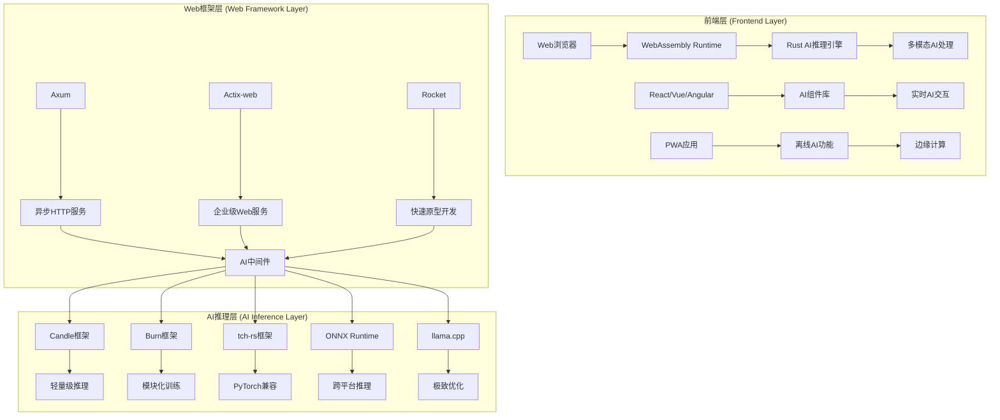

# 2025年Web AI与Rust技术架构图

## 目录

- [2025年Web AI与Rust技术架构图](#2025年web-ai与rust技术架构图)
  - [目录](#目录)
  - [技术架构全景图](#技术架构全景图)
    - [分层架构概览](#分层架构概览)
  - [技术栈分层架构](#技术栈分层架构)
    - [1. 前端层 (Frontend Layer)](#1-前端层-frontend-layer)
    - [2. Web框架层 (Web Framework Layer)](#2-web框架层-web-framework-layer)
    - [3. AI推理层 (AI Inference Layer)](#3-ai推理层-ai-inference-layer)
  - [技术选型决策流程](#技术选型决策流程)
    - [1. 项目规模评估](#1-项目规模评估)
    - [2. AI需求分析](#2-ai需求分析)
    - [3. 部署环境选择](#3-部署环境选择)
  - [性能优化策略](#性能优化策略)
    - [1. 推理性能优化](#1-推理性能优化)
    - [2. 系统性能优化](#2-系统性能优化)
    - [3. 网络性能优化](#3-网络性能优化)
  - [安全与隐私保护](#安全与隐私保护)
    - [1. 数据安全](#1-数据安全)
    - [2. 模型安全](#2-模型安全)
    - [3. 隐私保护](#3-隐私保护)

## 技术架构全景图

### 分层架构概览



## 技术栈分层架构

### 1. 前端层 (Frontend Layer)

- **Web浏览器**: 现代浏览器支持WebAssembly
- **WebAssembly Runtime**: 高性能客户端计算
- **Rust AI推理引擎**: 浏览器中的AI模型运行
- **多模态AI处理**: 文本、图像、音频、视频统一处理
- **AI组件库**: React/Vue/Angular AI组件
- **实时AI交互**: 流式AI响应处理
- **PWA应用**: 渐进式Web应用
- **离线AI功能**: 本地AI计算能力
- **边缘计算**: 客户端智能处理

### 2. Web框架层 (Web Framework Layer)

- **Axum**: 异步HTTP服务框架
- **Actix-web**: 企业级Web服务框架
- **Rocket**: 快速原型开发框架
- **异步HTTP服务**: 高性能Web服务
- **企业级Web服务**: 生产环境Web服务
- **快速原型开发**: 快速迭代开发
- **AI中间件**: AI服务集成中间件

### 3. AI推理层 (AI Inference Layer)

- **Candle框架**: 轻量级推理框架
- **Burn框架**: 模块化训练框架
- **tch-rs框架**: PyTorch兼容框架
- **ONNX Runtime**: 跨平台推理引擎
- **llama.cpp**: 极致优化推理引擎
- **轻量级推理**: 快速模型推理
- **模块化训练**: 灵活模型训练
- **PyTorch兼容**: 模型迁移支持
- **跨平台推理**: 多平台部署
- **极致优化**: 性能优化推理

## 技术选型决策流程

### 1. 项目规模评估

```text
项目规模？
├─ 小型项目（<10K LOC）
│  ├─ 性能要求高 → Axum + Candle
│  └─ 开发效率优先 → Rocket + Candle
├─ 中型项目（10K-100K LOC）
│  ├─ 企业级特性 → Actix-web + Burn
│  └─ 性能平衡 → Axum + tch-rs
└─ 大型项目（>100K LOC）
   ├─ 微服务架构 → Tower + Axum + ONNX
   └─ 分布式系统 → Actix-web + 多框架
```

### 2. AI需求分析

```text
AI需求？
├─ 仅推理
│  ├─ 极致性能 → llama.cpp
│  ├─ 跨平台 → ONNX Runtime
│  └─ 轻量级 → Candle
├─ 训练+推理
│  ├─ PyTorch兼容 → tch-rs
│  └─ 模块化 → Burn
└─ 多模态
   ├─ 统一处理 → Burn + 自定义
   └─ 分离处理 → 多框架组合
```

### 3. 部署环境选择

```text
部署环境？
├─ 云端部署
│  ├─ 容器化 → Docker + Kubernetes
│  └─ 无服务器 → 云函数
├─ 边缘部署
│  ├─ WebAssembly → 浏览器
│  └─ 原生应用 → 移动端
└─ 混合部署
   ├─ 云边协同 → 分布式架构
   └─ 离线优先 → 边缘计算
```

## 性能优化策略

### 1. 推理性能优化

- **模型量化**: 减少模型大小和计算量
- **批处理**: 提高GPU利用率
- **缓存策略**: 减少重复计算
- **异步处理**: 提高并发能力

### 2. 系统性能优化

- **负载均衡**: 分散请求压力
- **连接池**: 复用数据库连接
- **内存管理**: 优化内存使用
- **并发控制**: 控制并发数量

### 3. 网络性能优化

- **CDN加速**: 静态资源分发
- **压缩传输**: 减少网络传输
- **HTTP/2**: 多路复用
- **WebSocket**: 实时通信

## 安全与隐私保护

### 1. 数据安全

- **加密传输**: TLS/SSL加密
- **数据脱敏**: 敏感信息保护
- **访问控制**: 权限管理
- **审计日志**: 操作记录

### 2. 模型安全

- **模型加密**: 模型文件保护
- **输入验证**: 防止恶意输入
- **输出过滤**: 结果安全检查
- **版本控制**: 模型版本管理

### 3. 隐私保护

- **本地计算**: 数据不出设备
- **差分隐私**: 隐私保护算法
- **联邦学习**: 分布式训练
- **同态加密**: 加密计算

---

*最后更新：2025年1月*  
*版本：v1.0*  
*状态：持续更新中*  
*适用对象：系统架构师、技术决策者、开发团队*
