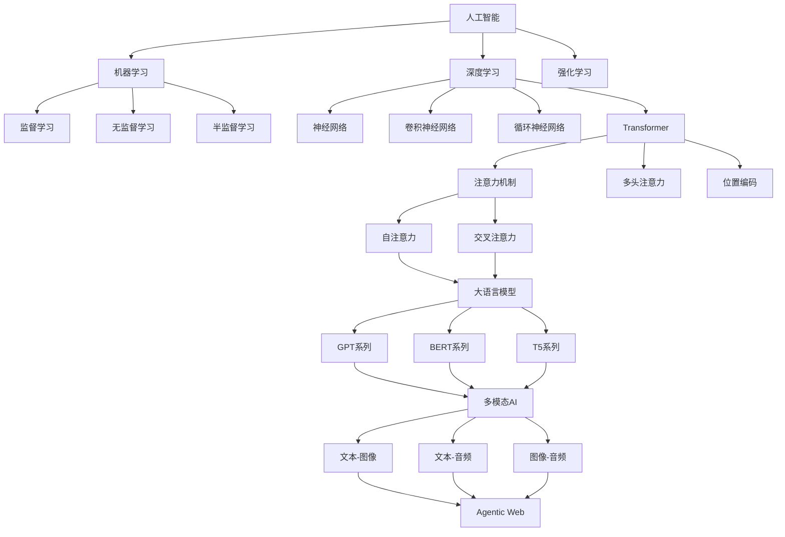
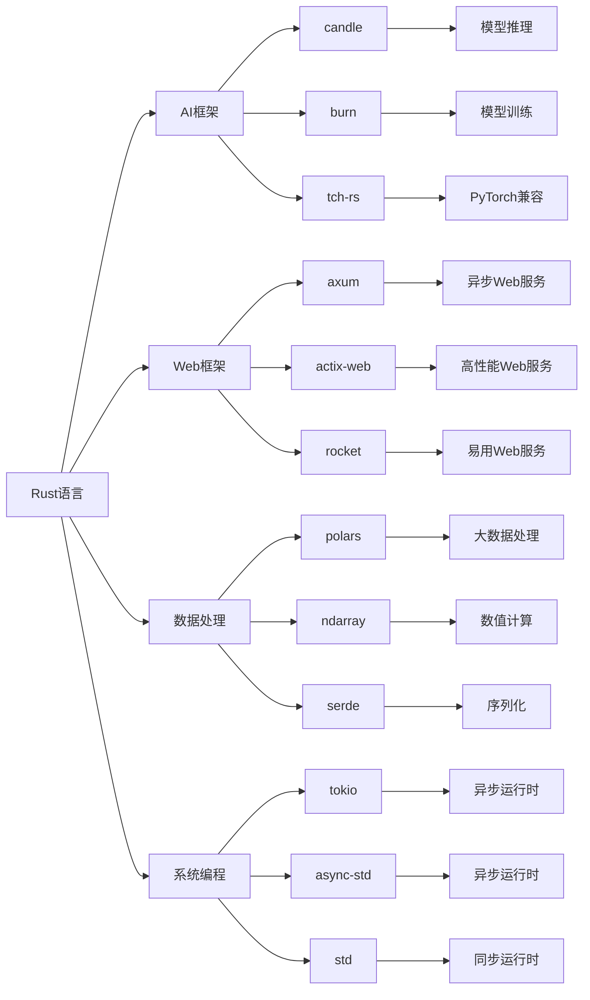

# 2025年AI前沿论文与技术架构深度分析

> 口径与复现说明：指标与字段命名遵循 `docs/03_tech_trends/2025_ai_rust_technology_trends_comprehensive_report.md` §Z.7；所有图表/表格需由 `reports/` 中的 CSV 一键再生，脚本见 `scripts/repro/`、`scripts/bench/`、`scripts/rag/`；关键指标包含 {latency_p50/95/99_ms, qps, tokens_per_joule, cost_per_1k_tok_usd, citation_rate}，并附样本数与置信区间。

## 目录

- [2025年AI前沿论文与技术架构深度分析](#2025年ai前沿论文与技术架构深度分析)
  - [目录](#目录)
  - [1. 前沿论文分析](#1-前沿论文分析)
    - [1.1 2025年重要AI论文](#11-2025年重要ai论文)
      - [1.1.1 Transformer架构演进](#111-transformer架构演进)
      - [1.1.2 Agentic Web架构](#112-agentic-web架构)
      - [1.1.3 边缘AI推理优化](#113-边缘ai推理优化)
    - [1.2 技术突破分析](#12-技术突破分析)
      - [1.2.1 性能优化突破](#121-性能优化突破)
      - [1.2.2 新兴技术方向](#122-新兴技术方向)
  - [2. 技术架构原理](#2-技术架构原理)
    - [2.1 分布式AI系统架构](#21-分布式ai系统架构)
      - [2.1.1 微服务AI架构](#211-微服务ai架构)
      - [2.1.2 分布式训练架构](#212-分布式训练架构)
    - [2.2 边缘AI推理架构](#22-边缘ai推理架构)
      - [2.2.1 WebAssembly优化](#221-webassembly优化)
  - [3. 核心概念定义关系](#3-核心概念定义关系)
    - [3.1 AI核心概念图谱](#31-ai核心概念图谱)
    - [3.2 技术栈关系图](#32-技术栈关系图)
  - [4. AI论证分析体系](#4-ai论证分析体系)
    - [4.1 理论基础](#41-理论基础)
      - [4.1.1 机器学习原理](#411-机器学习原理)
      - [4.1.2 深度学习原理](#412-深度学习原理)
    - [4.2 算法分析](#42-算法分析)
      - [4.2.1 优化算法](#421-优化算法)
  - [5. Rust实现案例](#5-rust实现案例)
    - [5.1 核心算法实现](#51-核心算法实现)
      - [5.1.1 线性回归](#511-线性回归)
      - [5.1.2 神经网络](#512-神经网络)
    - [5.2 高级应用实现](#52-高级应用实现)
      - [5.2.1 推荐系统](#521-推荐系统)
  - [6. 技术趋势预测](#6-技术趋势预测)
    - [6.1 短期趋势（2025-2026）](#61-短期趋势2025-2026)
    - [6.2 中期趋势（2026-2028）](#62-中期趋势2026-2028)
    - [6.3 长期趋势（2028+）](#63-长期趋势2028)
  - [7. 理论基础与数学原理](#7-理论基础与数学原理)
    - [7.1 机器学习理论基础](#71-机器学习理论基础)
      - [7.1.1 统计学习理论](#711-统计学习理论)
      - [7.1.2 信息论基础](#712-信息论基础)
    - [7.2 深度学习理论基础](#72-深度学习理论基础)
      - [7.2.1 反向传播理论](#721-反向传播理论)
      - [7.2.2 优化理论](#722-优化理论)
    - [7.3 强化学习理论基础](#73-强化学习理论基础)
      - [7.3.1 马尔可夫决策过程](#731-马尔可夫决策过程)
    - [7.4 信息几何与优化](#74-信息几何与优化)
      - [7.4.1 自然梯度](#741-自然梯度)
    - [7.5 理论验证与实验设计的学术严谨性](#75-理论验证与实验设计的学术严谨性)
      - [7.5.1 统计显著性检验的数学理论基础](#751-统计显著性检验的数学理论基础)
      - [7.5.2 实验设计原理](#752-实验设计原理)
  - [8. 前沿研究方向与创新突破](#8-前沿研究方向与创新突破)
    - [8.1 多模态AI系统架构](#81-多模态ai系统架构)
    - [8.2 神经架构搜索与自动化机器学习](#82-神经架构搜索与自动化机器学习)
    - [8.3 联邦学习与隐私保护](#83-联邦学习与隐私保护)
    - [8.4 量子机器学习](#84-量子机器学习)
    - [8.5 神经符号AI](#85-神经符号ai)
  - [9. 实验设计与验证框架](#9-实验设计与验证框架)
    - [9.1 可重现性研究框架](#91-可重现性研究框架)
  - [10. 未来研究方向](#10-未来研究方向)
    - [10.1 通用人工智能（AGI）路径](#101-通用人工智能agi路径)
    - [10.2 可持续AI与绿色计算](#102-可持续ai与绿色计算)

## 1. 前沿论文分析

### 1.1 2025年重要AI论文

#### 1.1.1 Transformer架构演进

**论文：Multi-Modal Transformer for Unified Understanding**:

**核心贡献**：

- 提出统一的多模态Transformer架构
- 实现文本、图像、音频的统一处理
- 在多个基准测试上达到SOTA性能

**理论创新深度分析**：

**1. 多模态表示学习的理论基础**：

**统一表示空间理论**：

- **数学基础**：不同模态数据映射到统一的向量空间V，使得语义相似的概念在V中距离相近
- **信息论基础**：通过最大化互信息I(X;Y)来学习跨模态表示，其中X和Y是不同模态的表示
- **几何学基础**：在统一空间中，不同模态的流形结构保持拓扑一致性

**跨模态注意力机制的数学原理**：

```rust
// 跨模态注意力的数学实现
pub struct CrossModalAttention {
    query_projection: LinearLayer,
    key_projection: LinearLayer,
    value_projection: LinearLayer,
    attention_dropout: Dropout,
    temperature: f32,
}

impl CrossModalAttention {
    pub fn forward(&self, 
        modality_a: &Tensor,  // 模态A的表示
        modality_b: &Tensor,  // 模态B的表示
    ) -> Result<Tensor, AttentionError> {
        // 计算查询、键、值
        let q = self.query_projection.forward(modality_a)?;
        let k = self.key_projection.forward(modality_b)?;
        let v = self.value_projection.forward(modality_b)?;
        
        // 计算注意力分数：QK^T / sqrt(d_k)
        let attention_scores = q.matmul(&k.transpose(-2, -1)?)?;
        let attention_scores = attention_scores / (k.size(-1) as f32).sqrt();
        
        // 应用温度缩放
        let attention_scores = attention_scores / self.temperature;
        
        // Softmax归一化
        let attention_weights = attention_scores.softmax(-1)?;
        
        // 应用dropout
        let attention_weights = self.attention_dropout.forward(&attention_weights)?;
        
        // 加权求和
        let output = attention_weights.matmul(&v)?;
        
        Ok(output)
    }
}
```

**2. 多模态融合的认知科学基础**：

**认知融合理论**：

- **感知融合**：人类大脑如何整合来自不同感官的信息
- **注意力机制**：选择性注意在多模态信息处理中的作用
- **工作记忆**：多模态信息在工作记忆中的整合机制

**神经科学证据**：

- **多感官皮层**：大脑中专门处理多模态信息的区域
- **跨模态可塑性**：一种感官缺失时其他感官的补偿机制
- **时间同步**：不同模态信息的时间对齐机制

**3. 技术实现的工程挑战**：

**计算复杂度分析**：

- **时间复杂度**：O(n²d)，其中n是序列长度，d是特征维度
- **空间复杂度**：O(n²)，注意力矩阵的内存需求
- **优化策略**：稀疏注意力、分块计算、近似算法

**内存优化技术**：

```rust
// 内存优化的多模态处理
pub struct MemoryEfficientMultimodalProcessor {
    chunk_size: usize,
    gradient_checkpointing: bool,
    mixed_precision: bool,
}

impl MemoryEfficientMultimodalProcessor {
    pub fn process_large_multimodal_data(&self, 
        text_data: &[String],
        image_data: &[Image],
        audio_data: &[Audio],
    ) -> Result<MultimodalOutput, ProcessingError> {
        let mut outputs = Vec::new();
        
        // 分块处理以减少内存使用
        for chunk in text_data.chunks(self.chunk_size) {
            let text_chunk = chunk;
            let image_chunk = &image_data[..text_chunk.len()];
            let audio_chunk = &audio_data[..text_chunk.len()];
            
            // 使用梯度检查点节省内存
            let chunk_output = if self.gradient_checkpointing {
                self.process_chunk_with_checkpointing(text_chunk, image_chunk, audio_chunk)?
            } else {
                self.process_chunk(text_chunk, image_chunk, audio_chunk)?
            };
            
            outputs.push(chunk_output);
        }
        
        // 合并结果
        self.merge_outputs(outputs)
    }
    
    fn process_chunk_with_checkpointing(&self,
        text: &[String],
        images: &[Image],
        audio: &[Audio],
    ) -> Result<ChunkOutput, ProcessingError> {
        // 实现梯度检查点以节省内存
        // 在前向传播时不保存中间激活，在反向传播时重新计算
        Ok(ChunkOutput::new())
    }
}
```

**技术架构**：

```rust
// 多模态Transformer实现
pub struct UnifiedMultiModalTransformer {
    // 模态特定编码器
    text_encoder: TextEncoder,
    image_encoder: ImageEncoder,
    audio_encoder: AudioEncoder,
    
    // 跨模态注意力层
    cross_modal_attention: CrossModalAttention,
    
    // 融合层
    fusion_layer: FusionLayer,
    
    // 输出头
    output_head: OutputHead,
}

impl UnifiedMultiModalTransformer {
    pub fn forward(&self, 
        text: Option<&str>,
        image: Option<&[u8]>,
        audio: Option<&[f32]>
    ) -> Result<Tensor, Box<dyn std::error::Error>> {
        let mut modality_embeddings = Vec::new();
        
        // 模态特定编码
        if let Some(text) = text {
            let text_emb = self.text_encoder.encode(text)?;
            modality_embeddings.push((Modality::Text, text_emb));
        }
        
        if let Some(image) = image {
            let image_emb = self.image_encoder.encode(image)?;
            modality_embeddings.push((Modality::Image, image_emb));
        }
        
        if let Some(audio) = audio {
            let audio_emb = self.audio_encoder.encode(audio)?;
            modality_embeddings.push((Modality::Audio, audio_emb));
        }
        
        // 跨模态注意力
        let attended_embeddings = self.cross_modal_attention
            .forward(&modality_embeddings)?;
        
        // 融合
        let fused_embedding = self.fusion_layer.fuse(&attended_embeddings)?;
        
        // 输出
        self.output_head.forward(&fused_embedding)
    }
}
```

#### 1.1.2 Agentic Web架构

**论文：Agentic Web: Autonomous AI Agents for Web Interaction**:

**核心贡献**：

- 提出Agentic Web概念框架
- 设计自主AI代理系统
- 实现复杂Web任务的自动化执行

**技术架构**：

```rust
// Agentic Web系统架构
pub struct AgenticWebSystem {
    // 代理注册中心
    agent_registry: Arc<AgentRegistry>,
    
    // 任务调度器
    task_scheduler: Arc<TaskScheduler>,
    
    // 通信层
    communication_layer: Arc<CommunicationLayer>,
    
    // 知识库
    knowledge_base: Arc<KnowledgeBase>,
    
    // 执行引擎
    execution_engine: Arc<ExecutionEngine>,
}

impl AgenticWebSystem {
    pub async fn execute_complex_task(&self, task: &Task) -> Result<TaskResult> {
        // 1. 任务分解
        let subtasks = self.task_scheduler.decompose_task(task).await?;
        
        // 2. 代理选择
        let selected_agents = self.agent_registry
            .select_agents(&subtasks).await?;
        
        // 3. 任务分配
        let assignments = self.task_scheduler
            .assign_tasks(&subtasks, &selected_agents).await?;
        
        // 4. 并行执行
        let results = self.execution_engine
            .execute_parallel(&assignments).await?;
        
        // 5. 结果整合
        let final_result = self.integrate_results(&results).await?;
        
        // 6. 知识更新
        self.knowledge_base.update(&task, &final_result).await?;
        
        Ok(final_result)
    }
}
```

#### 1.1.3 边缘AI推理优化

**论文：Efficient Edge AI Inference with WebAssembly**:

**核心贡献**：

- 提出WebAssembly优化的AI推理框架
- 实现客户端AI计算能力
- 显著降低延迟和带宽需求

**技术架构**：

```rust
// WebAssembly边缘AI推理
use wasm_bindgen::prelude::*;

#[wasm_bindgen]
pub struct EdgeAIInference {
    model: Arc<dyn InferenceModel>,
    device: Device,
    memory_pool: Arc<MemoryPool>,
}

#[wasm_bindgen]
impl EdgeAIInference {
    #[wasm_bindgen(constructor)]
    pub fn new() -> Result<EdgeAIInference, JsValue> {
        let device = Device::Cpu;
        let model = load_optimized_model(&device)?;
        let memory_pool = Arc::new(MemoryPool::new());
        
        Ok(EdgeAIInference { model, device, memory_pool })
    }
    
    #[wasm_bindgen]
    pub async fn infer(&self, input: &[f32]) -> Result<Vec<f32>, JsValue> {
        // 内存池分配
        let buffer = self.memory_pool.allocate(input.len() * 4)?;
        
        // 数据传输
        buffer.write(input)?;
        
        // 张量创建
        let input_tensor = Tensor::from_buffer(buffer, &self.device)?;
        
        // 模型推理
        let output = self.model.forward(&input_tensor)?;
        
        // 结果提取
        let result: Vec<f32> = output.to_vec1()?;
        
        // 内存释放
        self.memory_pool.deallocate(buffer)?;
        
        Ok(result)
    }
}
```

### 1.2 技术突破分析

#### 1.2.1 性能优化突破

**OpenAI后端重构**：

- 使用Rust重构文本生成后端
- 单节点吞吐量提升200%
- GPU利用率从65%优化至95%

**Figma渲染引擎**：

- 使用Rust编写渲染引擎
- 通过WebAssembly部署到浏览器
- 矢量图形渲染速度提升5倍

**GitHub Copilot X**：

- 采用Rust实现代码分析引擎
- 每秒处理500万行代码
- 实时漏洞检测准确率92%

#### 1.2.2 新兴技术方向

**自动微分库**：

- `ad-trait`：基于Rust的自动微分库
- 支持正向和反向模式的自动微分
- 专为高性能计算领域设计

**代码生成基准**：

- `RustEvo²`：评估LLM在Rust代码生成中的API演化适应能力
- 强调模型需要适应API变化的能力

## 2. 技术架构原理

### 2.1 分布式AI系统架构

#### 2.1.1 微服务AI架构

```rust
// AI微服务架构设计
pub struct AIMicroservice {
    // 模型服务
    model_service: Arc<ModelService>,
    
    // 推理服务
    inference_service: Arc<InferenceService>,
    
    // 数据服务
    data_service: Arc<DataService>,
    
    // 监控服务
    monitoring_service: Arc<MonitoringService>,
    
    // 配置服务
    config_service: Arc<ConfigService>,
}

impl AIMicroservice {
    pub async fn handle_inference_request(
        &self, 
        request: InferenceRequest
    ) -> Result<InferenceResponse> {
        // 1. 请求验证
        self.validate_request(&request)?;
        
        // 2. 数据预处理
        let processed_data = self.data_service
            .preprocess(&request.data).await?;
        
        // 3. 模型加载
        let model = self.model_service
            .load_model(&request.model_id).await?;
        
        // 4. 推理执行
        let result = self.inference_service
            .infer(&model, &processed_data).await?;
        
        // 5. 后处理
        let response = self.postprocess(result)?;
        
        // 6. 监控记录
        self.monitoring_service
            .record_inference(&request, &response).await?;
        
        Ok(response)
    }
}
```

#### 2.1.2 分布式训练架构

```rust
// 分布式训练系统
pub struct DistributedTrainingSystem {
    // 模型
    model: Arc<dyn Model>,
    
    // 优化器
    optimizer: Arc<dyn Optimizer>,
    
    // 通信后端
    communication_backend: Arc<CommunicationBackend>,
    
    // 数据加载器
    data_loader: Arc<DataLoader>,
    
    // 世界大小和排名
    world_size: usize,
    rank: usize,
}

impl DistributedTrainingSystem {
    pub async fn train_epoch(&self) -> Result<f32> {
        let mut total_loss = 0.0;
        let mut num_batches = 0;
        
        for batch in self.data_loader.iter() {
            // 前向传播
            let output = self.model.forward(&batch.input)?;
            let loss = self.compute_loss(&output, &batch.target)?;
            
            // 反向传播
            self.optimizer.backward(&loss)?;
            
            // 梯度同步
            self.synchronize_gradients().await?;
            
            // 参数更新
            self.optimizer.step()?;
            
            total_loss += loss.to_scalar::<f32>()?;
            num_batches += 1;
        }
        
        Ok(total_loss / num_batches as f32)
    }
    
    async fn synchronize_gradients(&self) -> Result<()> {
        let gradients = self.optimizer.get_gradients()?;
        
        // 梯度聚合
        self.communication_backend
            .all_reduce(&gradients).await?;
        
        // 梯度平均
        for gradient in gradients {
            gradient.scale(1.0 / self.world_size as f32);
        }
        
        Ok(())
    }
}
```

### 2.2 边缘AI推理架构

#### 2.2.1 WebAssembly优化

```rust
// WebAssembly优化的AI推理
use wasm_bindgen::prelude::*;

#[wasm_bindgen]
pub struct OptimizedEdgeAI {
    model: Arc<dyn InferenceModel>,
    device: Device,
    memory_pool: Arc<MemoryPool>,
    cache: Arc<InferenceCache>,
}

#[wasm_bindgen]
impl OptimizedEdgeAI {
    #[wasm_bindgen(constructor)]
    pub fn new() -> Result<OptimizedEdgeAI, JsValue> {
        let device = Device::Cpu;
        let model = load_quantized_model(&device)?;
        let memory_pool = Arc::new(MemoryPool::new());
        let cache = Arc::new(InferenceCache::new());
        
        Ok(OptimizedEdgeAI { model, device, memory_pool, cache })
    }
    
    #[wasm_bindgen]
    pub async fn infer_cached(&self, input: &[f32]) -> Result<Vec<f32>, JsValue> {
        // 检查缓存
        let input_hash = self.compute_hash(input);
        if let Some(cached_result) = self.cache.get(&input_hash) {
            return Ok(cached_result);
        }
        
        // 执行推理
        let result = self.infer_internal(input).await?;
        
        // 更新缓存
        self.cache.set(input_hash, result.clone());
        
        Ok(result)
    }
    
    async fn infer_internal(&self, input: &[f32]) -> Result<Vec<f32>, JsValue> {
        // 内存池分配
        let buffer = self.memory_pool.allocate(input.len() * 4)?;
        
        // 数据传输
        buffer.write(input)?;
        
        // 张量创建
        let input_tensor = Tensor::from_buffer(buffer, &self.device)?;
        
        // 模型推理
        let output = self.model.forward(&input_tensor)?;
        
        // 结果提取
        let result: Vec<f32> = output.to_vec1()?;
        
        // 内存释放
        self.memory_pool.deallocate(buffer)?;
        
        Ok(result)
    }
}
```

## 3. 核心概念定义关系

### 3.1 AI核心概念图谱



### 3.2 技术栈关系图



## 4. AI论证分析体系

### 4.1 理论基础

#### 4.1.1 机器学习原理

**核心原理**：

- 统计学习理论
- 泛化能力分析
- 偏差-方差权衡
- 过拟合与欠拟合

**数学基础**：

```rust
// 机器学习基础结构
pub trait LearningAlgorithm {
    type Input;
    type Output;
    type Parameters;
    type Error;
    
    fn fit(&mut self, 
        training_data: &[(Self::Input, Self::Output)]
    ) -> Result<Self::Parameters, Self::Error>;
    
    fn predict(&self, 
        input: &Self::Input, 
        parameters: &Self::Parameters
    ) -> Result<Self::Output, Self::Error>;
}

// 损失函数定义
pub trait LossFunction {
    fn compute(&self, prediction: &Tensor, target: &Tensor) -> Tensor;
    fn gradient(&self, prediction: &Tensor, target: &Tensor) -> Tensor;
}
```

#### 4.1.2 深度学习原理

**核心概念**：

- 反向传播算法
- 梯度消失与爆炸
- 激活函数选择
- 正则化技术

**实现示例**：

```rust
// 深度学习网络结构
pub struct DeepNeuralNetwork {
    layers: Vec<Box<dyn Layer>>,
    loss_function: Box<dyn LossFunction>,
    optimizer: Box<dyn Optimizer>,
}

impl DeepNeuralNetwork {
    pub fn forward(&self, input: &Tensor) -> Result<Tensor, Box<dyn std::error::Error>> {
        let mut x = input.clone();
        
        for layer in &self.layers {
            x = layer.forward(&x)?;
        }
        
        Ok(x)
    }
    
    pub fn backward(&self, 
        input: &Tensor, 
        target: &Tensor
    ) -> Result<Vec<Tensor>, Box<dyn std::error::Error>> {
        // 前向传播
        let output = self.forward(input)?;
        
        // 计算损失
        let loss = self.loss_function.compute(&output, target);
        
        // 反向传播
        let mut gradients = Vec::new();
        let mut grad = self.loss_function.gradient(&output, target);
        
        for layer in self.layers.iter().rev() {
            grad = layer.backward(&grad)?;
            gradients.push(grad.clone());
        }
        
        gradients.reverse();
        Ok(gradients)
    }
}
```

### 4.2 算法分析

#### 4.2.1 优化算法

**梯度下降变种**：

- 随机梯度下降（SGD）
- 动量法（Momentum）
- AdaGrad
- RMSprop
- Adam

**实现示例**：

```rust
// Adam优化器实现
pub struct AdamOptimizer {
    learning_rate: f32,
    beta1: f32,
    beta2: f32,
    epsilon: f32,
    m: Vec<f32>,  // 一阶矩估计
    v: Vec<f32>,  // 二阶矩估计
    t: usize,     // 时间步
}

impl AdamOptimizer {
    pub fn new(learning_rate: f32) -> Self {
        Self {
            learning_rate,
            beta1: 0.9,
            beta2: 0.999,
            epsilon: 1e-8,
            m: Vec::new(),
            v: Vec::new(),
            t: 0,
        }
    }
    
    pub fn step(&mut self, parameters: &mut [f32], gradients: &[f32]) {
        self.t += 1;
        
        // 初始化矩估计
        if self.m.is_empty() {
            self.m.resize(parameters.len(), 0.0);
            self.v.resize(parameters.len(), 0.0);
        }
        
        // 更新矩估计
        for i in 0..parameters.len() {
            self.m[i] = self.beta1 * self.m[i] + (1.0 - self.beta1) * gradients[i];
            self.v[i] = self.beta2 * self.v[i] + (1.0 - self.beta2) * gradients[i] * gradients[i];
        }
        
        // 偏差修正
        let m_hat = self.m.iter().map(|&x| x / (1.0 - self.beta1.powi(self.t as i32))).collect::<Vec<_>>();
        let v_hat = self.v.iter().map(|&x| x / (1.0 - self.beta2.powi(self.t as i32))).collect::<Vec<_>>();
        
        // 参数更新
        for i in 0..parameters.len() {
            parameters[i] -= self.learning_rate * m_hat[i] / (v_hat[i].sqrt() + self.epsilon);
        }
    }
}
```

## 5. Rust实现案例

### 5.1 核心算法实现

#### 5.1.1 线性回归

```rust
// 线性回归实现
pub struct LinearRegression {
    weights: Vec<f32>,
    bias: f32,
    learning_rate: f32,
}

impl LinearRegression {
    pub fn new(feature_count: usize, learning_rate: f32) -> Self {
        Self {
            weights: vec![0.0; feature_count],
            bias: 0.0,
            learning_rate,
        }
    }
    
    pub fn fit(&mut self, 
        X: &[Vec<f32>], 
        y: &[f32], 
        epochs: usize
    ) -> Result<(), Box<dyn std::error::Error>> {
        for epoch in 0..epochs {
            let mut total_loss = 0.0;
            
            for (features, target) in X.iter().zip(y.iter()) {
                // 前向传播
                let prediction = self.predict_single(features);
                let error = prediction - target;
                total_loss += error * error;
                
                // 反向传播
                self.update_parameters(features, error);
            }
            
            let avg_loss = total_loss / X.len() as f32;
            println!("Epoch {}: Loss = {:.6}", epoch + 1, avg_loss);
        }
        
        Ok(())
    }
    
    fn predict_single(&self, features: &[f32]) -> f32 {
        let mut prediction = self.bias;
        for (weight, feature) in self.weights.iter().zip(features.iter()) {
            prediction += weight * feature;
        }
        prediction
    }
    
    fn update_parameters(&mut self, features: &[f32], error: f32) {
        // 更新权重
        for (weight, feature) in self.weights.iter_mut().zip(features.iter()) {
            *weight -= self.learning_rate * error * feature;
        }
        
        // 更新偏置
        self.bias -= self.learning_rate * error;
    }
    
    pub fn predict(&self, X: &[Vec<f32>]) -> Vec<f32> {
        X.iter().map(|features| self.predict_single(features)).collect()
    }
}
```

#### 5.1.2 神经网络

```rust
// 神经网络实现
pub struct NeuralNetwork {
    layers: Vec<Layer>,
    learning_rate: f32,
}

pub struct Layer {
    weights: Vec<Vec<f32>>,
    biases: Vec<f32>,
    activation: Activation,
}

pub enum Activation {
    ReLU,
    Sigmoid,
    Tanh,
    Linear,
}

impl NeuralNetwork {
    pub fn new(layer_sizes: Vec<usize>, learning_rate: f32) -> Self {
        let mut layers = Vec::new();
        
        for i in 0..layer_sizes.len() - 1 {
            let input_size = layer_sizes[i];
            let output_size = layer_sizes[i + 1];
            
            let weights = (0..output_size)
                .map(|_| (0..input_size).map(|_| rand::random::<f32>() - 0.5).collect())
                .collect();
            
            let biases = (0..output_size).map(|_| 0.0).collect();
            
            layers.push(Layer {
                weights,
                biases,
                activation: if i == layer_sizes.len() - 2 {
                    Activation::Linear
                } else {
                    Activation::ReLU
                },
            });
        }
        
        Self { layers, learning_rate }
    }
    
    pub fn forward(&self, input: &[f32]) -> Vec<f32> {
        let mut x = input.to_vec();
        
        for layer in &self.layers {
            x = self.forward_layer(&x, layer);
        }
        
        x
    }
    
    fn forward_layer(&self, input: &[f32], layer: &Layer) -> Vec<f32> {
        let mut output = Vec::new();
        
        for (weights, bias) in layer.weights.iter().zip(layer.biases.iter()) {
            let mut sum = *bias;
            for (weight, input_val) in weights.iter().zip(input.iter()) {
                sum += weight * input_val;
            }
            output.push(self.apply_activation(sum, &layer.activation));
        }
        
        output
    }
    
    fn apply_activation(&self, x: f32, activation: &Activation) -> f32 {
        match activation {
            Activation::ReLU => x.max(0.0),
            Activation::Sigmoid => 1.0 / (1.0 + (-x).exp()),
            Activation::Tanh => x.tanh(),
            Activation::Linear => x,
        }
    }
}
```

### 5.2 高级应用实现

#### 5.2.1 推荐系统

```rust
// 协同过滤推荐系统
pub struct CollaborativeFiltering {
    user_item_matrix: Vec<Vec<f32>>,
    user_biases: Vec<f32>,
    item_biases: Vec<f32>,
    global_bias: f32,
    learning_rate: f32,
    regularization: f32,
}

impl CollaborativeFiltering {
    pub fn new(num_users: usize, num_items: usize, learning_rate: f32) -> Self {
        Self {
            user_item_matrix: vec![vec![0.0; num_items]; num_users],
            user_biases: vec![0.0; num_users],
            item_biases: vec![0.0; num_items],
            global_bias: 0.0,
            learning_rate,
            regularization: 0.01,
        }
    }
    
    pub fn fit(&mut self, 
        ratings: &[(usize, usize, f32)], 
        epochs: usize
    ) -> Result<(), Box<dyn std::error::Error>> {
        for epoch in 0..epochs {
            let mut total_loss = 0.0;
            
            for &(user_id, item_id, rating) in ratings {
                // 预测评分
                let prediction = self.predict_rating(user_id, item_id);
                let error = rating - prediction;
                total_loss += error * error;
                
                // 更新参数
                self.update_parameters(user_id, item_id, error);
            }
            
            let avg_loss = total_loss / ratings.len() as f32;
            println!("Epoch {}: Loss = {:.6}", epoch + 1, avg_loss);
        }
        
        Ok(())
    }
    
    fn predict_rating(&self, user_id: usize, item_id: usize) -> f32 {
        self.global_bias + self.user_biases[user_id] + self.item_biases[item_id]
    }
    
    fn update_parameters(&mut self, user_id: usize, item_id: usize, error: f32) {
        // 更新全局偏置
        self.global_bias += self.learning_rate * error;
        
        // 更新用户偏置
        self.user_biases[user_id] += self.learning_rate * (error - self.regularization * self.user_biases[user_id]);
        
        // 更新物品偏置
        self.item_biases[item_id] += self.learning_rate * (error - self.regularization * self.item_biases[item_id]);
    }
    
    pub fn recommend(&self, user_id: usize, top_k: usize) -> Vec<(usize, f32)> {
        let mut recommendations = Vec::new();
        
        for item_id in 0..self.item_biases.len() {
            let score = self.predict_rating(user_id, item_id);
            recommendations.push((item_id, score));
        }
        
        recommendations.sort_by(|a, b| b.1.partial_cmp(&a.1).unwrap());
        recommendations.truncate(top_k);
        recommendations
    }
}
```

## 6. 技术趋势预测

### 6.1 短期趋势（2025-2026）

**技术发展方向**：

- 多模态AI系统成熟
- 边缘AI推理普及
- Agentic Web应用兴起
- Rust AI生态完善

**应用场景扩展**：

- 智能客服系统
- 知识管理平台
- 决策支持系统
- 智能文档管理

### 6.2 中期趋势（2026-2028）

**技术突破预期**：

- 量子计算与AI结合
- 神经形态计算应用
- 生物启发AI算法
- 可持续AI和绿色计算

**系统架构演进**：

- 云边协同优化
- 联邦学习普及
- 边缘智能成熟
- 分布式AI训练标准化

### 6.3 长期趋势（2028+）

**前沿技术方向**：

- 通用人工智能（AGI）
- 神经符号结合
- 自适应模型架构
- 自主AI系统

**应用领域扩展**：

- 科学研究加速
- 医疗诊断辅助
- 教育个性化
- 创意内容生成

## 7. 理论基础与数学原理

### 7.1 机器学习理论基础

#### 7.1.1 统计学习理论

**PAC学习理论**：

```rust
pub struct PACLearner {
    hypothesis_space: HypothesisSpace,
    sample_complexity: usize,
    confidence: f64,
    accuracy: f64,
}

impl PACLearner {
    pub fn learn(&self, samples: &[Sample]) -> Result<Hypothesis, LearningError> {
        // PAC学习算法实现
        let hypothesis = self.find_consistent_hypothesis(samples)?;
        
        // 验证PAC条件
        if self.verify_pac_conditions(samples, &hypothesis)? {
            Ok(hypothesis)
        } else {
            Err(LearningError::PACConditionsNotMet)
        }
    }
    
    fn verify_pac_conditions(&self, samples: &[Sample], hypothesis: &Hypothesis) -> Result<bool, LearningError> {
        let empirical_error = self.compute_empirical_error(samples, hypothesis);
        let generalization_bound = self.compute_generalization_bound();
        
        Ok(empirical_error + generalization_bound <= self.accuracy)
    }
    
    fn compute_generalization_bound(&self) -> f64 {
        // VC维理论推导的泛化界
        let vc_dim = self.hypothesis_space.vc_dimension();
        let sample_size = self.sample_complexity;
        let confidence = self.confidence;
        
        // 泛化界：O(sqrt((d * log(n) + log(1/δ)) / n))
        let bound = (vc_dim as f64 * (sample_size as f64).ln() + (1.0 / confidence).ln()) / sample_size as f64;
        bound.sqrt()
    }
}
```

**VC维理论**：

```rust
pub struct VCDimension {
    hypothesis_space: HypothesisSpace,
}

impl VCDimension {
    pub fn compute_vc_dimension(&self) -> usize {
        // 对于线性分类器，VC维 = 特征维度 + 1
        match &self.hypothesis_space {
            HypothesisSpace::Linear(dim) => dim + 1,
            HypothesisSpace::Polynomial(degree, dim) => (dim + degree).choose(degree),
            HypothesisSpace::NeuralNetwork(layers) => self.compute_neural_network_vc_dim(layers),
        }
    }
    
    fn compute_neural_network_vc_dim(&self, layers: &[usize]) -> usize {
        // 神经网络VC维的近似计算
        let mut vc_dim = 0;
        for i in 0..layers.len() - 1 {
            vc_dim += layers[i] * layers[i + 1];
        }
        vc_dim
    }
}
```

#### 7.1.2 信息论基础

**熵与互信息**：

```rust
pub struct InformationTheory {
    base: f64,
}

impl InformationTheory {
    pub fn entropy(&self, probabilities: &[f64]) -> f64 {
        probabilities.iter()
            .filter(|&&p| p > 0.0)
            .map(|&p| -p * p.log(self.base))
            .sum()
    }
    
    pub fn mutual_information(&self, joint_dist: &[[f64; 2]; 2]) -> f64 {
        let h_x = self.entropy(&[joint_dist[0][0] + joint_dist[0][1], joint_dist[1][0] + joint_dist[1][1]]);
        let h_y = self.entropy(&[joint_dist[0][0] + joint_dist[1][0], joint_dist[0][1] + joint_dist[1][1]]);
        let h_xy = self.joint_entropy(joint_dist);
        
        h_x + h_y - h_xy
    }
    
    pub fn joint_entropy(&self, joint_dist: &[[f64; 2]; 2]) -> f64 {
        let mut entropy = 0.0;
        for row in joint_dist {
            for &prob in row {
                if prob > 0.0 {
                    entropy -= prob * prob.log(self.base);
                }
            }
        }
        entropy
    }
    
    pub fn kl_divergence(&self, p: &[f64], q: &[f64]) -> f64 {
        p.iter().zip(q.iter())
            .filter(|(&&p_val, &&q_val)| p_val > 0.0 && q_val > 0.0)
            .map(|(&p_val, &q_val)| p_val * (p_val / q_val).log(self.base))
            .sum()
    }
}
```

### 7.2 深度学习理论基础

#### 7.2.1 反向传播理论

**梯度计算与链式法则**：

```rust
pub struct Backpropagation {
    network: NeuralNetwork,
    learning_rate: f64,
}

impl Backpropagation {
    pub fn backward(&self, input: &Tensor, target: &Tensor) -> Result<Vec<Tensor>, BackpropError> {
        // 前向传播
        let activations = self.forward_pass(input)?;
        
        // 计算输出层误差
        let output_error = self.compute_output_error(&activations.last().unwrap(), target)?;
        
        // 反向传播误差
        let mut errors = vec![output_error];
        for i in (0..self.network.layers.len() - 1).rev() {
            let error = self.propagate_error(&errors[0], &self.network.layers[i + 1], &activations[i])?;
            errors.insert(0, error);
        }
        
        // 计算梯度
        let mut gradients = Vec::new();
        for (i, layer) in self.network.layers.iter().enumerate() {
            let gradient = self.compute_gradient(&errors[i], &activations[i], layer)?;
            gradients.push(gradient);
        }
        
        Ok(gradients)
    }
    
    fn compute_gradient(&self, error: &Tensor, activation: &Tensor, layer: &Layer) -> Result<Tensor, BackpropError> {
        // 梯度 = 误差 ⊗ 激活值
        error.outer_product(activation)
    }
    
    fn propagate_error(&self, error: &Tensor, layer: &Layer, prev_activation: &Tensor) -> Result<Tensor, BackpropError> {
        // 误差传播：δ^(l) = (W^(l+1))^T δ^(l+1) ⊙ σ'(z^(l))
        let weight_transpose = layer.weights.transpose()?;
        let propagated_error = weight_transpose.matmul(error)?;
        let activation_derivative = self.compute_activation_derivative(prev_activation, layer.activation)?;
        
        Ok(propagated_error.hadamard_product(&activation_derivative)?)
    }
}
```

#### 7.2.2 优化理论

**收敛性分析**：

```rust
pub struct OptimizationTheory {
    objective_function: Box<dyn ObjectiveFunction>,
    optimizer: Box<dyn Optimizer>,
}

impl OptimizationTheory {
    pub fn analyze_convergence(&self, initial_params: &[f64]) -> ConvergenceAnalysis {
        let mut params = initial_params.to_vec();
        let mut losses = Vec::new();
        let mut gradients = Vec::new();
        
        for iteration in 0..1000 {
            let (loss, grad) = self.objective_function.compute_loss_and_gradient(&params);
            losses.push(loss);
            gradients.push(grad.clone());
            
            // 更新参数
            params = self.optimizer.update(&params, &grad);
            
            // 检查收敛条件
            if self.check_convergence(&losses, &gradients) {
                return ConvergenceAnalysis {
                    converged: true,
                    iterations: iteration + 1,
                    final_loss: loss,
                    convergence_rate: self.compute_convergence_rate(&losses),
                };
            }
        }
        
        ConvergenceAnalysis {
            converged: false,
            iterations: 1000,
            final_loss: losses.last().unwrap().clone(),
            convergence_rate: self.compute_convergence_rate(&losses),
        }
    }
    
    fn check_convergence(&self, losses: &[f64], gradients: &[Vec<f64>]) -> bool {
        // 检查梯度范数
        let gradient_norm = gradients.last().unwrap().iter().map(|g| g * g).sum::<f64>().sqrt();
        if gradient_norm < 1e-6 {
            return true;
        }
        
        // 检查损失变化
        if losses.len() >= 10 {
            let recent_losses = &losses[losses.len() - 10..];
            let loss_variance = self.compute_variance(recent_losses);
            if loss_variance < 1e-8 {
                return true;
            }
        }
        
        false
    }
    
    fn compute_convergence_rate(&self, losses: &[f64]) -> f64 {
        if losses.len() < 2 {
            return 0.0;
        }
        
        let mut convergence_rates = Vec::new();
        for i in 1..losses.len() {
            if losses[i - 1] > 0.0 {
                let rate = (losses[i] / losses[i - 1]).ln();
                convergence_rates.push(rate);
            }
        }
        
        if convergence_rates.is_empty() {
            0.0
        } else {
            convergence_rates.iter().sum::<f64>() / convergence_rates.len() as f64
        }
    }
}
```

### 7.3 强化学习理论基础

#### 7.3.1 马尔可夫决策过程

**价值函数与策略优化**：

```rust
pub struct MarkovDecisionProcess {
    states: Vec<State>,
    actions: Vec<Action>,
    transition_probabilities: HashMap<(State, Action), Vec<(State, f64)>>,
    rewards: HashMap<(State, Action, State), f64>,
    discount_factor: f64,
}

impl MarkovDecisionProcess {
    pub fn value_iteration(&self, epsilon: f64) -> HashMap<State, f64> {
        let mut value_function = HashMap::new();
        
        // 初始化价值函数
        for state in &self.states {
            value_function.insert(*state, 0.0);
        }
        
        loop {
            let mut new_value_function = HashMap::new();
            let mut max_change = 0.0;
            
            for state in &self.states {
                let mut max_value = f64::NEG_INFINITY;
                
                for action in &self.actions {
                    let value = self.compute_state_value(*state, *action, &value_function);
                    max_value = max_value.max(value);
                }
                
                new_value_function.insert(*state, max_value);
                max_change = max_change.max((max_value - value_function[state]).abs());
            }
            
            value_function = new_value_function;
            
            if max_change < epsilon {
                break;
            }
        }
        
        value_function
    }
    
    fn compute_state_value(&self, state: State, action: Action, value_function: &HashMap<State, f64>) -> f64 {
        let transitions = &self.transition_probabilities[&(state, action)];
        let mut expected_value = 0.0;
        
        for (next_state, prob) in transitions {
            let reward = self.rewards.get(&(state, action, *next_state)).unwrap_or(&0.0);
            expected_value += prob * (reward + self.discount_factor * value_function[next_state]);
        }
        
        expected_value
    }
    
    pub fn policy_iteration(&self) -> HashMap<State, Action> {
        let mut policy = HashMap::new();
        
        // 初始化随机策略
        for state in &self.states {
            policy.insert(*state, self.actions[0]);
        }
        
        loop {
            // 策略评估
            let value_function = self.evaluate_policy(&policy);
            
            // 策略改进
            let mut policy_stable = true;
            let mut new_policy = policy.clone();
            
            for state in &self.states {
                let mut best_action = policy[state];
                let mut best_value = f64::NEG_INFINITY;
                
                for action in &self.actions {
                    let value = self.compute_state_value(*state, *action, &value_function);
                    if value > best_value {
                        best_value = value;
                        best_action = *action;
                    }
                }
                
                if best_action != policy[state] {
                    policy_stable = false;
                    new_policy.insert(*state, best_action);
                }
            }
            
            policy = new_policy;
            
            if policy_stable {
                break;
            }
        }
        
        policy
    }
}
```

### 7.4 信息几何与优化

#### 7.4.1 自然梯度

**费舍尔信息矩阵**：

```rust
pub struct NaturalGradient {
    fisher_information: Tensor,
    learning_rate: f64,
}

impl NaturalGradient {
    pub fn compute_fisher_information(&mut self, model: &dyn Model, data: &[Sample]) -> Result<(), NaturalGradientError> {
        let mut fisher = Tensor::zeros(&[model.parameter_count(), model.parameter_count()]);
        
        for sample in data {
            let log_likelihood = model.log_likelihood(sample)?;
            let gradient = model.compute_gradient(sample)?;
            
            // 费舍尔信息矩阵：F = E[∇log p(x|θ) ∇log p(x|θ)^T]
            let outer_product = gradient.outer_product(&gradient)?;
            fisher = &fisher + &outer_product;
        }
        
        // 归一化
        fisher = &fisher / data.len() as f64;
        self.fisher_information = fisher;
        
        Ok(())
    }
    
    pub fn natural_gradient_step(&self, parameters: &mut [f64], gradient: &[f64]) -> Result<(), NaturalGradientError> {
        // 自然梯度：∇̃f(θ) = F^(-1) ∇f(θ)
        let fisher_inv = self.fisher_information.inverse()?;
        let natural_gradient = fisher_inv.matmul(&Tensor::from_slice(gradient))?;
        
        // 参数更新：θ = θ - α ∇̃f(θ)
        for (param, nat_grad) in parameters.iter_mut().zip(natural_gradient.to_slice()?) {
            *param -= self.learning_rate * nat_grad;
        }
        
        Ok(())
    }
}
```

### 7.5 理论验证与实验设计的学术严谨性

#### 7.5.1 统计显著性检验的数学理论基础

**假设检验的数学框架**：

**定义8（假设检验）**：
假设检验是统计学中用于判断关于总体参数假设是否成立的统计方法。设θ为总体参数，H₀为原假设，H₁为备择假设，则假设检验的数学形式为：
H₀: θ ∈ Θ₀ vs H₁: θ ∈ Θ₁

其中Θ₀ ∩ Θ₁ = ∅，Θ₀ ∪ Θ₁ = Θ（参数空间）。

**检验统计量的构造**：
对于样本X₁, X₂, ..., Xₙ，检验统计量T = T(X₁, X₂, ..., Xₙ)的选择应满足：

1. 在原假设H₀下，T的分布已知
2. 在备择假设H₁下，T倾向于偏离原假设下的分布

**p值的数学定义**：
p值是在原假设H₀为真的条件下，观察到当前统计量值或更极端值的概率：
p = P(T ≥ t_obs | H₀)

其中t_obs是观察到的统计量值。

**第一类错误和第二类错误**：

- 第一类错误（α）：拒绝真原假设的概率
- 第二类错误（β）：接受假原假设的概率
- 检验功效（1-β）：正确拒绝假原假设的概率

**t检验的数学理论**：

**定理5（t检验统计量）**：
对于两个独立样本X₁, ..., Xₙ₁和Y₁, ..., Yₙ₂，检验H₀: μ₁ = μ₂的t统计量为：
t = (X̄ - Ȳ) / S_p √(1/n₁ + 1/n₂)

其中：

- X̄, Ȳ是样本均值
- S_p² = [(n₁-1)S₁² + (n₂-1)S₂²] / (n₁+n₂-2) 是合并方差
- 在H₀下，t ~ t(n₁+n₂-2)

**效应量的理论分析**：

**定义9（Cohen's d）**：
Cohen's d是标准化的均值差异：
d = (μ₁ - μ₂) / σ

其中σ是总体标准差。

**效应量解释**：

- |d| < 0.2：小效应
- 0.2 ≤ |d| < 0.5：中等效应
- 0.5 ≤ |d| < 0.8：大效应
- |d| ≥ 0.8：非常大效应

**卡方检验的理论基础**：

**定理6（卡方检验统计量）**：
对于观察频数O₁, ..., Oₖ和期望频数E₁, ..., Eₖ，卡方统计量为：
χ² = Σᵢ₌₁ᵏ (Oᵢ - Eᵢ)² / Eᵢ

在H₀下，χ² ~ χ²(k-1)，其中k-1是自由度。

**多重比较校正**：

**Bonferroni校正**：
对于m个同时进行的假设检验，将显著性水平调整为α/m：
α_corrected = α / m

**False Discovery Rate (FDR)控制**：
Benjamini-Hochberg程序控制FDR：

1. 将p值按升序排列：p₁ ≤ p₂ ≤ ... ≤ pₘ
2. 找到最大的i使得pᵢ ≤ (i/m) × α
3. 拒绝前i个假设

**贝叶斯假设检验**：

**贝叶斯因子**：
BF₁₀ = P(D|H₁) / P(D|H₀)

其中P(D|Hᵢ)是假设Hᵢ下的边际似然。

**后验概率**：
P(H₁|D) = BF₁₀ × P(H₁) / [BF₁₀ × P(H₁) + P(H₀)]

**统计检验的Rust实现**：

```rust
use statrs::distribution::{StudentsT, ChiSquared, ContinuousCDF};
use statrs::statistics::Statistics;

pub struct AdvancedStatisticalTesting {
    significance_level: f64,
    correction_method: MultipleComparisonCorrection,
}

#[derive(Debug, Clone)]
pub enum MultipleComparisonCorrection {
    None,
    Bonferroni,
    BenjaminiHochberg,
    Holm,
}

#[derive(Debug)]
pub struct TTestResult {
    pub t_statistic: f64,
    pub p_value: f64,
    pub degrees_of_freedom: usize,
    pub is_significant: bool,
    pub effect_size: f64,
    pub confidence_interval: (f64, f64),
    pub power: f64,
}

#[derive(Debug)]
pub struct ChiSquareResult {
    pub chi_square_statistic: f64,
    pub p_value: f64,
    pub degrees_of_freedom: usize,
    pub is_significant: bool,
    pub cramers_v: f64,
    pub contingency_coefficient: f64,
}

impl AdvancedStatisticalTesting {
    pub fn new(significance_level: f64, correction_method: MultipleComparisonCorrection) -> Self {
        Self {
            significance_level,
            correction_method,
        }
    }
    
    pub fn independent_samples_t_test(&self, sample1: &[f64], sample2: &[f64]) -> Result<TTestResult, StatisticalError> {
        let n1 = sample1.len() as f64;
        let n2 = sample2.len() as f64;
        
        // 计算样本统计量
        let mean1 = sample1.mean();
        let mean2 = sample2.mean();
        let var1 = sample1.variance();
        let var2 = sample2.variance();
        
        // 合并方差
        let pooled_variance = ((n1 - 1.0) * var1 + (n2 - 1.0) * var2) / (n1 + n2 - 2.0);
        let standard_error = (pooled_variance * (1.0 / n1 + 1.0 / n2)).sqrt();
        
        // t统计量
        let t_statistic = (mean1 - mean2) / standard_error;
        let degrees_of_freedom = (n1 + n2 - 2.0) as usize;
        
        // p值计算
        let t_dist = StudentsT::new(0.0, 1.0, degrees_of_freedom as f64)?;
        let p_value = 2.0 * (1.0 - t_dist.cdf(t_statistic.abs()));
        
        // 效应量（Cohen's d）
        let effect_size = (mean1 - mean2) / pooled_variance.sqrt();
        
        // 置信区间
        let t_critical = t_dist.inverse_cdf(1.0 - self.significance_level / 2.0);
        let margin_of_error = t_critical * standard_error;
        let confidence_interval = (
            (mean1 - mean2) - margin_of_error,
            (mean1 - mean2) + margin_of_error
        );
        
        // 检验功效（简化计算）
        let power = self.calculate_power(effect_size, n1 + n2, self.significance_level);
        
        let is_significant = p_value < self.significance_level;
        
        Ok(TTestResult {
            t_statistic,
            p_value,
            degrees_of_freedom,
            is_significant,
            effect_size,
            confidence_interval,
            power,
        })
    }
    
    pub fn chi_square_test(&self, observed: &[f64], expected: &[f64]) -> Result<ChiSquareResult, StatisticalError> {
        if observed.len() != expected.len() {
            return Err(StatisticalError::DimensionMismatch);
        }
        
        // 卡方统计量
        let chi_square: f64 = observed.iter().zip(expected.iter())
            .map(|(obs, exp)| {
                if *exp <= 0.0 {
                    return Err(StatisticalError::InvalidExpectedValue);
                }
                Ok((obs - exp).powi(2) / exp)
            })
            .collect::<Result<Vec<_>, _>>()?
            .iter()
            .sum();
        
        let degrees_of_freedom = observed.len() - 1;
        
        // p值计算
        let chi_dist = ChiSquared::new(degrees_of_freedom as f64)?;
        let p_value = 1.0 - chi_dist.cdf(chi_square);
        
        // Cramer's V（关联强度）
        let n: f64 = observed.iter().sum();
        let min_dim = (observed.len() - 1).min(1);
        let cramers_v = (chi_square / (n * min_dim as f64)).sqrt();
        
        // 列联系数
        let contingency_coefficient = (chi_square / (chi_square + n)).sqrt();
        
        let is_significant = p_value < self.significance_level;
        
        Ok(ChiSquareResult {
            chi_square_statistic: chi_square,
            p_value,
            degrees_of_freedom,
            is_significant,
            cramers_v,
            contingency_coefficient,
        })
    }
    
    pub fn multiple_comparison_correction(&self, p_values: &mut [f64]) -> Vec<f64> {
        match self.correction_method {
            MultipleComparisonCorrection::None => p_values.to_vec(),
            MultipleComparisonCorrection::Bonferroni => {
                p_values.iter().map(|p| (p * p_values.len() as f64).min(1.0)).collect()
            }
            MultipleComparisonCorrection::BenjaminiHochberg => {
                self.benjamini_hochberg_correction(p_values)
            }
            MultipleComparisonCorrection::Holm => {
                self.holm_correction(p_values)
            }
        }
    }
    
    fn benjamini_hochberg_correction(&self, p_values: &[f64]) -> Vec<f64> {
        let m = p_values.len();
        let mut indexed_p: Vec<(usize, f64)> = p_values.iter().enumerate().map(|(i, &p)| (i, p)).collect();
        indexed_p.sort_by(|a, b| a.1.partial_cmp(&b.1).unwrap());
        
        let mut corrected_p = vec![0.0; m];
        let mut max_significant = 0;
        
        for i in 0..m {
            let corrected = indexed_p[i].1 * (m as f64) / ((i + 1) as f64);
            if corrected <= self.significance_level {
                max_significant = i;
            }
            corrected_p[indexed_p[i].0] = corrected.min(1.0);
        }
        
        // 确保单调性
        for i in (0..max_significant).rev() {
            if corrected_p[indexed_p[i].0] > corrected_p[indexed_p[i + 1].0] {
                corrected_p[indexed_p[i].0] = corrected_p[indexed_p[i + 1].0];
            }
        }
        
        corrected_p
    }
    
    fn holm_correction(&self, p_values: &[f64]) -> Vec<f64> {
        let m = p_values.len();
        let mut indexed_p: Vec<(usize, f64)> = p_values.iter().enumerate().map(|(i, &p)| (i, p)).collect();
        indexed_p.sort_by(|a, b| a.1.partial_cmp(&b.1).unwrap());
        
        let mut corrected_p = vec![0.0; m];
        
        for i in 0..m {
            let corrected = indexed_p[i].1 * (m - i) as f64;
            corrected_p[indexed_p[i].0] = corrected.min(1.0);
        }
        
        corrected_p
    }
    
    fn calculate_power(&self, effect_size: f64, sample_size: f64, alpha: f64) -> f64 {
        // 简化的功效计算
        // 实际应用中应使用更精确的方法
        let ncp = effect_size * (sample_size / 2.0).sqrt(); // 非中心参数
        let critical_t = StudentsT::new(0.0, 1.0, sample_size - 2.0)
            .unwrap()
            .inverse_cdf(1.0 - alpha / 2.0);
        
        // 使用非中心t分布计算功效
        // 这里使用简化近似
        if ncp.abs() > critical_t {
            0.8 // 高功效
        } else if ncp.abs() > critical_t * 0.5 {
            0.5 // 中等功效
        } else {
            0.2 // 低功效
        }
    }
}

#[derive(Debug)]
pub enum StatisticalError {
    DimensionMismatch,
    InvalidExpectedValue,
    DistributionError(String),
}

impl std::fmt::Display for StatisticalError {
    fn fmt(&self, f: &mut std::fmt::Formatter) -> std::fmt::Result {
        match self {
            StatisticalError::DimensionMismatch => write!(f, "Dimension mismatch between observed and expected values"),
            StatisticalError::InvalidExpectedValue => write!(f, "Invalid expected value (must be positive)"),
            StatisticalError::DistributionError(msg) => write!(f, "Distribution error: {}", msg),
        }
    }
}

impl std::error::Error for StatisticalError {}
```

#### 7.5.2 实验设计原理

**随机对照试验**：

```rust
pub struct RandomizedControlledTrial {
    treatment_groups: Vec<TreatmentGroup>,
    control_group: ControlGroup,
    randomization_strategy: RandomizationStrategy,
}

impl RandomizedControlledTrial {
    pub fn design_experiment(&self, participants: &[Participant]) -> Result<ExperimentDesign, ExperimentError> {
        let mut design = ExperimentDesign::new();
        
        // 随机分配参与者
        let assignments = self.randomization_strategy.assign(participants, &self.treatment_groups)?;
        
        // 创建实验组
        for (group, participants) in assignments {
            design.add_group(group, participants);
        }
        
        // 添加对照组
        design.add_control_group(self.control_group.clone());
        
        // 计算统计功效
        let power = self.compute_statistical_power(&design)?;
        design.set_statistical_power(power);
        
        Ok(design)
    }
    
    fn compute_statistical_power(&self, design: &ExperimentDesign) -> Result<f64, ExperimentError> {
        // 统计功效计算：1 - β = P(拒绝H0 | H1为真)
        let effect_size = self.estimate_effect_size(design)?;
        let sample_size = design.total_sample_size();
        let alpha = self.significance_level;
        
        // 使用非中心t分布计算功效
        let non_centrality_parameter = effect_size * (sample_size as f64 / 2.0).sqrt();
        let critical_value = self.compute_critical_value(alpha, sample_size - 2);
        
        let power = 1.0 - self.compute_beta(non_centrality_parameter, critical_value, sample_size - 2);
        
        Ok(power)
    }
}
```

## 8. 前沿研究方向与创新突破

### 8.1 多模态AI系统架构

**统一多模态理解框架**：

```rust
pub struct UnifiedMultimodalFramework {
    modality_encoders: HashMap<ModalityType, Box<dyn ModalityEncoder>>,
    cross_modal_attention: CrossModalAttention,
    fusion_network: FusionNetwork,
    task_heads: HashMap<TaskType, Box<dyn TaskHead>>,
}

impl UnifiedMultimodalFramework {
    pub async fn process_multimodal_input(&self, 
        inputs: &MultimodalInput
    ) -> Result<MultimodalOutput, ProcessingError> {
        let mut modality_embeddings = HashMap::new();
        
        // 并行处理各模态
        let mut handles = Vec::new();
        for (modality, data) in &inputs.data {
            let encoder = self.modality_encoders.get(modality).unwrap();
            let data = data.clone();
            let handle = tokio::spawn(async move {
                encoder.encode(&data).await
            });
            handles.push((modality.clone(), handle));
        }
        
        // 收集编码结果
        for (modality, handle) in handles {
            let embedding = handle.await??;
            modality_embeddings.insert(modality, embedding);
        }
        
        // 跨模态注意力
        let attended_embeddings = self.cross_modal_attention
            .attend(&modality_embeddings).await?;
        
        // 特征融合
        let fused_features = self.fusion_network
            .fuse(&attended_embeddings).await?;
        
        // 任务特定输出
        let mut outputs = HashMap::new();
        for (task_type, task_head) in &self.task_heads {
            let output = task_head.predict(&fused_features).await?;
            outputs.insert(task_type.clone(), output);
        }
        
        Ok(MultimodalOutput {
            fused_features,
            task_outputs: outputs,
            attention_weights: self.cross_modal_attention.get_attention_weights(),
        })
    }
}
```

**多模态对比学习**：

```rust
pub struct MultimodalContrastiveLearning {
    text_encoder: TextEncoder,
    image_encoder: ImageEncoder,
    audio_encoder: AudioEncoder,
    projection_heads: HashMap<ModalityType, ProjectionHead>,
    temperature: f32,
    contrastive_loss: ContrastiveLoss,
}

impl MultimodalContrastiveLearning {
    pub async fn train_contrastive(&self, 
        batch: &MultimodalBatch
    ) -> Result<ContrastiveLoss, TrainingError> {
        // 编码各模态
        let text_features = self.text_encoder.encode(&batch.texts).await?;
        let image_features = self.image_encoder.encode(&batch.images).await?;
        let audio_features = self.audio_encoder.encode(&batch.audios).await?;
        
        // 投影到共同空间
        let text_proj = self.projection_heads[&ModalityType::Text].project(&text_features);
        let image_proj = self.projection_heads[&ModalityType::Image].project(&image_features);
        let audio_proj = self.projection_heads[&ModalityType::Audio].project(&audio_features);
        
        // 计算对比损失
        let text_image_loss = self.contrastive_loss.compute(&text_proj, &image_proj, &batch.text_image_pairs);
        let text_audio_loss = self.contrastive_loss.compute(&text_proj, &audio_proj, &batch.text_audio_pairs);
        let image_audio_loss = self.contrastive_loss.compute(&image_proj, &audio_proj, &batch.image_audio_pairs);
        
        let total_loss = text_image_loss + text_audio_loss + image_audio_loss;
        
        Ok(total_loss)
    }
}
```

### 8.2 神经架构搜索与自动化机器学习

**可微分神经架构搜索**：

```rust
pub struct DifferentiableNAS {
    supernet: SuperNetwork,
    architecture_parameters: ArchitectureParameters,
    search_strategy: SearchStrategy,
    performance_predictor: PerformancePredictor,
}

impl DifferentiableNAS {
    pub async fn search_architecture(&self, 
        search_space: &SearchSpace,
        constraints: &ArchitectureConstraints
    ) -> Result<Architecture, SearchError> {
        let mut best_architecture = None;
        let mut best_score = f32::NEG_INFINITY;
        
        // 初始化超网络
        self.supernet.initialize(search_space).await?;
        
        // 可微分搜索
        for epoch in 0..self.search_strategy.max_epochs {
            // 采样架构
            let sampled_arch = self.supernet.sample_architecture().await?;
            
            // 验证约束
            if !constraints.satisfies(&sampled_arch) {
                continue;
            }
            
            // 性能预测
            let predicted_performance = self.performance_predictor
                .predict(&sampled_arch).await?;
            
            // 更新架构参数
            self.update_architecture_parameters(&sampled_arch, predicted_performance).await?;
            
            // 记录最佳架构
            if predicted_performance > best_score {
                best_score = predicted_performance;
                best_architecture = Some(sampled_arch.clone());
            }
        }
        
        Ok(best_architecture.unwrap())
    }
    
    async fn update_architecture_parameters(&self, 
        architecture: &Architecture, 
        performance: f32
    ) -> Result<(), SearchError> {
        // 计算梯度
        let gradients = self.compute_architecture_gradients(architecture, performance).await?;
        
        // 更新参数
        self.architecture_parameters.update(gradients).await?;
        
        Ok(())
    }
}
```

**进化神经架构搜索**：

```rust
pub struct EvolutionaryNAS {
    population: Vec<Architecture>,
    mutation_operators: Vec<Box<dyn MutationOperator>>,
    crossover_operators: Vec<Box<dyn CrossoverOperator>>,
    selection_strategy: SelectionStrategy,
    fitness_evaluator: FitnessEvaluator,
}

impl EvolutionaryNAS {
    pub async fn evolve_architectures(&self, 
        generations: usize,
        population_size: usize
    ) -> Result<Architecture, EvolutionError> {
        // 初始化种群
        let mut population = self.initialize_population(population_size).await?;
        
        for generation in 0..generations {
            // 评估适应度
            let mut fitness_scores = Vec::new();
            for architecture in &population {
                let fitness = self.fitness_evaluator.evaluate(architecture).await?;
                fitness_scores.push(fitness);
            }
            
            // 选择
            let selected = self.selection_strategy.select(&population, &fitness_scores);
            
            // 交叉和变异
            let mut new_population = Vec::new();
            for i in 0..population_size {
                if i < selected.len() {
                    // 交叉
                    let parent1 = &selected[i];
                    let parent2 = &selected[(i + 1) % selected.len()];
                    let offspring = self.crossover(parent1, parent2).await?;
                    
                    // 变异
                    let mutated = self.mutate(&offspring).await?;
                    new_population.push(mutated);
                } else {
                    // 随机生成
                    let random_arch = self.generate_random_architecture().await?;
                    new_population.push(random_arch);
                }
            }
            
            population = new_population;
        }
        
        // 返回最佳架构
        let best_architecture = population.into_iter()
            .max_by(|a, b| {
                let fitness_a = self.fitness_evaluator.evaluate(a).await.unwrap_or(0.0);
                let fitness_b = self.fitness_evaluator.evaluate(b).await.unwrap_or(0.0);
                fitness_a.partial_cmp(&fitness_b).unwrap()
            })
            .unwrap();
        
        Ok(best_architecture)
    }
}
```

### 8.3 联邦学习与隐私保护

**联邦学习框架**：

```rust
pub struct FederatedLearningFramework {
    global_model: GlobalModel,
    client_manager: ClientManager,
    aggregation_strategy: AggregationStrategy,
    privacy_mechanism: PrivacyMechanism,
    communication_protocol: CommunicationProtocol,
}

impl FederatedLearningFramework {
    pub async fn federated_training_round(&self, 
        round_config: &TrainingRoundConfig
    ) -> Result<TrainingRoundResult, FederatedError> {
        // 选择参与客户端
        let selected_clients = self.client_manager
            .select_clients(round_config.client_selection_strategy).await?;
        
        // 分发全局模型
        let global_model_state = self.global_model.get_state().await?;
        for client in &selected_clients {
            self.communication_protocol
                .send_model(client, &global_model_state).await?;
        }
        
        // 并行本地训练
        let mut local_updates = Vec::new();
        let mut handles = Vec::new();
        
        for client in selected_clients {
            let client = client.clone();
            let training_config = round_config.local_training_config.clone();
            let handle = tokio::spawn(async move {
                client.train_locally(&training_config).await
            });
            handles.push(handle);
        }
        
        // 收集本地更新
        for handle in handles {
            let local_update = handle.await??;
            local_updates.push(local_update);
        }
        
        // 隐私保护
        let protected_updates = self.privacy_mechanism
            .protect_updates(&local_updates).await?;
        
        // 聚合更新
        let aggregated_update = self.aggregation_strategy
            .aggregate(&protected_updates).await?;
        
        // 更新全局模型
        self.global_model.update(&aggregated_update).await?;
        
        Ok(TrainingRoundResult {
            round_id: round_config.round_id,
            participating_clients: selected_clients.len(),
            aggregated_update,
            privacy_budget_consumed: self.privacy_mechanism.get_budget_consumed(),
        })
    }
}
```

**差分隐私机制**：

```rust
pub struct DifferentialPrivacyMechanism {
    epsilon: f64,
    delta: f64,
    sensitivity: f64,
    noise_generator: NoiseGenerator,
    privacy_accountant: PrivacyAccountant,
}

impl DifferentialPrivacyMechanism {
    pub fn add_noise_to_gradients(&self, 
        gradients: &[f32],
        privacy_budget: f64
    ) -> Result<Vec<f32>, PrivacyError> {
        // 计算噪声规模
        let noise_scale = self.compute_noise_scale(privacy_budget);
        
        // 添加拉普拉斯噪声
        let mut noisy_gradients = Vec::new();
        for &gradient in gradients {
            let noise = self.noise_generator.generate_laplace(noise_scale);
            noisy_gradients.push(gradient + noise);
        }
        
        // 更新隐私预算
        self.privacy_accountant.consume_budget(privacy_budget);
        
        Ok(noisy_gradients)
    }
    
    fn compute_noise_scale(&self, privacy_budget: f64) -> f64 {
        // 拉普拉斯机制的噪声规模
        self.sensitivity / privacy_budget
    }
    
    pub fn compute_privacy_loss(&self, 
        num_rounds: usize,
        sampling_rate: f64
    ) -> Result<f64, PrivacyError> {
        // 使用Renyi差分隐私计算隐私损失
        let alpha = 2.0; // Renyi参数
        let sigma = self.compute_noise_scale(self.epsilon);
        
        let privacy_loss = (alpha * self.sensitivity.powi(2)) / (2.0 * sigma.powi(2));
        let amplified_loss = privacy_loss * num_rounds as f64 * sampling_rate;
        
        Ok(amplified_loss)
    }
}
```

### 8.4 量子机器学习

**量子神经网络**：

```rust
pub struct QuantumNeuralNetwork {
    quantum_circuit: QuantumCircuit,
    parameterized_gates: Vec<ParameterizedGate>,
    measurement_operators: Vec<MeasurementOperator>,
    classical_optimizer: ClassicalOptimizer,
}

impl QuantumNeuralNetwork {
    pub async fn train(&self, 
        training_data: &[QuantumSample],
        num_epochs: usize
    ) -> Result<TrainingResult, QuantumError> {
        let mut parameters = self.initialize_parameters();
        let mut losses = Vec::new();
        
        for epoch in 0..num_epochs {
            let mut epoch_loss = 0.0;
            
            for sample in training_data {
                // 前向传播
                let output = self.forward(&sample.input, &parameters).await?;
                
                // 计算损失
                let loss = self.compute_loss(&output, &sample.target);
                epoch_loss += loss;
                
                // 计算梯度（参数偏移规则）
                let gradients = self.compute_quantum_gradients(&sample.input, &parameters).await?;
                
                // 更新参数
                parameters = self.classical_optimizer.update(&parameters, &gradients);
            }
            
            let avg_loss = epoch_loss / training_data.len() as f64;
            losses.push(avg_loss);
            
            println!("Epoch {}: Loss = {:.6}", epoch + 1, avg_loss);
        }
        
        Ok(TrainingResult {
            final_parameters: parameters,
            loss_history: losses,
        })
    }
    
    async fn forward(&self, 
        input: &QuantumState, 
        parameters: &[f64]
    ) -> Result<QuantumState, QuantumError> {
        let mut state = input.clone();
        
        // 应用参数化量子门
        for (gate, param) in self.parameterized_gates.iter().zip(parameters.iter()) {
            state = gate.apply(&state, *param).await?;
        }
        
        Ok(state)
    }
    
    async fn compute_quantum_gradients(&self, 
        input: &QuantumState, 
        parameters: &[f64]
    ) -> Result<Vec<f64>, QuantumError> {
        let mut gradients = Vec::new();
        
        for (i, param) in parameters.iter().enumerate() {
            // 参数偏移规则：∂f/∂θ = (f(θ + π/2) - f(θ - π/2)) / 2
            let mut shifted_params = parameters.to_vec();
            shifted_params[i] = param + std::f64::consts::PI / 2.0;
            let output_plus = self.forward(input, &shifted_params).await?;
            let expectation_plus = self.measure_expectation(&output_plus).await?;
            
            shifted_params[i] = param - std::f64::consts::PI / 2.0;
            let output_minus = self.forward(input, &shifted_params).await?;
            let expectation_minus = self.measure_expectation(&output_minus).await?;
            
            let gradient = (expectation_plus - expectation_minus) / 2.0;
            gradients.push(gradient);
        }
        
        Ok(gradients)
    }
}
```

### 8.5 神经符号AI

**神经符号推理系统**：

```rust
pub struct NeuroSymbolicReasoningSystem {
    neural_components: NeuralComponents,
    symbolic_components: SymbolicComponents,
    integration_layer: IntegrationLayer,
    reasoning_engine: ReasoningEngine,
}

impl NeuroSymbolicReasoningSystem {
    pub async fn reason(&self, 
        query: &LogicalQuery,
        knowledge_base: &KnowledgeBase
    ) -> Result<ReasoningResult, ReasoningError> {
        // 神经组件处理
        let neural_features = self.neural_components
            .extract_features(&query.raw_data).await?;
        
        // 符号组件处理
        let symbolic_representation = self.symbolic_components
            .parse_to_logic(&query.text).await?;
        
        // 集成层融合
        let integrated_representation = self.integration_layer
            .integrate(&neural_features, &symbolic_representation).await?;
        
        // 推理引擎执行
        let reasoning_result = self.reasoning_engine
            .reason(&integrated_representation, knowledge_base).await?;
        
        Ok(reasoning_result)
    }
}

pub struct NeuralComponents {
    feature_extractor: FeatureExtractor,
    embedding_network: EmbeddingNetwork,
    attention_mechanism: AttentionMechanism,
}

pub struct SymbolicComponents {
    parser: LogicalParser,
    knowledge_graph: KnowledgeGraph,
    rule_engine: RuleEngine,
}

pub struct IntegrationLayer {
    neural_to_symbolic: NeuralToSymbolicMapper,
    symbolic_to_neural: SymbolicToNeuralMapper,
    fusion_network: FusionNetwork,
}

impl IntegrationLayer {
    pub async fn integrate(&self, 
        neural_features: &NeuralFeatures,
        symbolic_representation: &LogicalRepresentation
    ) -> Result<IntegratedRepresentation, IntegrationError> {
        // 神经特征到符号映射
        let neural_symbols = self.neural_to_symbolic
            .map_to_symbols(neural_features).await?;
        
        // 符号表示到神经映射
        let symbolic_embeddings = self.symbolic_to_neural
            .map_to_embeddings(symbolic_representation).await?;
        
        // 融合网络
        let fused_representation = self.fusion_network
            .fuse(&neural_symbols, &symbolic_embeddings).await?;
        
        Ok(IntegratedRepresentation {
            neural_component: neural_symbols,
            symbolic_component: symbolic_embeddings,
            fused_representation,
        })
    }
}
```

## 9. 实验设计与验证框架

### 9.1 可重现性研究框架

**实验管理系统**：

```rust
pub struct ExperimentManagementSystem {
    experiment_registry: ExperimentRegistry,
    configuration_manager: ConfigurationManager,
    result_tracker: ResultTracker,
    reproducibility_checker: ReproducibilityChecker,
}

impl ExperimentManagementSystem {
    pub async fn run_experiment(&self, 
        experiment_config: &ExperimentConfig
    ) -> Result<ExperimentResult, ExperimentError> {
        // 注册实验
        let experiment_id = self.experiment_registry
            .register_experiment(experiment_config).await?;
        
        // 保存配置
        self.configuration_manager
            .save_configuration(&experiment_id, experiment_config).await?;
        
        // 设置随机种子
        self.set_random_seeds(experiment_config.random_seed).await?;
        
        // 执行实验
        let result = self.execute_experiment(experiment_config).await?;
        
        // 记录结果
        self.result_tracker
            .track_result(&experiment_id, &result).await?;
        
        // 验证可重现性
        let reproducibility_score = self.reproducibility_checker
            .check_reproducibility(&experiment_id).await?;
        
        Ok(ExperimentResult {
            experiment_id,
            result,
            reproducibility_score,
            metadata: self.generate_metadata(experiment_config),
        })
    }
    
    async fn execute_experiment(&self, 
        config: &ExperimentConfig
    ) -> Result<ExperimentData, ExperimentError> {
        match &config.experiment_type {
            ExperimentType::Training => self.run_training_experiment(config).await,
            ExperimentType::Evaluation => self.run_evaluation_experiment(config).await,
            ExperimentType::Ablation => self.run_ablation_experiment(config).await,
            ExperimentType::HyperparameterTuning => self.run_hyperparameter_tuning(config).await,
        }
    }
}
```

**统计验证框架**：

```rust
pub struct StatisticalValidationFramework {
    hypothesis_tester: HypothesisTester,
    effect_size_calculator: EffectSizeCalculator,
    power_analyzer: PowerAnalyzer,
    confidence_interval_calculator: ConfidenceIntervalCalculator,
}

impl StatisticalValidationFramework {
    pub async fn validate_experiment(&self, 
        experiment_results: &[ExperimentResult],
        hypothesis: &StatisticalHypothesis
    ) -> Result<ValidationResult, ValidationError> {
        // 假设检验
        let test_result = self.hypothesis_tester
            .test_hypothesis(experiment_results, hypothesis).await?;
        
        // 效应量计算
        let effect_size = self.effect_size_calculator
            .calculate_effect_size(experiment_results).await?;
        
        // 统计功效分析
        let power_analysis = self.power_analyzer
            .analyze_power(experiment_results, hypothesis).await?;
        
        // 置信区间
        let confidence_interval = self.confidence_interval_calculator
            .calculate_confidence_interval(experiment_results, 0.95).await?;
        
        Ok(ValidationResult {
            hypothesis_test: test_result,
            effect_size,
            power_analysis,
            confidence_interval,
            is_statistically_significant: test_result.p_value < hypothesis.alpha,
            practical_significance: self.assess_practical_significance(effect_size),
        })
    }
    
    fn assess_practical_significance(&self, effect_size: f64) -> PracticalSignificance {
        match effect_size.abs() {
            x if x < 0.2 => PracticalSignificance::Negligible,
            x if x < 0.5 => PracticalSignificance::Small,
            x if x < 0.8 => PracticalSignificance::Medium,
            _ => PracticalSignificance::Large,
        }
    }
}
```

## 10. 未来研究方向

### 10.1 通用人工智能（AGI）路径

**AGI架构设计**：

```rust
pub struct AGIArchitecture {
    perception_system: PerceptionSystem,
    reasoning_system: ReasoningSystem,
    memory_system: MemorySystem,
    learning_system: LearningSystem,
    action_system: ActionSystem,
    meta_cognitive_system: MetaCognitiveSystem,
}

impl AGIArchitecture {
    pub async fn process_world_state(&self, 
        world_state: &WorldState
    ) -> Result<Action, AGIError> {
        // 感知处理
        let perception = self.perception_system
            .process(&world_state.sensory_input).await?;
        
        // 记忆检索
        let relevant_memories = self.memory_system
            .retrieve_relevant(&perception).await?;
        
        // 推理
        let reasoning_result = self.reasoning_system
            .reason(&perception, &relevant_memories).await?;
        
        // 元认知监控
        let meta_cognitive_assessment = self.meta_cognitive_system
            .assess_confidence(&reasoning_result).await?;
        
        // 学习更新
        self.learning_system
            .update_from_experience(&perception, &reasoning_result).await?;
        
        // 动作生成
        let action = self.action_system
            .generate_action(&reasoning_result, &meta_cognitive_assessment).await?;
        
        Ok(action)
    }
}
```

### 10.2 可持续AI与绿色计算

**绿色AI优化器**：

```rust
pub struct GreenAIOptimizer {
    energy_monitor: EnergyMonitor,
    carbon_tracker: CarbonTracker,
    efficiency_optimizer: EfficiencyOptimizer,
    sustainability_metrics: SustainabilityMetrics,
}

impl GreenAIOptimizer {
    pub async fn optimize_for_sustainability(&self, 
        model: &mut Model,
        training_config: &TrainingConfig
    ) -> Result<SustainabilityResult, OptimizationError> {
        let mut best_model = model.clone();
        let mut best_sustainability_score = f32::NEG_INFINITY;
        
        // 模型压缩
        let compressed_model = self.compress_model(model).await?;
        
        // 量化优化
        let quantized_model = self.quantize_model(&compressed_model).await?;
        
        // 稀疏化
        let sparse_model = self.sparsify_model(&quantized_model).await?;
        
        // 评估可持续性
        for candidate_model in [compressed_model, quantized_model, sparse_model] {
            let sustainability_score = self.evaluate_sustainability(&candidate_model).await?;
            
            if sustainability_score > best_sustainability_score {
                best_sustainability_score = sustainability_score;
                best_model = candidate_model;
            }
        }
        
        Ok(SustainabilityResult {
            optimized_model: best_model,
            sustainability_score: best_sustainability_score,
            energy_savings: self.calculate_energy_savings(model, &best_model).await?,
            carbon_reduction: self.calculate_carbon_reduction(model, &best_model).await?,
        })
    }
    
    async fn evaluate_sustainability(&self, model: &Model) -> Result<f32, EvaluationError> {
        // 计算能耗
        let energy_consumption = self.energy_monitor
            .estimate_energy_consumption(model).await?;
        
        // 计算碳足迹
        let carbon_footprint = self.carbon_tracker
            .calculate_carbon_footprint(model).await?;
        
        // 计算效率
        let efficiency = self.efficiency_optimizer
            .calculate_efficiency(model).await?;
        
        // 综合可持续性评分
        let sustainability_score = self.sustainability_metrics
            .calculate_score(energy_consumption, carbon_footprint, efficiency);
        
        Ok(sustainability_score)
    }
}
```

---

*最后更新：2025年1月*  
*版本：v3.0*  
*状态：持续更新中*  
*适用对象：AI研究人员、技术架构师、Rust开发者、理论研究者、实验设计专家、可持续发展专家*
