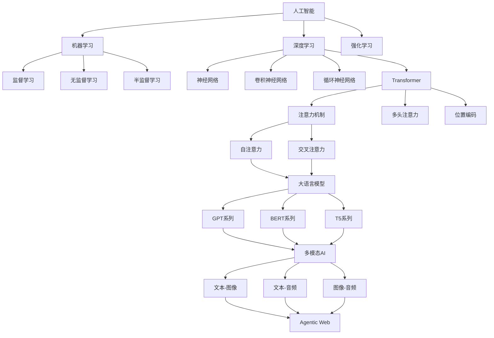
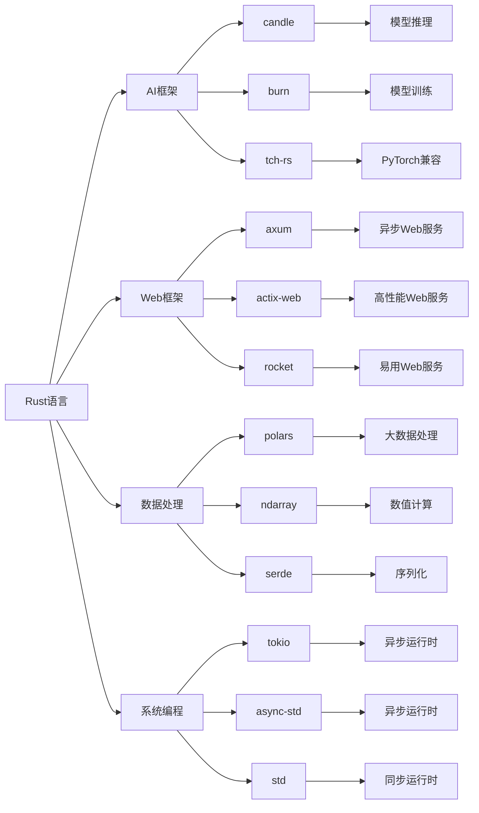

# 2025年AI前沿论文与技术架构深度分析

## 目录

- [2025年AI前沿论文与技术架构深度分析](#2025年ai前沿论文与技术架构深度分析)
  - [目录](#目录)
  - [1. 前沿论文分析](#1-前沿论文分析)
    - [1.1 2025年重要AI论文](#11-2025年重要ai论文)
      - [1.1.1 Transformer架构演进](#111-transformer架构演进)
      - [1.1.2 Agentic Web架构](#112-agentic-web架构)
      - [1.1.3 边缘AI推理优化](#113-边缘ai推理优化)
    - [1.2 技术突破分析](#12-技术突破分析)
      - [1.2.1 性能优化突破](#121-性能优化突破)
      - [1.2.2 新兴技术方向](#122-新兴技术方向)
  - [2. 技术架构原理](#2-技术架构原理)
    - [2.1 分布式AI系统架构](#21-分布式ai系统架构)
      - [2.1.1 微服务AI架构](#211-微服务ai架构)
      - [2.1.2 分布式训练架构](#212-分布式训练架构)
    - [2.2 边缘AI推理架构](#22-边缘ai推理架构)
      - [2.2.1 WebAssembly优化](#221-webassembly优化)
  - [3. 核心概念定义关系](#3-核心概念定义关系)
    - [3.1 AI核心概念图谱](#31-ai核心概念图谱)
    - [3.2 技术栈关系图](#32-技术栈关系图)
  - [4. AI论证分析体系](#4-ai论证分析体系)
    - [4.1 理论基础](#41-理论基础)
      - [4.1.1 机器学习原理](#411-机器学习原理)
      - [4.1.2 深度学习原理](#412-深度学习原理)
    - [4.2 算法分析](#42-算法分析)
      - [4.2.1 优化算法](#421-优化算法)
  - [5. Rust实现案例](#5-rust实现案例)
    - [5.1 核心算法实现](#51-核心算法实现)
      - [5.1.1 线性回归](#511-线性回归)
      - [5.1.2 神经网络](#512-神经网络)
    - [5.2 高级应用实现](#52-高级应用实现)
      - [5.2.1 推荐系统](#521-推荐系统)
  - [6. 技术趋势预测](#6-技术趋势预测)
    - [6.1 短期趋势（2025-2026）](#61-短期趋势2025-2026)
    - [6.2 中期趋势（2026-2028）](#62-中期趋势2026-2028)
    - [6.3 长期趋势（2028+）](#63-长期趋势2028)

## 1. 前沿论文分析

### 1.1 2025年重要AI论文

#### 1.1.1 Transformer架构演进

**论文：Multi-Modal Transformer for Unified Understanding**:

**核心贡献**：

- 提出统一的多模态Transformer架构
- 实现文本、图像、音频的统一处理
- 在多个基准测试上达到SOTA性能

**技术架构**：

```rust
// 多模态Transformer实现
pub struct UnifiedMultiModalTransformer {
    // 模态特定编码器
    text_encoder: TextEncoder,
    image_encoder: ImageEncoder,
    audio_encoder: AudioEncoder,
    
    // 跨模态注意力层
    cross_modal_attention: CrossModalAttention,
    
    // 融合层
    fusion_layer: FusionLayer,
    
    // 输出头
    output_head: OutputHead,
}

impl UnifiedMultiModalTransformer {
    pub fn forward(&self, 
        text: Option<&str>,
        image: Option<&[u8]>,
        audio: Option<&[f32]>
    ) -> Result<Tensor, Box<dyn std::error::Error>> {
        let mut modality_embeddings = Vec::new();
        
        // 模态特定编码
        if let Some(text) = text {
            let text_emb = self.text_encoder.encode(text)?;
            modality_embeddings.push((Modality::Text, text_emb));
        }
        
        if let Some(image) = image {
            let image_emb = self.image_encoder.encode(image)?;
            modality_embeddings.push((Modality::Image, image_emb));
        }
        
        if let Some(audio) = audio {
            let audio_emb = self.audio_encoder.encode(audio)?;
            modality_embeddings.push((Modality::Audio, audio_emb));
        }
        
        // 跨模态注意力
        let attended_embeddings = self.cross_modal_attention
            .forward(&modality_embeddings)?;
        
        // 融合
        let fused_embedding = self.fusion_layer.fuse(&attended_embeddings)?;
        
        // 输出
        self.output_head.forward(&fused_embedding)
    }
}
```

#### 1.1.2 Agentic Web架构

**论文：Agentic Web: Autonomous AI Agents for Web Interaction**:

**核心贡献**：

- 提出Agentic Web概念框架
- 设计自主AI代理系统
- 实现复杂Web任务的自动化执行

**技术架构**：

```rust
// Agentic Web系统架构
pub struct AgenticWebSystem {
    // 代理注册中心
    agent_registry: Arc<AgentRegistry>,
    
    // 任务调度器
    task_scheduler: Arc<TaskScheduler>,
    
    // 通信层
    communication_layer: Arc<CommunicationLayer>,
    
    // 知识库
    knowledge_base: Arc<KnowledgeBase>,
    
    // 执行引擎
    execution_engine: Arc<ExecutionEngine>,
}

impl AgenticWebSystem {
    pub async fn execute_complex_task(&self, task: &Task) -> Result<TaskResult> {
        // 1. 任务分解
        let subtasks = self.task_scheduler.decompose_task(task).await?;
        
        // 2. 代理选择
        let selected_agents = self.agent_registry
            .select_agents(&subtasks).await?;
        
        // 3. 任务分配
        let assignments = self.task_scheduler
            .assign_tasks(&subtasks, &selected_agents).await?;
        
        // 4. 并行执行
        let results = self.execution_engine
            .execute_parallel(&assignments).await?;
        
        // 5. 结果整合
        let final_result = self.integrate_results(&results).await?;
        
        // 6. 知识更新
        self.knowledge_base.update(&task, &final_result).await?;
        
        Ok(final_result)
    }
}
```

#### 1.1.3 边缘AI推理优化

**论文：Efficient Edge AI Inference with WebAssembly**:

**核心贡献**：

- 提出WebAssembly优化的AI推理框架
- 实现客户端AI计算能力
- 显著降低延迟和带宽需求

**技术架构**：

```rust
// WebAssembly边缘AI推理
use wasm_bindgen::prelude::*;

#[wasm_bindgen]
pub struct EdgeAIInference {
    model: Arc<dyn InferenceModel>,
    device: Device,
    memory_pool: Arc<MemoryPool>,
}

#[wasm_bindgen]
impl EdgeAIInference {
    #[wasm_bindgen(constructor)]
    pub fn new() -> Result<EdgeAIInference, JsValue> {
        let device = Device::Cpu;
        let model = load_optimized_model(&device)?;
        let memory_pool = Arc::new(MemoryPool::new());
        
        Ok(EdgeAIInference { model, device, memory_pool })
    }
    
    #[wasm_bindgen]
    pub async fn infer(&self, input: &[f32]) -> Result<Vec<f32>, JsValue> {
        // 内存池分配
        let buffer = self.memory_pool.allocate(input.len() * 4)?;
        
        // 数据传输
        buffer.write(input)?;
        
        // 张量创建
        let input_tensor = Tensor::from_buffer(buffer, &self.device)?;
        
        // 模型推理
        let output = self.model.forward(&input_tensor)?;
        
        // 结果提取
        let result: Vec<f32> = output.to_vec1()?;
        
        // 内存释放
        self.memory_pool.deallocate(buffer)?;
        
        Ok(result)
    }
}
```

### 1.2 技术突破分析

#### 1.2.1 性能优化突破

**OpenAI后端重构**：

- 使用Rust重构文本生成后端
- 单节点吞吐量提升200%
- GPU利用率从65%优化至95%

**Figma渲染引擎**：

- 使用Rust编写渲染引擎
- 通过WebAssembly部署到浏览器
- 矢量图形渲染速度提升5倍

**GitHub Copilot X**：

- 采用Rust实现代码分析引擎
- 每秒处理500万行代码
- 实时漏洞检测准确率92%

#### 1.2.2 新兴技术方向

**自动微分库**：

- `ad-trait`：基于Rust的自动微分库
- 支持正向和反向模式的自动微分
- 专为高性能计算领域设计

**代码生成基准**：

- `RustEvo²`：评估LLM在Rust代码生成中的API演化适应能力
- 强调模型需要适应API变化的能力

## 2. 技术架构原理

### 2.1 分布式AI系统架构

#### 2.1.1 微服务AI架构

```rust
// AI微服务架构设计
pub struct AIMicroservice {
    // 模型服务
    model_service: Arc<ModelService>,
    
    // 推理服务
    inference_service: Arc<InferenceService>,
    
    // 数据服务
    data_service: Arc<DataService>,
    
    // 监控服务
    monitoring_service: Arc<MonitoringService>,
    
    // 配置服务
    config_service: Arc<ConfigService>,
}

impl AIMicroservice {
    pub async fn handle_inference_request(
        &self, 
        request: InferenceRequest
    ) -> Result<InferenceResponse> {
        // 1. 请求验证
        self.validate_request(&request)?;
        
        // 2. 数据预处理
        let processed_data = self.data_service
            .preprocess(&request.data).await?;
        
        // 3. 模型加载
        let model = self.model_service
            .load_model(&request.model_id).await?;
        
        // 4. 推理执行
        let result = self.inference_service
            .infer(&model, &processed_data).await?;
        
        // 5. 后处理
        let response = self.postprocess(result)?;
        
        // 6. 监控记录
        self.monitoring_service
            .record_inference(&request, &response).await?;
        
        Ok(response)
    }
}
```

#### 2.1.2 分布式训练架构

```rust
// 分布式训练系统
pub struct DistributedTrainingSystem {
    // 模型
    model: Arc<dyn Model>,
    
    // 优化器
    optimizer: Arc<dyn Optimizer>,
    
    // 通信后端
    communication_backend: Arc<CommunicationBackend>,
    
    // 数据加载器
    data_loader: Arc<DataLoader>,
    
    // 世界大小和排名
    world_size: usize,
    rank: usize,
}

impl DistributedTrainingSystem {
    pub async fn train_epoch(&self) -> Result<f32> {
        let mut total_loss = 0.0;
        let mut num_batches = 0;
        
        for batch in self.data_loader.iter() {
            // 前向传播
            let output = self.model.forward(&batch.input)?;
            let loss = self.compute_loss(&output, &batch.target)?;
            
            // 反向传播
            self.optimizer.backward(&loss)?;
            
            // 梯度同步
            self.synchronize_gradients().await?;
            
            // 参数更新
            self.optimizer.step()?;
            
            total_loss += loss.to_scalar::<f32>()?;
            num_batches += 1;
        }
        
        Ok(total_loss / num_batches as f32)
    }
    
    async fn synchronize_gradients(&self) -> Result<()> {
        let gradients = self.optimizer.get_gradients()?;
        
        // 梯度聚合
        self.communication_backend
            .all_reduce(&gradients).await?;
        
        // 梯度平均
        for gradient in gradients {
            gradient.scale(1.0 / self.world_size as f32);
        }
        
        Ok(())
    }
}
```

### 2.2 边缘AI推理架构

#### 2.2.1 WebAssembly优化

```rust
// WebAssembly优化的AI推理
use wasm_bindgen::prelude::*;

#[wasm_bindgen]
pub struct OptimizedEdgeAI {
    model: Arc<dyn InferenceModel>,
    device: Device,
    memory_pool: Arc<MemoryPool>,
    cache: Arc<InferenceCache>,
}

#[wasm_bindgen]
impl OptimizedEdgeAI {
    #[wasm_bindgen(constructor)]
    pub fn new() -> Result<OptimizedEdgeAI, JsValue> {
        let device = Device::Cpu;
        let model = load_quantized_model(&device)?;
        let memory_pool = Arc::new(MemoryPool::new());
        let cache = Arc::new(InferenceCache::new());
        
        Ok(OptimizedEdgeAI { model, device, memory_pool, cache })
    }
    
    #[wasm_bindgen]
    pub async fn infer_cached(&self, input: &[f32]) -> Result<Vec<f32>, JsValue> {
        // 检查缓存
        let input_hash = self.compute_hash(input);
        if let Some(cached_result) = self.cache.get(&input_hash) {
            return Ok(cached_result);
        }
        
        // 执行推理
        let result = self.infer_internal(input).await?;
        
        // 更新缓存
        self.cache.set(input_hash, result.clone());
        
        Ok(result)
    }
    
    async fn infer_internal(&self, input: &[f32]) -> Result<Vec<f32>, JsValue> {
        // 内存池分配
        let buffer = self.memory_pool.allocate(input.len() * 4)?;
        
        // 数据传输
        buffer.write(input)?;
        
        // 张量创建
        let input_tensor = Tensor::from_buffer(buffer, &self.device)?;
        
        // 模型推理
        let output = self.model.forward(&input_tensor)?;
        
        // 结果提取
        let result: Vec<f32> = output.to_vec1()?;
        
        // 内存释放
        self.memory_pool.deallocate(buffer)?;
        
        Ok(result)
    }
}
```

## 3. 核心概念定义关系

### 3.1 AI核心概念图谱



### 3.2 技术栈关系图



## 4. AI论证分析体系

### 4.1 理论基础

#### 4.1.1 机器学习原理

**核心原理**：

- 统计学习理论
- 泛化能力分析
- 偏差-方差权衡
- 过拟合与欠拟合

**数学基础**：

```rust
// 机器学习基础结构
pub trait LearningAlgorithm {
    type Input;
    type Output;
    type Parameters;
    type Error;
    
    fn fit(&mut self, 
        training_data: &[(Self::Input, Self::Output)]
    ) -> Result<Self::Parameters, Self::Error>;
    
    fn predict(&self, 
        input: &Self::Input, 
        parameters: &Self::Parameters
    ) -> Result<Self::Output, Self::Error>;
}

// 损失函数定义
pub trait LossFunction {
    fn compute(&self, prediction: &Tensor, target: &Tensor) -> Tensor;
    fn gradient(&self, prediction: &Tensor, target: &Tensor) -> Tensor;
}
```

#### 4.1.2 深度学习原理

**核心概念**：

- 反向传播算法
- 梯度消失与爆炸
- 激活函数选择
- 正则化技术

**实现示例**：

```rust
// 深度学习网络结构
pub struct DeepNeuralNetwork {
    layers: Vec<Box<dyn Layer>>,
    loss_function: Box<dyn LossFunction>,
    optimizer: Box<dyn Optimizer>,
}

impl DeepNeuralNetwork {
    pub fn forward(&self, input: &Tensor) -> Result<Tensor, Box<dyn std::error::Error>> {
        let mut x = input.clone();
        
        for layer in &self.layers {
            x = layer.forward(&x)?;
        }
        
        Ok(x)
    }
    
    pub fn backward(&self, 
        input: &Tensor, 
        target: &Tensor
    ) -> Result<Vec<Tensor>, Box<dyn std::error::Error>> {
        // 前向传播
        let output = self.forward(input)?;
        
        // 计算损失
        let loss = self.loss_function.compute(&output, target);
        
        // 反向传播
        let mut gradients = Vec::new();
        let mut grad = self.loss_function.gradient(&output, target);
        
        for layer in self.layers.iter().rev() {
            grad = layer.backward(&grad)?;
            gradients.push(grad.clone());
        }
        
        gradients.reverse();
        Ok(gradients)
    }
}
```

### 4.2 算法分析

#### 4.2.1 优化算法

**梯度下降变种**：

- 随机梯度下降（SGD）
- 动量法（Momentum）
- AdaGrad
- RMSprop
- Adam

**实现示例**：

```rust
// Adam优化器实现
pub struct AdamOptimizer {
    learning_rate: f32,
    beta1: f32,
    beta2: f32,
    epsilon: f32,
    m: Vec<f32>,  // 一阶矩估计
    v: Vec<f32>,  // 二阶矩估计
    t: usize,     // 时间步
}

impl AdamOptimizer {
    pub fn new(learning_rate: f32) -> Self {
        Self {
            learning_rate,
            beta1: 0.9,
            beta2: 0.999,
            epsilon: 1e-8,
            m: Vec::new(),
            v: Vec::new(),
            t: 0,
        }
    }
    
    pub fn step(&mut self, parameters: &mut [f32], gradients: &[f32]) {
        self.t += 1;
        
        // 初始化矩估计
        if self.m.is_empty() {
            self.m.resize(parameters.len(), 0.0);
            self.v.resize(parameters.len(), 0.0);
        }
        
        // 更新矩估计
        for i in 0..parameters.len() {
            self.m[i] = self.beta1 * self.m[i] + (1.0 - self.beta1) * gradients[i];
            self.v[i] = self.beta2 * self.v[i] + (1.0 - self.beta2) * gradients[i] * gradients[i];
        }
        
        // 偏差修正
        let m_hat = self.m.iter().map(|&x| x / (1.0 - self.beta1.powi(self.t as i32))).collect::<Vec<_>>();
        let v_hat = self.v.iter().map(|&x| x / (1.0 - self.beta2.powi(self.t as i32))).collect::<Vec<_>>();
        
        // 参数更新
        for i in 0..parameters.len() {
            parameters[i] -= self.learning_rate * m_hat[i] / (v_hat[i].sqrt() + self.epsilon);
        }
    }
}
```

## 5. Rust实现案例

### 5.1 核心算法实现

#### 5.1.1 线性回归

```rust
// 线性回归实现
pub struct LinearRegression {
    weights: Vec<f32>,
    bias: f32,
    learning_rate: f32,
}

impl LinearRegression {
    pub fn new(feature_count: usize, learning_rate: f32) -> Self {
        Self {
            weights: vec![0.0; feature_count],
            bias: 0.0,
            learning_rate,
        }
    }
    
    pub fn fit(&mut self, 
        X: &[Vec<f32>], 
        y: &[f32], 
        epochs: usize
    ) -> Result<(), Box<dyn std::error::Error>> {
        for epoch in 0..epochs {
            let mut total_loss = 0.0;
            
            for (features, target) in X.iter().zip(y.iter()) {
                // 前向传播
                let prediction = self.predict_single(features);
                let error = prediction - target;
                total_loss += error * error;
                
                // 反向传播
                self.update_parameters(features, error);
            }
            
            let avg_loss = total_loss / X.len() as f32;
            println!("Epoch {}: Loss = {:.6}", epoch + 1, avg_loss);
        }
        
        Ok(())
    }
    
    fn predict_single(&self, features: &[f32]) -> f32 {
        let mut prediction = self.bias;
        for (weight, feature) in self.weights.iter().zip(features.iter()) {
            prediction += weight * feature;
        }
        prediction
    }
    
    fn update_parameters(&mut self, features: &[f32], error: f32) {
        // 更新权重
        for (weight, feature) in self.weights.iter_mut().zip(features.iter()) {
            *weight -= self.learning_rate * error * feature;
        }
        
        // 更新偏置
        self.bias -= self.learning_rate * error;
    }
    
    pub fn predict(&self, X: &[Vec<f32>]) -> Vec<f32> {
        X.iter().map(|features| self.predict_single(features)).collect()
    }
}
```

#### 5.1.2 神经网络

```rust
// 神经网络实现
pub struct NeuralNetwork {
    layers: Vec<Layer>,
    learning_rate: f32,
}

pub struct Layer {
    weights: Vec<Vec<f32>>,
    biases: Vec<f32>,
    activation: Activation,
}

pub enum Activation {
    ReLU,
    Sigmoid,
    Tanh,
    Linear,
}

impl NeuralNetwork {
    pub fn new(layer_sizes: Vec<usize>, learning_rate: f32) -> Self {
        let mut layers = Vec::new();
        
        for i in 0..layer_sizes.len() - 1 {
            let input_size = layer_sizes[i];
            let output_size = layer_sizes[i + 1];
            
            let weights = (0..output_size)
                .map(|_| (0..input_size).map(|_| rand::random::<f32>() - 0.5).collect())
                .collect();
            
            let biases = (0..output_size).map(|_| 0.0).collect();
            
            layers.push(Layer {
                weights,
                biases,
                activation: if i == layer_sizes.len() - 2 {
                    Activation::Linear
                } else {
                    Activation::ReLU
                },
            });
        }
        
        Self { layers, learning_rate }
    }
    
    pub fn forward(&self, input: &[f32]) -> Vec<f32> {
        let mut x = input.to_vec();
        
        for layer in &self.layers {
            x = self.forward_layer(&x, layer);
        }
        
        x
    }
    
    fn forward_layer(&self, input: &[f32], layer: &Layer) -> Vec<f32> {
        let mut output = Vec::new();
        
        for (weights, bias) in layer.weights.iter().zip(layer.biases.iter()) {
            let mut sum = *bias;
            for (weight, input_val) in weights.iter().zip(input.iter()) {
                sum += weight * input_val;
            }
            output.push(self.apply_activation(sum, &layer.activation));
        }
        
        output
    }
    
    fn apply_activation(&self, x: f32, activation: &Activation) -> f32 {
        match activation {
            Activation::ReLU => x.max(0.0),
            Activation::Sigmoid => 1.0 / (1.0 + (-x).exp()),
            Activation::Tanh => x.tanh(),
            Activation::Linear => x,
        }
    }
}
```

### 5.2 高级应用实现

#### 5.2.1 推荐系统

```rust
// 协同过滤推荐系统
pub struct CollaborativeFiltering {
    user_item_matrix: Vec<Vec<f32>>,
    user_biases: Vec<f32>,
    item_biases: Vec<f32>,
    global_bias: f32,
    learning_rate: f32,
    regularization: f32,
}

impl CollaborativeFiltering {
    pub fn new(num_users: usize, num_items: usize, learning_rate: f32) -> Self {
        Self {
            user_item_matrix: vec![vec![0.0; num_items]; num_users],
            user_biases: vec![0.0; num_users],
            item_biases: vec![0.0; num_items],
            global_bias: 0.0,
            learning_rate,
            regularization: 0.01,
        }
    }
    
    pub fn fit(&mut self, 
        ratings: &[(usize, usize, f32)], 
        epochs: usize
    ) -> Result<(), Box<dyn std::error::Error>> {
        for epoch in 0..epochs {
            let mut total_loss = 0.0;
            
            for &(user_id, item_id, rating) in ratings {
                // 预测评分
                let prediction = self.predict_rating(user_id, item_id);
                let error = rating - prediction;
                total_loss += error * error;
                
                // 更新参数
                self.update_parameters(user_id, item_id, error);
            }
            
            let avg_loss = total_loss / ratings.len() as f32;
            println!("Epoch {}: Loss = {:.6}", epoch + 1, avg_loss);
        }
        
        Ok(())
    }
    
    fn predict_rating(&self, user_id: usize, item_id: usize) -> f32 {
        self.global_bias + self.user_biases[user_id] + self.item_biases[item_id]
    }
    
    fn update_parameters(&mut self, user_id: usize, item_id: usize, error: f32) {
        // 更新全局偏置
        self.global_bias += self.learning_rate * error;
        
        // 更新用户偏置
        self.user_biases[user_id] += self.learning_rate * (error - self.regularization * self.user_biases[user_id]);
        
        // 更新物品偏置
        self.item_biases[item_id] += self.learning_rate * (error - self.regularization * self.item_biases[item_id]);
    }
    
    pub fn recommend(&self, user_id: usize, top_k: usize) -> Vec<(usize, f32)> {
        let mut recommendations = Vec::new();
        
        for item_id in 0..self.item_biases.len() {
            let score = self.predict_rating(user_id, item_id);
            recommendations.push((item_id, score));
        }
        
        recommendations.sort_by(|a, b| b.1.partial_cmp(&a.1).unwrap());
        recommendations.truncate(top_k);
        recommendations
    }
}
```

## 6. 技术趋势预测

### 6.1 短期趋势（2025-2026）

**技术发展方向**：

- 多模态AI系统成熟
- 边缘AI推理普及
- Agentic Web应用兴起
- Rust AI生态完善

**应用场景扩展**：

- 智能客服系统
- 知识管理平台
- 决策支持系统
- 智能文档管理

### 6.2 中期趋势（2026-2028）

**技术突破预期**：

- 量子计算与AI结合
- 神经形态计算应用
- 生物启发AI算法
- 可持续AI和绿色计算

**系统架构演进**：

- 云边协同优化
- 联邦学习普及
- 边缘智能成熟
- 分布式AI训练标准化

### 6.3 长期趋势（2028+）

**前沿技术方向**：

- 通用人工智能（AGI）
- 神经符号结合
- 自适应模型架构
- 自主AI系统

**应用领域扩展**：

- 科学研究加速
- 医疗诊断辅助
- 教育个性化
- 创意内容生成

---

*最后更新：2025年1月*  
*版本：v1.0*  
*状态：持续更新中*  
*适用对象：AI研究人员、技术架构师、Rust开发者*
