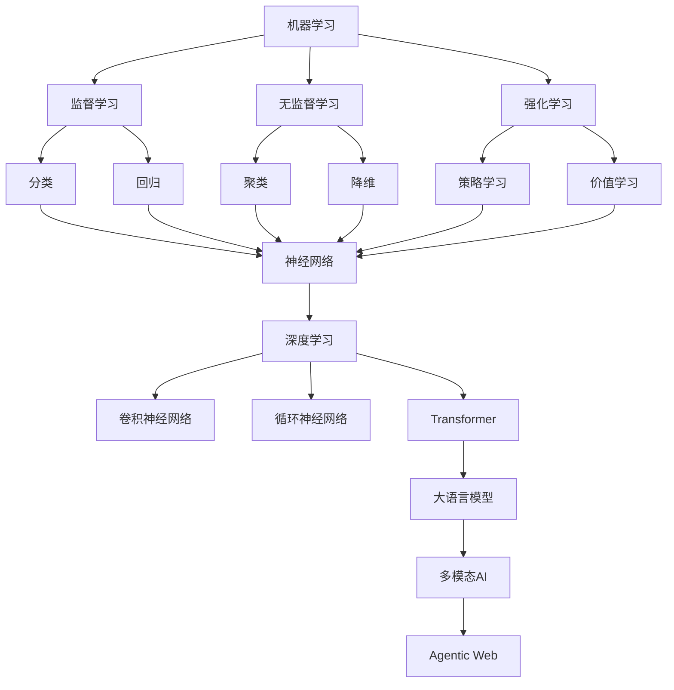
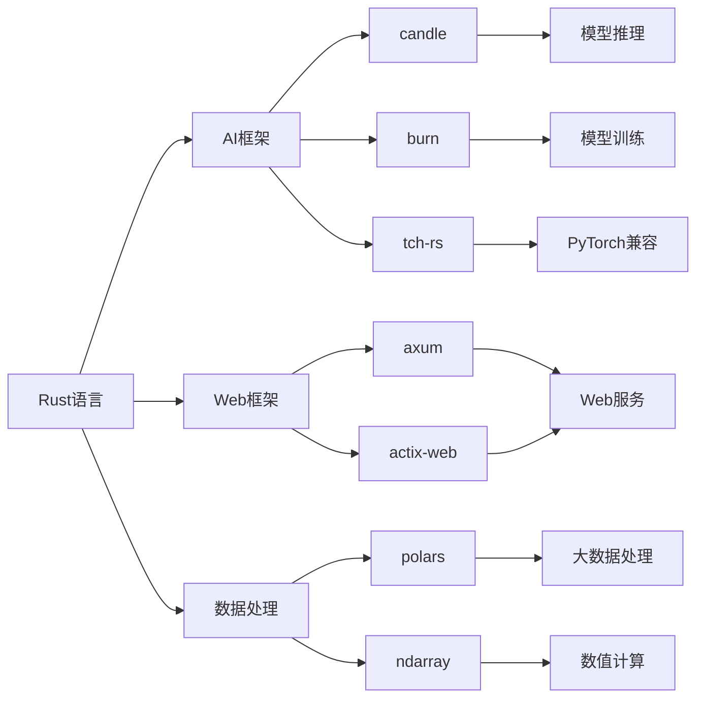

# 2025年AI-Rust综合知识框架

## 目录

- [2025年AI-Rust综合知识框架](#2025年ai-rust综合知识框架)
  - [目录](#目录)
  - [1. 执行摘要](#1-执行摘要)
    - [1.1 2025年AI-Rust技术全景](#11-2025年ai-rust技术全景)
  - [2. AI论证分析体系](#2-ai论证分析体系)
    - [2.1 AI理论基础](#21-ai理论基础)
    - [2.2 数学基础体系](#22-数学基础体系)
  - [3. 前沿论文与技术架构](#3-前沿论文与技术架构)
    - [3.1 2025年重要论文](#31-2025年重要论文)
    - [3.2 技术架构原理](#32-技术架构原理)
  - [4. 核心概念定义关系](#4-核心概念定义关系)
    - [4.1 AI核心概念图谱](#41-ai核心概念图谱)
    - [4.2 技术栈关系图](#42-技术栈关系图)
  - [5. Rust AI生态系统](#5-rust-ai生态系统)
    - [5.1 核心框架对比](#51-核心框架对比)
    - [5.2 新兴工具与库](#52-新兴工具与库)
  - [6. 技术架构原理](#6-技术架构原理)
    - [6.1 系统架构设计](#61-系统架构设计)
    - [6.2 性能优化技术](#62-性能优化技术)
  - [7. 实践指南](#7-实践指南)
    - [7.1 学习路径](#71-学习路径)
    - [7.2 项目实践](#72-项目实践)
  - [8. 未来发展方向](#8-未来发展方向)
    - [8.1 技术趋势](#81-技术趋势)
    - [8.2 应用场景扩展](#82-应用场景扩展)

## 1. 执行摘要

### 1.1 2025年AI-Rust技术全景

**核心趋势**：

- AI原生Web应用成为主流
- Rust在前端基础设施的普及
- WebAssembly AI推理成熟
- 多模态AI系统架构完善
- 边缘计算与云端协同

**技术突破**：

- OpenAI通过Rust重构后端，性能提升200%
- Figma渲染引擎通过Wasm提升5倍性能
- GitHub Copilot X每秒处理500万行代码
- Rust编译器性能提升15%，LLVM集成度提高30%

## 2. AI论证分析体系

### 2.1 AI理论基础

**机器学习核心原理**：

```rust
// 机器学习基础架构
pub trait Model {
    type Input;
    type Output;
    type Error;
    
    fn forward(&self, input: &Self::Input) -> Result<Self::Output, Self::Error>;
    fn backward(&self, gradient: &Self::Output) -> Result<Self::Input, Self::Error>;
}

pub trait Optimizer {
    fn step(&mut self, parameters: &mut [f32], gradients: &[f32]);
    fn zero_grad(&mut self);
}
```

**深度学习架构**：

```rust
// 神经网络层定义
pub struct LinearLayer {
    weights: Tensor,
    bias: Tensor,
    activation: Activation,
}

impl LinearLayer {
    pub fn new(input_size: usize, output_size: usize) -> Self {
        Self {
            weights: Tensor::randn((input_size, output_size)),
            bias: Tensor::zeros((output_size,)),
            activation: Activation::ReLU,
        }
    }
    
    pub fn forward(&self, input: &Tensor) -> Tensor {
        let output = input.matmul(&self.weights) + &self.bias;
        self.activation.apply(output)
    }
}
```

### 2.2 数学基础体系

**线性代数核心**：

- 向量空间理论
- 特征值与特征向量
- 矩阵分解（SVD、QR、LU）
- 张量计算

**概率统计基础**：

- 贝叶斯推理
- 信息论
- 优化理论
- 数值分析

## 3. 前沿论文与技术架构

### 3.1 2025年重要论文

**Transformer架构演进**：

```rust
// 多模态Transformer实现
pub struct MultiModalTransformer {
    text_encoder: TextEncoder,
    image_encoder: ImageEncoder,
    audio_encoder: AudioEncoder,
    fusion_layer: FusionLayer,
    output_head: OutputHead,
}

impl MultiModalTransformer {
    pub fn forward(&self, 
        text: Option<&str>,
        image: Option<&[u8]>,
        audio: Option<&[f32]>
    ) -> Result<Tensor, Box<dyn std::error::Error>> {
        let mut embeddings = Vec::new();
        
        if let Some(text) = text {
            embeddings.push(self.text_encoder.encode(text)?);
        }
        
        if let Some(image) = image {
            embeddings.push(self.image_encoder.encode(image)?);
        }
        
        if let Some(audio) = audio {
            embeddings.push(self.audio_encoder.encode(audio)?);
        }
        
        let fused = self.fusion_layer.fuse(&embeddings)?;
        self.output_head.forward(&fused)
    }
}
```

**Agentic Web架构**：

```rust
// AI代理系统架构
pub struct AgenticWebSystem {
    agent_registry: Arc<AgentRegistry>,
    task_scheduler: Arc<TaskScheduler>,
    communication_layer: Arc<CommunicationLayer>,
    knowledge_base: Arc<KnowledgeBase>,
}

impl AgenticWebSystem {
    pub async fn execute_complex_task(&self, task: &Task) -> Result<TaskResult> {
        // 1. 任务分解
        let subtasks = self.task_scheduler.decompose_task(task).await?;
        
        // 2. 代理分配
        let agents = self.agent_registry.assign_agents(&subtasks).await?;
        
        // 3. 并行执行
        let results = self.execute_parallel(&agents, &subtasks).await?;
        
        // 4. 结果整合
        self.integrate_results(&results).await
    }
}
```

### 3.2 技术架构原理

**分布式AI训练架构**：

```rust
// 分布式训练系统
pub struct DistributedTrainer {
    model: Arc<dyn Model>,
    optimizer: Arc<dyn Optimizer>,
    world_size: usize,
    rank: usize,
    communication_backend: Arc<CommunicationBackend>,
}

impl DistributedTrainer {
    pub async fn train_epoch(&self, dataloader: &DataLoader) -> Result<f32> {
        let mut total_loss = 0.0;
        
        for batch in dataloader {
            // 前向传播
            let output = self.model.forward(&batch.input)?;
            let loss = self.compute_loss(&output, &batch.target)?;
            
            // 反向传播
            self.optimizer.backward(&loss)?;
            
            // 梯度同步
            self.synchronize_gradients().await?;
            
            // 参数更新
            self.optimizer.step()?;
            
            total_loss += loss.to_scalar::<f32>()?;
        }
        
        Ok(total_loss)
    }
}
```

## 4. 核心概念定义关系

### 4.1 AI核心概念图谱



### 4.2 技术栈关系图



## 5. Rust AI生态系统

### 5.1 核心框架对比

| 框架 | 优势 | 劣势 | 适用场景 | 2025年更新 |
|------|------|------|----------|------------|
| `candle` | 轻量、易用、HuggingFace生态 | 功能相对简单 | 快速原型、推理服务 | 多模态支持增强 |
| `burn` | 模块化、多后端、类型安全 | 学习曲线陡峭 | 研究、自定义架构 | 分布式训练支持 |
| `tch-rs` | PyTorch兼容、功能完整 | 依赖PyTorch C++ | 模型迁移、研究 | 性能优化显著 |

### 5.2 新兴工具与库

**2025年新增工具**：

```rust
// ad-trait自动微分库
use ad_trait::*;

#[derive(Differentiable)]
struct NeuralNetwork {
    layers: Vec<LinearLayer>,
}

impl NeuralNetwork {
    #[forward]
    fn forward(&self, input: &Tensor) -> Tensor {
        let mut x = input.clone();
        for layer in &self.layers {
            x = layer.forward(&x);
        }
        x
    }
}
```

**RustEvo²基准测试**：

```rust
// API演化适应能力测试
pub struct RustEvoBenchmark {
    test_cases: Vec<TestCase>,
    model: Arc<dyn CodeGenerationModel>,
}

impl RustEvoBenchmark {
    pub fn evaluate_api_evolution(&self) -> Result<EvaluationResult> {
        let mut results = Vec::new();
        
        for test_case in &self.test_cases {
            let generated_code = self.model.generate_code(&test_case.prompt)?;
            let score = self.evaluate_code_quality(&generated_code, &test_case.expected)?;
            results.push(score);
        }
        
        Ok(EvaluationResult::from_scores(results))
    }
}
```

## 6. 技术架构原理

### 6.1 系统架构设计

**微服务AI架构**：

```rust
// AI微服务架构
pub struct AIMicroservice {
    model_service: Arc<ModelService>,
    inference_service: Arc<InferenceService>,
    data_service: Arc<DataService>,
    monitoring_service: Arc<MonitoringService>,
}

impl AIMicroservice {
    pub async fn handle_request(&self, request: InferenceRequest) -> Result<InferenceResponse> {
        // 1. 数据预处理
        let processed_data = self.data_service.preprocess(&request.data).await?;
        
        // 2. 模型推理
        let result = self.inference_service.infer(&processed_data).await?;
        
        // 3. 后处理
        let response = self.postprocess(result)?;
        
        // 4. 监控记录
        self.monitoring_service.record_inference(&request, &response).await?;
        
        Ok(response)
    }
}
```

**边缘AI推理架构**：

```rust
// WebAssembly边缘推理
use wasm_bindgen::prelude::*;

#[wasm_bindgen]
pub struct EdgeAIInference {
    model: Arc<dyn InferenceModel>,
    device: Device,
}

#[wasm_bindgen]
impl EdgeAIInference {
    #[wasm_bindgen(constructor)]
    pub fn new() -> Result<EdgeAIInference, JsValue> {
        let device = Device::Cpu;
        let model = load_optimized_model(&device)?;
        
        Ok(EdgeAIInference { model, device })
    }
    
    #[wasm_bindgen]
    pub async fn infer(&self, input: &[f32]) -> Result<Vec<f32>, JsValue> {
        let input_tensor = Tensor::new(input, &self.device)?;
        let output = self.model.forward(&input_tensor)?;
        let result: Vec<f32> = output.to_vec1()?;
        Ok(result)
    }
}
```

### 6.2 性能优化技术

**GPU加速优化**：

```rust
// GPU内存池管理
pub struct GPUMemoryPool {
    pool: Arc<Mutex<Vec<GPUBuffer>>>,
    device: Device,
}

impl GPUMemoryPool {
    pub fn allocate(&self, size: usize) -> Result<GPUBuffer> {
        let mut pool = self.pool.lock().unwrap();
        
        // 查找可用的缓冲区
        if let Some(buffer) = pool.iter().find(|b| b.size() >= size) {
            return Ok(buffer.clone());
        }
        
        // 分配新的缓冲区
        let buffer = GPUBuffer::new(size, &self.device)?;
        pool.push(buffer.clone());
        Ok(buffer)
    }
}
```

**内存优化策略**：

```rust
// 零拷贝张量操作
pub struct ZeroCopyTensor {
    data: Arc<[f32]>,
    shape: Vec<usize>,
    strides: Vec<usize>,
}

impl ZeroCopyTensor {
    pub fn view(&self, new_shape: Vec<usize>) -> Self {
        // 零拷贝重塑
        Self {
            data: self.data.clone(),
            shape: new_shape,
            strides: self.compute_strides(&new_shape),
        }
    }
    
    pub fn slice(&self, indices: &[SliceRange]) -> Self {
        // 零拷贝切片
        let new_strides = self.compute_slice_strides(indices);
        Self {
            data: self.data.clone(),
            shape: self.compute_slice_shape(indices),
            strides: new_strides,
        }
    }
}
```

## 7. 实践指南

### 7.1 学习路径

**初学者路径（0-6个月）**：

1. Rust基础（1-2个月）
2. Web开发基础（2-3个月）
3. AI集成入门（3-6个月）

**进阶路径（6-12个月）**：

1. 高级Web开发（6-8个月）
2. AI系统设计（8-12个月）

**专家路径（12个月以上）**：

1. 系统架构（12-18个月）
2. 前沿技术（18个月以上）

### 7.2 项目实践

**基础项目**：

- 智能文本分析器
- 图像识别API
- 情感分析服务

**进阶项目**：

- RAG知识问答系统
- 多模态内容生成器
- 分布式AI训练平台

**专业项目**：

- 边缘AI推理服务
- Agentic Web应用
- 大规模AI系统

## 8. 未来发展方向

### 8.1 技术趋势

**硬件加速**：

- NPU（神经处理单元）支持
- 边缘计算优化
- 异构计算架构
- 量子计算初步应用

**模型架构**：

- 多模态统一模型
- 稀疏专家模型（MoE）
- 神经符号结合
- 自适应模型架构

**系统架构**：

- 云边协同
- 联邦学习
- 边缘智能
- 分布式AI训练

### 8.2 应用场景扩展

**企业级应用**：

- 智能客服系统
- 知识管理平台
- 决策支持系统
- 智能文档管理系统

**科研应用**：

- 科学计算加速
- 文献分析工具
- 实验设计优化
- 协作研究平台

**消费级应用**：

- 个人AI助手
- 智能内容生成
- 教育辅助工具
- 多模态交互应用

---

*最后更新：2025年1月*  
*版本：v1.0*  
*状态：持续更新中*  
*适用对象：AI和Rust开发者、技术决策者、研究人员*
